---
hide:
  - navigation
  - toc
---
# Searchable 🔍 Instagram Recipe Collection

> **About:** I find Instagram to be a wonderful site to find and save recipes. Alas, Instagram collections are not searchable, so I made this simple tool to search my personal Instagram recipe collection. The "tried and tested" recipes go to [**cook.luischav.es**](https://cook.luischav.es/)

- [{: style="width:100%;height:200px;object-fit: cover;object-position: center;" }](posts/eatmoreplants.no_04-08-2024_1808.md)  
        **@eatmoreplants.no** - Ad. I’ve been using @veri to track my glucose resp [Read More...](posts/eatmoreplants.no_04-08-2024_1808.md)
- [{: style="width:100%;height:200px;object-fit: cover;object-position: center;" }](posts/eatmoreplants.no_14-08-2024_1108.md)  
        **@eatmoreplants.no** - Sometimes you just need to eat an entire cucumber  [Read More...](posts/eatmoreplants.no_14-08-2024_1108.md)
- [{: style="width:100%;height:200px;object-fit: cover;object-position: center;" }](posts/eatmoreplants.no_26-08-2024_1308.md)  
        **@eatmoreplants.no** - Instant ramen jars on a monday🍜 Add more sriracha  [Read More...](posts/eatmoreplants.no_26-08-2024_1308.md)
- [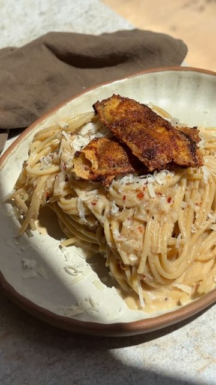{: style="width:100%;height:200px;object-fit: cover;object-position: center;" }](posts/eatmoreplants.no_30-08-2024_1708.md)  
        **@eatmoreplants.no** - I’m sick, so I’m reposting a few oldies but GOLDIE [Read More...](posts/eatmoreplants.no_30-08-2024_1708.md)
- [{: style="width:100%;height:200px;object-fit: cover;object-position: center;" }](posts/thefoodietakesflight_31-08-2024_1508.md)  
        **@thefoodietakesflight** - Spicy Garlic & Herb Mushroom Foil Bake! [Read More...](posts/thefoodietakesflight_31-08-2024_1508.md)
- [{: style="width:100%;height:200px;object-fit: cover;object-position: center;" }](posts/nomeatdisco_03-09-2024_1509.md)  
        **@nomeatdisco** - CHILLI JAM & TOFU RICOTTA FILO PARCEL 🥮  [Read More...](posts/nomeatdisco_03-09-2024_1509.md)
- [{: style="width:100%;height:200px;object-fit: cover;object-position: center;" }](posts/eatmoreplants.no_04-09-2024_1409.md)  
        **@eatmoreplants.no** - Ad. I’ve been using the @veri method to educate my [Read More...](posts/eatmoreplants.no_04-09-2024_1409.md)
- [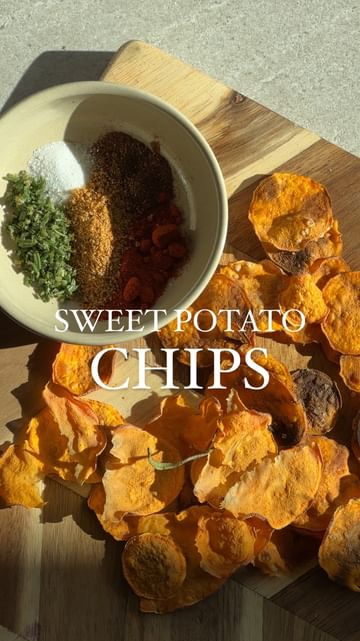{: style="width:100%;height:200px;object-fit: cover;object-position: center;" }](posts/eatmoreplants.no_07-09-2024_1309.md)  
        **@eatmoreplants.no** - There are moments where you need to eat an entire  [Read More...](posts/eatmoreplants.no_07-09-2024_1309.md)
- [{: style="width:100%;height:200px;object-fit: cover;object-position: center;" }](posts/pierceabernathy_09-09-2024_1509.md)  
        **@pierceabernathy** - Marinated tomato and watermelon with a clarified v [Read More...](posts/pierceabernathy_09-09-2024_1509.md)
- [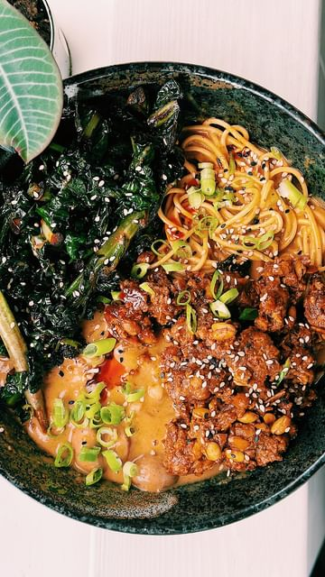{: style="width:100%;height:200px;object-fit: cover;object-position: center;" }](posts/nomeatdisco_09-09-2024_1509.md)  
        **@nomeatdisco** - SPICY PEANUT NOODLE SOUP 🍜  [Read More...](posts/nomeatdisco_09-09-2024_1509.md)
- [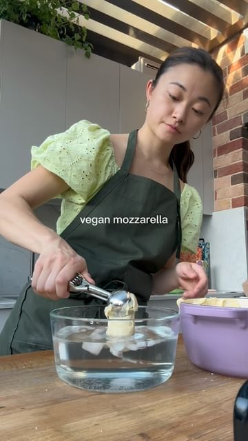{: style="width:100%;height:200px;object-fit: cover;object-position: center;" }](posts/itslizmiu_09-09-2024_1309.md)  
        **@itslizmiu** - VEGAN MOZZ IN BRINE  [Read More...](posts/itslizmiu_09-09-2024_1309.md)
- [{: style="width:100%;height:200px;object-fit: cover;object-position: center;" }](posts/eatmoreplants.no_19-08-2024_1508.md)  
        **@eatmoreplants.no** - One pot marry me butter beans💍 [Read More...](posts/eatmoreplants.no_19-08-2024_1508.md)
- [{: style="width:100%;height:200px;object-fit: cover;object-position: center;" }](posts/rgveganfood_07-07-2024_1207.md)  
        **@rgveganfood** - RASTA PASTA [Read More...](posts/rgveganfood_07-07-2024_1207.md)
- [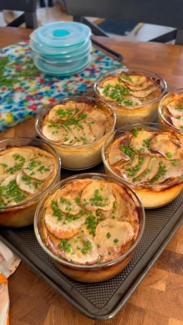{: style="width:100%;height:200px;object-fit: cover;object-position: center;" }](posts/itslizmiu_05-06-2024_2306.md)  
        **@itslizmiu** - CREAMY LEEK & POTATO BAKE MEAL PREP 🥔  [Read More...](posts/itslizmiu_05-06-2024_2306.md)
- [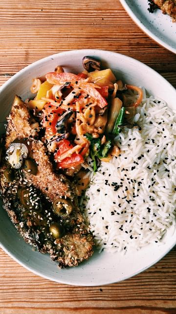{: style="width:100%;height:200px;object-fit: cover;object-position: center;" }](posts/nomeatdisco_01-06-2024_1206.md)  
        **@nomeatdisco** - JALEPENO HONEY AUBERGINE SCHNITZEL WITH A THAI SAL [Read More...](posts/nomeatdisco_01-06-2024_1206.md)
- [{: style="width:100%;height:200px;object-fit: cover;object-position: center;" }](posts/itslizmiu_22-04-2024_1004.md)  
        **@itslizmiu** - I know it’s only April but this year has been the  [Read More...](posts/itslizmiu_22-04-2024_1004.md)
- [{: style="width:100%;height:200px;object-fit: cover;object-position: center;" }](posts/itslizmiu_16-04-2024_0904.md)  
        **@itslizmiu** - 5-MINUTE CASHEW ROMESCO SAUCE 🫑  [Read More...](posts/itslizmiu_16-04-2024_0904.md)
- [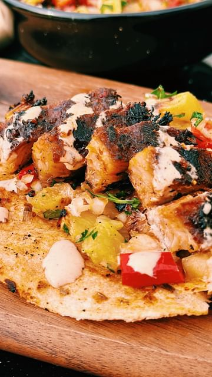{: style="width:100%;height:200px;object-fit: cover;object-position: center;" }](posts/nomeatdisco_31-03-2024_1403.md)  
        **@nomeatdisco** - JERK MUSHROOM STEAK TACOS 🌮  [Read More...](posts/nomeatdisco_31-03-2024_1403.md)
- [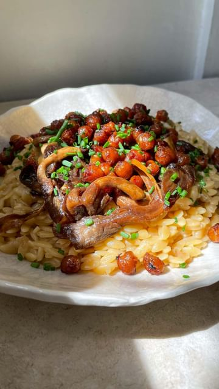{: style="width:100%;height:200px;object-fit: cover;object-position: center;" }](posts/thefoodietakesflight_16-03-2024_1503.md)  
        **@thefoodietakesflight** - Miso Orzo with Gochujang Chickpeas and Teriyaki Mu [Read More...](posts/thefoodietakesflight_16-03-2024_1503.md)
- [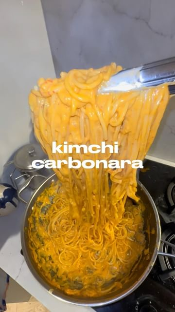{: style="width:100%;height:200px;object-fit: cover;object-position: center;" }](posts/itslizmiu_15-03-2024_1203.md)  
        **@itslizmiu** - KIMCHI CARBONARA 🤠 (not actually carbonara at all) [Read More...](posts/itslizmiu_15-03-2024_1203.md)
- [{: style="width:100%;height:200px;object-fit: cover;object-position: center;" }](posts/nomeatdisco_17-03-2024_1503.md)  
        **@nomeatdisco** - TOM KHA GAI - THAI COCONUT SOUP 🥣  [Read More...](posts/nomeatdisco_17-03-2024_1503.md)
- [{: style="width:100%;height:200px;object-fit: cover;object-position: center;" }](posts/rgveganfood_05-12-2023_1312.md)  
        **@rgveganfood** - BRUNCH [Read More...](posts/rgveganfood_05-12-2023_1312.md)
- [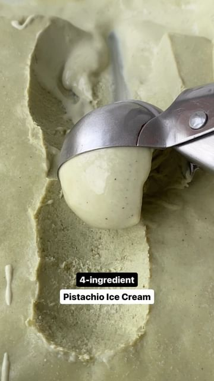{: style="width:100%;height:200px;object-fit: cover;object-position: center;" }](posts/allplants_02-07-2023_1107.md)  
        **@allplants** - 4-ingredient Pistachio Ice Cream ⭐️ [Read More...](posts/allplants_02-07-2023_1107.md)
- [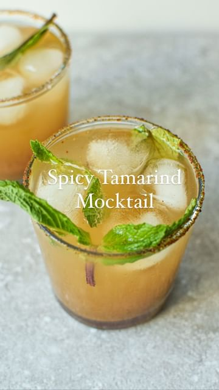{: style="width:100%;height:200px;object-fit: cover;object-position: center;" }](posts/eatwithafia_29-06-2023_1506.md)  
        **@eatwithafia** - Spicy tamarind mocktail with mint and a spicy rim  [Read More...](posts/eatwithafia_29-06-2023_1506.md)
- [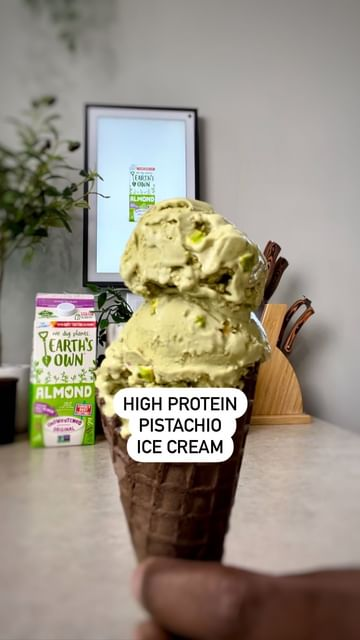{: style="width:100%;height:200px;object-fit: cover;object-position: center;" }](posts/plantcrazii_26-06-2023_1506.md)  
        **@plantcrazii** - I’m excited about sharing this High Protein Pistac [Read More...](posts/plantcrazii_26-06-2023_1506.md)
- [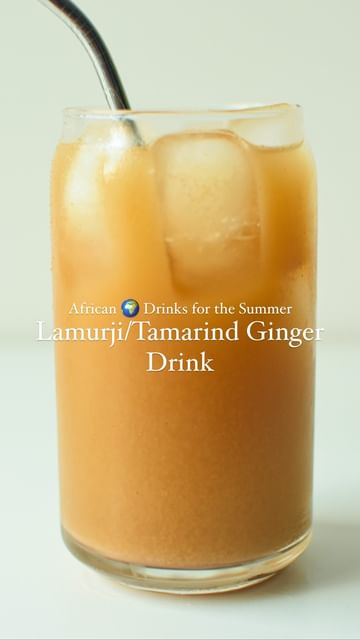{: style="width:100%;height:200px;object-fit: cover;object-position: center;" }](posts/eatwithafia_27-06-2023_1506.md)  
        **@eatwithafia** - Cool down this summer with some of my favourite an [Read More...](posts/eatwithafia_27-06-2023_1506.md)
- [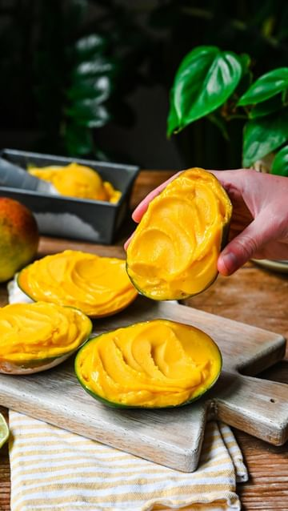{: style="width:100%;height:200px;object-fit: cover;object-position: center;" }](posts/crowded_kitchen_12-06-2023_1406.md)  
        **@crowded_kitchen** - MANGO LIME SORBET 🥭🍨 Island way sorbet who?? Make  [Read More...](posts/crowded_kitchen_12-06-2023_1406.md)
- [{: style="width:100%;height:200px;object-fit: cover;object-position: center;" }](posts/zaccharybird_18-06-2023_0006.md)  
        **@zaccharybird** - TEMPE KECAP! If you’ve never enjoyed tempeh before [Read More...](posts/zaccharybird_18-06-2023_0006.md)
- [{: style="width:100%;height:200px;object-fit: cover;object-position: center;" }](posts/abclifestyle_15-06-2023_0706.md)  
        **@abclifestyle** - Homemade Garlic and Sesame Chilli Crisp to put on  [Read More...](posts/abclifestyle_15-06-2023_0706.md)
- [{: style="width:100%;height:200px;object-fit: cover;object-position: center;" }](posts/itslizmiu_13-06-2023_0806.md)  
        **@itslizmiu** - Portuguese Saltcod Fritters 🇵🇹🐟Bolinhos/Pasteis de [Read More...](posts/itslizmiu_13-06-2023_0806.md)
- [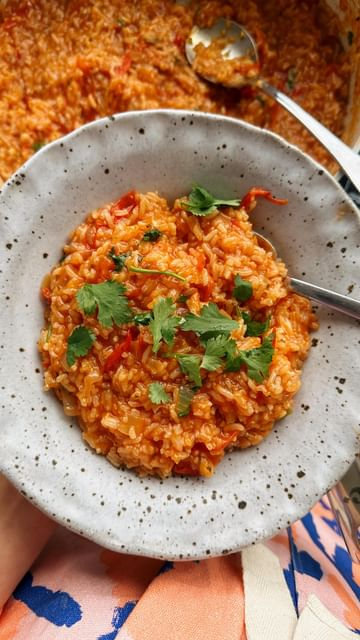{: style="width:100%;height:200px;object-fit: cover;object-position: center;" }](posts/itslizmiu_08-06-2023_1106.md)  
        **@itslizmiu** - Portuguese Tomato Rice (Arroz de Tomate) 🍅 Inspire [Read More...](posts/itslizmiu_08-06-2023_1106.md)
- [{: style="width:100%;height:200px;object-fit: cover;object-position: center;" }](posts/fitgreenmind_11-01-2023_2001.md)  
        **@fitgreenmind** - SHREDDED TOFU TACOS 🌮  [Read More...](posts/fitgreenmind_11-01-2023_2001.md)
- [{: style="width:100%;height:200px;object-fit: cover;object-position: center;" }](posts/the.undisputable.vegans_21-04-2023_1104.md)  
        **@the.undisputable.vegans** - 🥭 Mangum [Read More...](posts/the.undisputable.vegans_21-04-2023_1104.md)
- [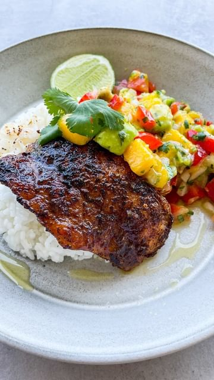{: style="width:100%;height:200px;object-fit: cover;object-position: center;" }](posts/primal_gourmet_29-03-2023_1603.md)  
        **@primal_gourmet** - Blackened Snapper with Mango Salsa… easy, healthy  [Read More...](posts/primal_gourmet_29-03-2023_1603.md)
- [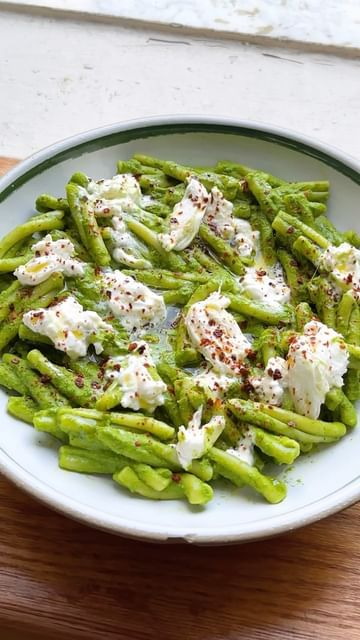{: style="width:100%;height:200px;object-fit: cover;object-position: center;" }](posts/pierceabernathy_31-05-2023_1605.md)  
        **@pierceabernathy** - Greens are everywhere at the market and I’ve been  [Read More...](posts/pierceabernathy_31-05-2023_1605.md)
- [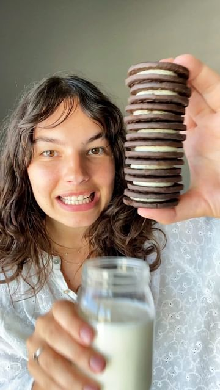{: style="width:100%;height:200px;object-fit: cover;object-position: center;" }](posts/carolinagelen_25-05-2023_1905.md)  
        **@carolinagelen** - Follow @carolinagelen for more recipes  [Read More...](posts/carolinagelen_25-05-2023_1905.md)
- [{: style="width:100%;height:200px;object-fit: cover;object-position: center;" }](posts/carolinagelen_25-05-2023_0105.md)  
        **@carolinagelen** - follow @carolinagelen for more recipes  [Read More...](posts/carolinagelen_25-05-2023_0105.md)
- [{: style="width:100%;height:200px;object-fit: cover;object-position: center;" }](posts/carolinagelen_22-05-2023_1805.md)  
        **@carolinagelen** - follow @carolinagelen for more recipes  [Read More...](posts/carolinagelen_22-05-2023_1805.md)
- [{: style="width:100%;height:200px;object-fit: cover;object-position: center;" }](posts/thefoodietakesflight_19-05-2023_1305.md)  
        **@thefoodietakesflight** - Garlic Pepper Tofu! 🥢 [Read More...](posts/thefoodietakesflight_19-05-2023_1305.md)
- [{: style="width:100%;height:200px;object-fit: cover;object-position: center;" }](posts/vegandemocracy_15-04-2023_1304.md)  
        **@vegandemocracy** - EAT OR PASS?? 😍 [Read More...](posts/vegandemocracy_15-04-2023_1304.md)
- [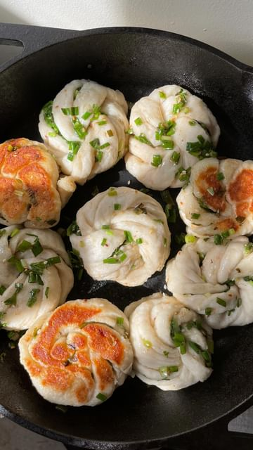{: style="width:100%;height:200px;object-fit: cover;object-position: center;" }](posts/thefoodietakesflight_13-05-2023_1405.md)  
        **@thefoodietakesflight** - Pan-Fried Scallion & Sesame Buns for all the amazi [Read More...](posts/thefoodietakesflight_13-05-2023_1405.md)
- [{: style="width:100%;height:200px;object-fit: cover;object-position: center;" }](posts/abclifestyle_11-05-2023_0605.md)  
        **@abclifestyle** - SAMBAL GORENG TEMPE(H) by @itslizmiu 🇮🇩 If you don [Read More...](posts/abclifestyle_11-05-2023_0605.md)
- [{: style="width:100%;height:200px;object-fit: cover;object-position: center;" }](posts/jensplantbase_09-04-2023_1904.md)  
        **@jensplantbase** - Chick’n & Plantain Waffles - a plant based-alterna [Read More...](posts/jensplantbase_09-04-2023_1904.md)
- [{: style="width:100%;height:200px;object-fit: cover;object-position: center;" }](posts/veganezer_25-03-2023_1303.md)  
        **@veganezer** - 🇳🇬 Efo Riro 🇳🇬 [Read More...](posts/veganezer_25-03-2023_1303.md)
- [{: style="width:100%;height:200px;object-fit: cover;object-position: center;" }](posts/plantyou_19-04-2023_1804.md)  
        **@plantyou** - 💕🥰🥕VEGAN OVERNIGHT OAT BUNS by @plantyou inspired  [Read More...](posts/plantyou_19-04-2023_1804.md)
- [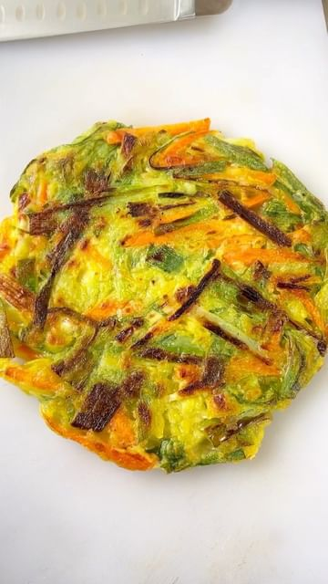{: style="width:100%;height:200px;object-fit: cover;object-position: center;" }](posts/thefoodietakesflight_27-12-2022_1312.md)  
        **@thefoodietakesflight** - My fav way to eat veggies are in the form of panca [Read More...](posts/thefoodietakesflight_27-12-2022_1312.md)
- [{: style="width:100%;height:200px;object-fit: cover;object-position: center;" }](posts/eatwithafia_06-01-2023_2001.md)  
        **@eatwithafia** - What I eat in a day as a vegan who enjoys food fro [Read More...](posts/eatwithafia_06-01-2023_2001.md)
- [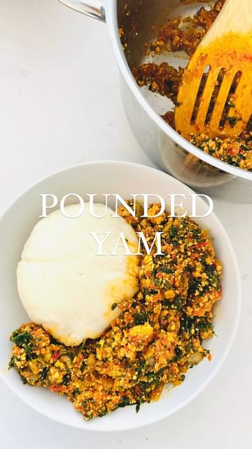{: style="width:100%;height:200px;object-fit: cover;object-position: center;" }](posts/eatwithafia_12-01-2023_1601.md)  
        **@eatwithafia** - How to make pounded yam in a food processor  [Read More...](posts/eatwithafia_12-01-2023_1601.md)
- [{: style="width:100%;height:200px;object-fit: cover;object-position: center;" }](posts/pierceabernathy_15-01-2023_1501.md)  
        **@pierceabernathy** - Homemade Pici with Calabrian Chile Squash Sauce. A [Read More...](posts/pierceabernathy_15-01-2023_1501.md)
- [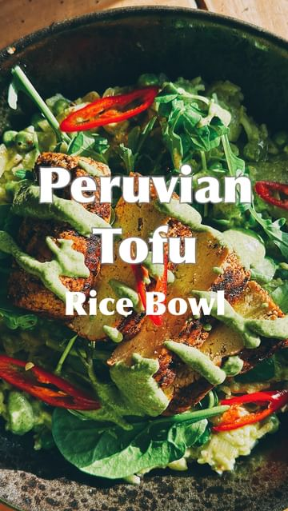{: style="width:100%;height:200px;object-fit: cover;object-position: center;" }](posts/nomeatdisco_15-01-2023_1401.md)  
        **@nomeatdisco** - PERUVIAN TOFU RICE BOWL 🍗  [Read More...](posts/nomeatdisco_15-01-2023_1401.md)
- [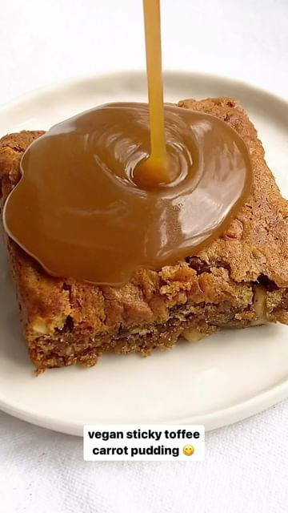{: style="width:100%;height:200px;object-fit: cover;object-position: center;" }](posts/allplants_23-01-2023_1401.md)  
        **@allplants** - There’s always room for dessert, especially on #St [Read More...](posts/allplants_23-01-2023_1401.md)
- [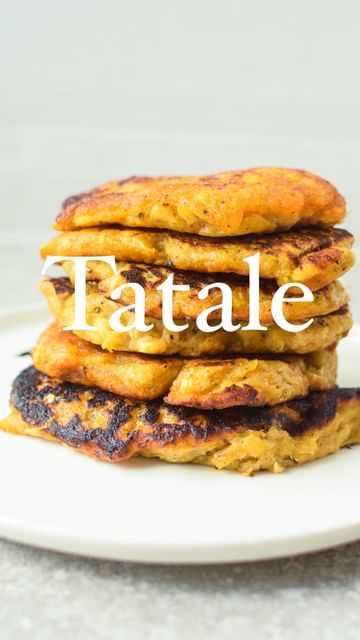{: style="width:100%;height:200px;object-fit: cover;object-position: center;" }](posts/eatwithafia_24-01-2023_1601.md)  
        **@eatwithafia** - ✨Tatale✨ is one of the best ways to use over ripe  [Read More...](posts/eatwithafia_24-01-2023_1601.md)
- [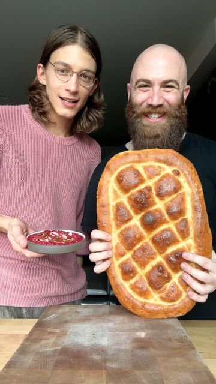{: style="width:100%;height:200px;object-fit: cover;object-position: center;" }](posts/bengingi_24-01-2023_1601.md)  
        **@bengingi** - Armenian Matnakash 🇦🇲 [Read More...](posts/bengingi_24-01-2023_1601.md)
- [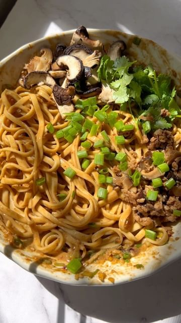{: style="width:100%;height:200px;object-fit: cover;object-position: center;" }](posts/thefoodietakesflight_25-01-2023_1401.md)  
        **@thefoodietakesflight** - Can’t go wrong with a bowl of 🍜 [Read More...](posts/thefoodietakesflight_25-01-2023_1401.md)
- [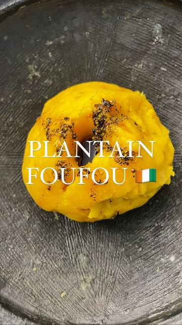{: style="width:100%;height:200px;object-fit: cover;object-position: center;" }](posts/eatwithafia_26-01-2023_1601.md)  
        **@eatwithafia** - Ivorian friends, please let me know how I did??  [Read More...](posts/eatwithafia_26-01-2023_1601.md)
- [{: style="width:100%;height:200px;object-fit: cover;object-position: center;" }](posts/itslizmiu_31-01-2023_0601.md)  
        **@itslizmiu** - PEACHY PANZANELLA SALAD 🍅🥖 COZ BREAD SALAD IS THE  [Read More...](posts/itslizmiu_31-01-2023_0601.md)
- [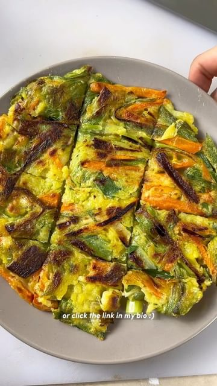{: style="width:100%;height:200px;object-fit: cover;object-position: center;" }](posts/thefoodietakesflight_01-02-2023_1402.md)  
        **@thefoodietakesflight** - Starting off February with my fav Korean vegetable [Read More...](posts/thefoodietakesflight_01-02-2023_1402.md)
- [{: style="width:100%;height:200px;object-fit: cover;object-position: center;" }](posts/itslizmiu_03-02-2023_0102.md)  
        **@itslizmiu** - KILLER SALT AND PEPPER TOFU! 🔪 CRISPY on the outsi [Read More...](posts/itslizmiu_03-02-2023_0102.md)
- [{: style="width:100%;height:200px;object-fit: cover;object-position: center;" }](posts/allplants_05-02-2023_2002.md)  
        **@allplants** - Have major FOMO on #WorldNutellaDay? Let’s make ✨v [Read More...](posts/allplants_05-02-2023_2002.md)
- [{: style="width:100%;height:200px;object-fit: cover;object-position: center;" }](posts/itslizmiu_08-02-2023_0002.md)  
        **@itslizmiu** - 20 MIN TERIYAKI TOFU 👩🏻‍🍳 Such an excellent one fo [Read More...](posts/itslizmiu_08-02-2023_0002.md)
- [{: style="width:100%;height:200px;object-fit: cover;object-position: center;" }](posts/thefoodietakesflight_08-02-2023_1402.md)  
        **@thefoodietakesflight** - Soy Sauce Udon - might just be the easiest bowl of [Read More...](posts/thefoodietakesflight_08-02-2023_1402.md)
- [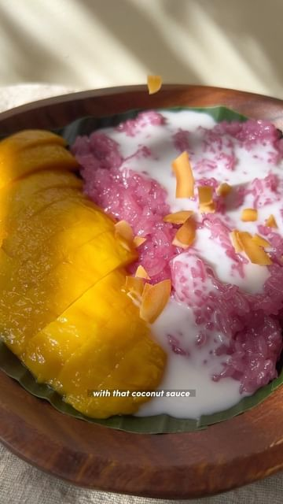{: style="width:100%;height:200px;object-fit: cover;object-position: center;" }](posts/thefoodietakesflight_11-02-2023_1502.md)  
        **@thefoodietakesflight** - Mango Sticky Rice, but make it pink 💗🥭  [Read More...](posts/thefoodietakesflight_11-02-2023_1502.md)
- [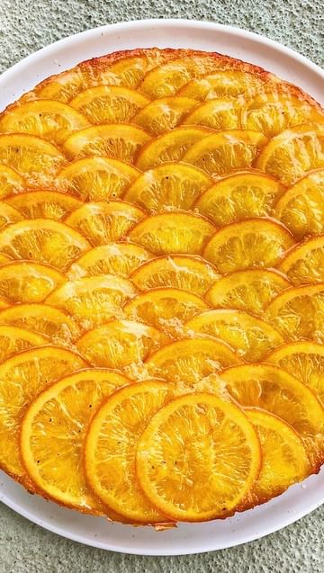{: style="width:100%;height:200px;object-fit: cover;object-position: center;" }](posts/carolinagelen_11-12-2022_2112.md)  
        **@carolinagelen** - ORANGE CARDAMOM OLIVE OIL CAKE - this upside down  [Read More...](posts/carolinagelen_11-12-2022_2112.md)
- [{: style="width:100%;height:200px;object-fit: cover;object-position: center;" }](posts/carolinagelen_06-01-2023_2101.md)  
        **@carolinagelen** - BEANS ALLA VODKA, just like penne alla vodka, but  [Read More...](posts/carolinagelen_06-01-2023_2101.md)
- [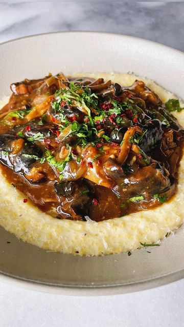{: style="width:100%;height:200px;object-fit: cover;object-position: center;" }](posts/carolinagelen_27-11-2022_2111.md)  
        **@carolinagelen** - THE ULTIMATE COMFORT FOOD : creamy polenta with a  [Read More...](posts/carolinagelen_27-11-2022_2111.md)
- [{: style="width:100%;height:200px;object-fit: cover;object-position: center;" }](posts/itslizmiu_13-02-2023_0102.md)  
        **@itslizmiu** - PEKING TOFFEE APPLES 🍎 These Chinese-style Toffee  [Read More...](posts/itslizmiu_13-02-2023_0102.md)
- [{: style="width:100%;height:200px;object-fit: cover;object-position: center;" }](posts/thefoodietakesflight_13-02-2023_1402.md)  
        **@thefoodietakesflight** - This is a light, refreshing, and crisp Chinese cuc [Read More...](posts/thefoodietakesflight_13-02-2023_1402.md)
- [{: style="width:100%;height:200px;object-fit: cover;object-position: center;" }](posts/itslizmiu_17-02-2023_0002.md)  
        **@itslizmiu** - MANGO SAGO 🥭 the perfect summer dessert! It’s refr [Read More...](posts/itslizmiu_17-02-2023_0002.md)
- [{: style="width:100%;height:200px;object-fit: cover;object-position: center;" }](posts/thefoodietakesflight_18-02-2023_1302.md)  
        **@thefoodietakesflight** - Filipino Style Tofu Curry 🍛 best enjoyed w heap lo [Read More...](posts/thefoodietakesflight_18-02-2023_1302.md)
- [{: style="width:100%;height:200px;object-fit: cover;object-position: center;" }](posts/nomeatdisco_25-02-2023_1202.md)  
        **@nomeatdisco** - TOFU RAGU 🍝  [Read More...](posts/nomeatdisco_25-02-2023_1202.md)
- [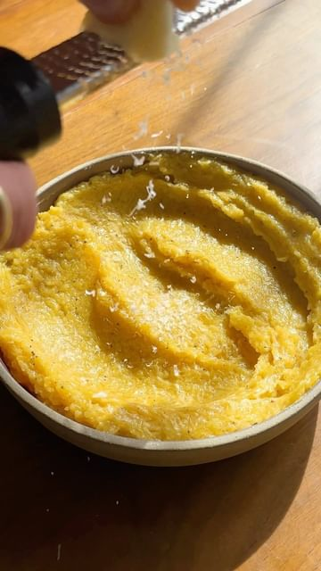{: style="width:100%;height:200px;object-fit: cover;object-position: center;" }](posts/pierceabernathy_03-03-2023_1703.md)  
        **@pierceabernathy** - Cacio e Pepe inspired spaghetti squash dip. In thi [Read More...](posts/pierceabernathy_03-03-2023_1703.md)
- [{: style="width:100%;height:200px;object-fit: cover;object-position: center;" }](posts/itslizmiu_10-03-2023_0603.md)  
        **@itslizmiu** - Korean Vegan Fried Shrimp Toast 멘보샤 by @itslizmiu  [Read More...](posts/itslizmiu_10-03-2023_0603.md)
- [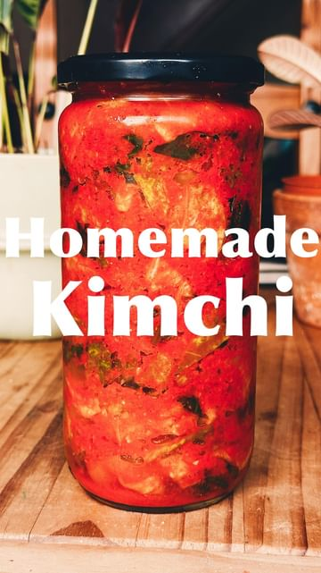{: style="width:100%;height:200px;object-fit: cover;object-position: center;" }](posts/nomeatdisco_21-03-2023_1703.md)  
        **@nomeatdisco** - HOMEMADE VEGAN KIMCHI 🥬  [Read More...](posts/nomeatdisco_21-03-2023_1703.md)
- [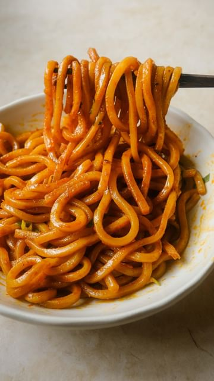{: style="width:100%;height:200px;object-fit: cover;object-position: center;" }](posts/thefoodietakesflight_18-03-2023_1503.md)  
        **@thefoodietakesflight** - This one’s for my fellow garlic and gochujang-love [Read More...](posts/thefoodietakesflight_18-03-2023_1503.md)
- [{: style="width:100%;height:200px;object-fit: cover;object-position: center;" }](posts/itslizmiu_21-03-2023_2303.md)  
        **@itslizmiu** - Charred broccolini, crispy beans on whipped tofu r [Read More...](posts/itslizmiu_21-03-2023_2303.md)
- [{: style="width:100%;height:200px;object-fit: cover;object-position: center;" }](posts/thefoodietakesflight_20-03-2023_1203.md)  
        **@thefoodietakesflight** - Tofu balls - reposting since IG removed my audio 😬 [Read More...](posts/thefoodietakesflight_20-03-2023_1203.md)
- [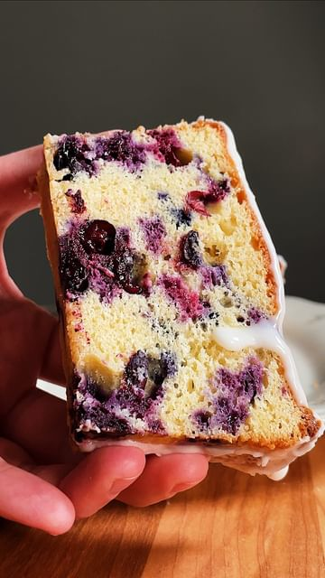{: style="width:100%;height:200px;object-fit: cover;object-position: center;" }](posts/carolinagelen_27-03-2023_2003.md)  
        **@carolinagelen** - follow @carolinagelen for more recipes  [Read More...](posts/carolinagelen_27-03-2023_2003.md)
- [{: style="width:100%;height:200px;object-fit: cover;object-position: center;" }](posts/thefoodietakesflight_01-04-2023_0004.md)  
        **@thefoodietakesflight** - Maple Hoisin Tempeh using @lightlifelifefoods orig [Read More...](posts/thefoodietakesflight_01-04-2023_0004.md)
- [{: style="width:100%;height:200px;object-fit: cover;object-position: center;" }](posts/thefoodietakesflight_12-04-2023_1404.md)  
        **@thefoodietakesflight** - Wood Ear Mushroom Salad 🍄🥗 [Read More...](posts/thefoodietakesflight_12-04-2023_1404.md)
- [{: style="width:100%;height:200px;object-fit: cover;object-position: center;" }](posts/carolinagelen_09-04-2023_2204.md)  
        **@carolinagelen** - follow @carolinagelen for more recipes  [Read More...](posts/carolinagelen_09-04-2023_2204.md)
- [{: style="width:100%;height:200px;object-fit: cover;object-position: center;" }](posts/thefrenchiegardener_08-02-2023_1602.md)  
        **@thefrenchiegardener** - How to grow your own Ginger at home 🌱💚 [Read More...](posts/thefrenchiegardener_08-02-2023_1602.md)
- [{: style="width:100%;height:200px;object-fit: cover;object-position: center;" }](posts/rachelama__29-03-2023_1703.md)  
        **@rachelama_** - JERK WRAPS WITH SWEET FRIED PLANTAIN🌱 [Read More...](posts/rachelama__29-03-2023_1703.md)
- [{: style="width:100%;height:200px;object-fit: cover;object-position: center;" }](posts/eatwithafia_06-04-2023_1504.md)  
        **@eatwithafia** - We are making Ugandan Rolex for breakfast today. A [Read More...](posts/eatwithafia_06-04-2023_1504.md)
- [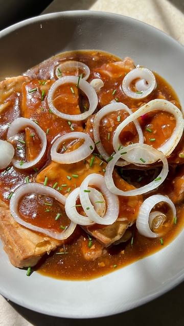{: style="width:100%;height:200px;object-fit: cover;object-position: center;" }](posts/thefoodietakesflight_03-04-2023_1704.md)  
        **@thefoodietakesflight** - Filipino Style Tofu Steak (with lotsa onions of co [Read More...](posts/thefoodietakesflight_03-04-2023_1704.md)
- [{: style="width:100%;height:200px;object-fit: cover;object-position: center;" }](posts/okonomikitchen_25-01-2023_1501.md)  
        **@okonomikitchen** - Miso Balls 味噌玉 (Miso-dama) ⁣ [Read More...](posts/okonomikitchen_25-01-2023_1501.md)
- [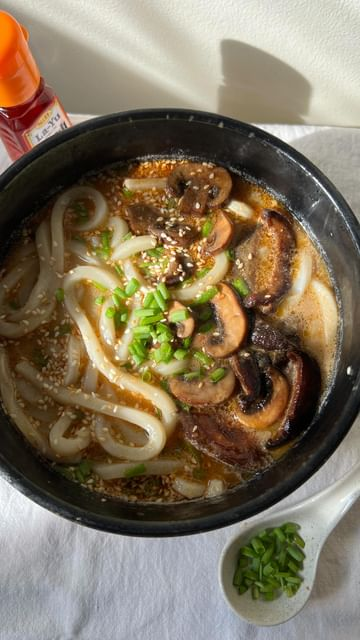{: style="width:100%;height:200px;object-fit: cover;object-position: center;" }](posts/thefoodietakesflight_07-01-2023_1401.md)  
        **@thefoodietakesflight** - Warm hugs for you all 🤗🍜 [Read More...](posts/thefoodietakesflight_07-01-2023_1401.md)
- [{: style="width:100%;height:200px;object-fit: cover;object-position: center;" }](posts/thefoodietakesflight_05-01-2023_1301.md)  
        **@thefoodietakesflight** - Taiwanese-Style Popcorn Mushrooms with fried basil [Read More...](posts/thefoodietakesflight_05-01-2023_1301.md)
- [{: style="width:100%;height:200px;object-fit: cover;object-position: center;" }](posts/eatwithafia_04-01-2023_1701.md)  
        **@eatwithafia** - How to make okra stew🇬🇭 everyone makes their versi [Read More...](posts/eatwithafia_04-01-2023_1701.md)
- [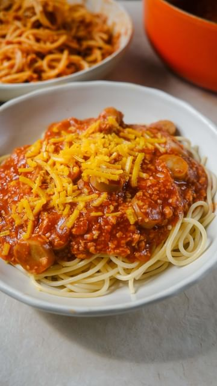{: style="width:100%;height:200px;object-fit: cover;object-position: center;" }](posts/thefoodietakesflight_23-12-2022_1512.md)  
        **@thefoodietakesflight** - Quarter of a century today ✌🏼🖐🏼 [Read More...](posts/thefoodietakesflight_23-12-2022_1512.md)
- [{: style="width:100%;height:200px;object-fit: cover;object-position: center;" }](posts/allplants_22-12-2022_1412.md)  
        **@allplants** - The star of the show 🌟  [Read More...](posts/allplants_22-12-2022_1412.md)
- [{: style="width:100%;height:200px;object-fit: cover;object-position: center;" }](posts/thefoodietakesflight_21-12-2022_1512.md)  
        **@thefoodietakesflight** - Scalloped Potatoes with a Creamy Lemon Dill Sauce  [Read More...](posts/thefoodietakesflight_21-12-2022_1512.md)
- [{: style="width:100%;height:200px;object-fit: cover;object-position: center;" }](posts/jacobking_16-12-2022_1712.md)  
        **@jacobking** - VEGAN PRAWN TOAST 🍤written recipe below 👇🏾  [Read More...](posts/jacobking_16-12-2022_1712.md)
- [{: style="width:100%;height:200px;object-fit: cover;object-position: center;" }](posts/nomeatdisco_15-12-2022_1712.md)  
        **@nomeatdisco** - SALTED CARAMEL APPLE TARTE TATIN 🥧  [Read More...](posts/nomeatdisco_15-12-2022_1712.md)
- [{: style="width:100%;height:200px;object-fit: cover;object-position: center;" }](posts/itslizmiu_15-12-2022_0112.md)  
        **@itslizmiu** - PANDAN COCONUT PANCAKES or KUIH DADAR GULUNG (KETA [Read More...](posts/itslizmiu_15-12-2022_0112.md)
- [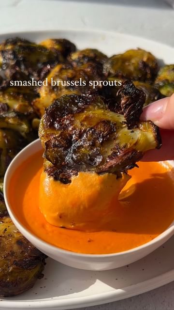{: style="width:100%;height:200px;object-fit: cover;object-position: center;" }](posts/plantyou_14-11-2022_2111.md)  
        **@plantyou** - 🤯💕🥬SMASHED BRUSSELS by @PLANTYOU. RECIPE for the s [Read More...](posts/plantyou_14-11-2022_2111.md)
- [{: style="width:100%;height:200px;object-fit: cover;object-position: center;" }](posts/jacobking_09-12-2022_1712.md)  
        **@jacobking** - CARROT + HARISSA DIP 🥕 full written recipe below 👇 [Read More...](posts/jacobking_09-12-2022_1712.md)
- [{: style="width:100%;height:200px;object-fit: cover;object-position: center;" }](posts/thefoodietakesflight_09-12-2022_1412.md)  
        **@thefoodietakesflight** - 🌽🥣, anyone? Get the recipe on my blog www.thefoodi [Read More...](posts/thefoodietakesflight_09-12-2022_1412.md)
- [{: style="width:100%;height:200px;object-fit: cover;object-position: center;" }](posts/jacobking_08-12-2022_1712.md)  
        **@jacobking** - VEGAN CALAMARI 🦑 written recipe below 👇🏾  [Read More...](posts/jacobking_08-12-2022_1712.md)
- [{: style="width:100%;height:200px;object-fit: cover;object-position: center;" }](posts/thefoodietakesflight_06-12-2022_1412.md)  
        **@thefoodietakesflight** - Tofu Giniling - Filipino Style Picadillo! [Read More...](posts/thefoodietakesflight_06-12-2022_1412.md)
- [{: style="width:100%;height:200px;object-fit: cover;object-position: center;" }](posts/jacobking_02-12-2022_1712.md)  
        **@jacobking** - (crispy + salty) ROAST POTATOES 🧂🥔 written recipe  [Read More...](posts/jacobking_02-12-2022_1712.md)
- [{: style="width:100%;height:200px;object-fit: cover;object-position: center;" }](posts/thefoodietakesflight_02-12-2022_1312.md)  
        **@thefoodietakesflight** - Pls share your go-to 🍆 recipes or ways to enjoy it [Read More...](posts/thefoodietakesflight_02-12-2022_1312.md)
- [{: style="width:100%;height:200px;object-fit: cover;object-position: center;" }](posts/nomeatdisco_01-12-2022_1712.md)  
        **@nomeatdisco** - MISO PARSNIPS WITH PEA & BUTTER BEAN PURÉE 🥕  [Read More...](posts/nomeatdisco_01-12-2022_1712.md)
- [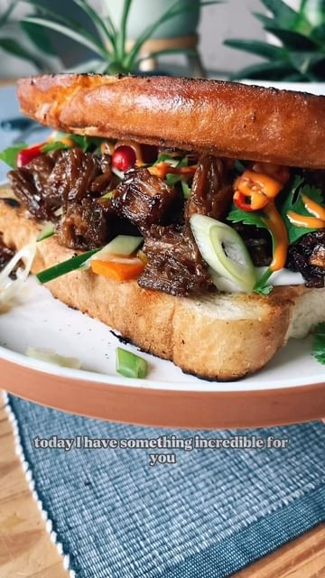{: style="width:100%;height:200px;object-fit: cover;object-position: center;" }](posts/nomeatdisco_29-11-2022_1811.md)  
        **@nomeatdisco** - DECONSTRUCTED BÀNH MI TOASTIE 🥪  [Read More...](posts/nomeatdisco_29-11-2022_1811.md)
- [{: style="width:100%;height:200px;object-fit: cover;object-position: center;" }](posts/thefoodietakesflight_26-11-2022_1511.md)  
        **@thefoodietakesflight** - A simple yet really tasty Green Bean and Mushroom  [Read More...](posts/thefoodietakesflight_26-11-2022_1511.md)
- [{: style="width:100%;height:200px;object-fit: cover;object-position: center;" }](posts/pierceabernathy_25-11-2022_1711.md)  
        **@pierceabernathy** - Super Fluffy Squash pancakes with ginger-date syru [Read More...](posts/pierceabernathy_25-11-2022_1711.md)
- [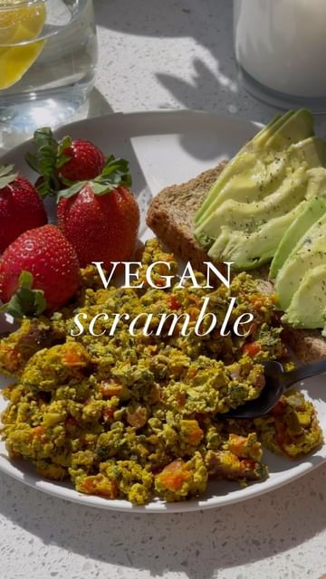{: style="width:100%;height:200px;object-fit: cover;object-position: center;" }](posts/healthygirlkitchen_19-11-2022_1511.md)  
        **@healthygirlkitchen** - bookmark how to make VEGAN SCRAMBLED EGGS using pu [Read More...](posts/healthygirlkitchen_19-11-2022_1511.md)
- [{: style="width:100%;height:200px;object-fit: cover;object-position: center;" }](posts/jacobking_20-11-2022_1111.md)  
        **@jacobking** - AUTUMN (🇬🇧) FALL (🇺🇸) SALAD 🥶🥗 a warming, filling  [Read More...](posts/jacobking_20-11-2022_1111.md)
- [{: style="width:100%;height:200px;object-fit: cover;object-position: center;" }](posts/thefoodietakesflight_20-11-2022_1411.md)  
        **@thefoodietakesflight** - This easy baked tofu is marinated overnight in a s [Read More...](posts/thefoodietakesflight_20-11-2022_1411.md)
- [{: style="width:100%;height:200px;object-fit: cover;object-position: center;" }](posts/plantboiis_19-11-2022_1411.md)  
        **@plantboiis** - ad | Amazon Fresh challenged 3 of the plantboiis t [Read More...](posts/plantboiis_19-11-2022_1411.md)
- [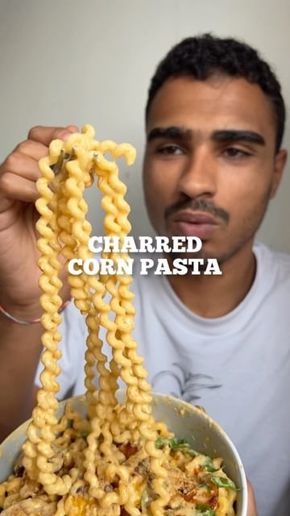{: style="width:100%;height:200px;object-fit: cover;object-position: center;" }](posts/jacobking_18-11-2022_1711.md)  
        **@jacobking** - CHARRED CORN PASTA 🌽 the combination you never kne [Read More...](posts/jacobking_18-11-2022_1711.md)
- [{: style="width:100%;height:200px;object-fit: cover;object-position: center;" }](posts/jacobking_16-11-2022_1711.md)  
        **@jacobking** - KOREAN FRIED CHICK’N 🇰🇷 my take on a Korean classi [Read More...](posts/jacobking_16-11-2022_1711.md)
- [{: style="width:100%;height:200px;object-fit: cover;object-position: center;" }](posts/thefoodietakesflight_16-11-2022_1411.md)  
        **@thefoodietakesflight** - Vegan Tom Yum Soup 🥣  [Read More...](posts/thefoodietakesflight_16-11-2022_1411.md)
- [{: style="width:100%;height:200px;object-fit: cover;object-position: center;" }](posts/eatwithafia_07-11-2022_1611.md)  
        **@eatwithafia** - I partnered with @MetroOntario to share a simple l [Read More...](posts/eatwithafia_07-11-2022_1611.md)
- [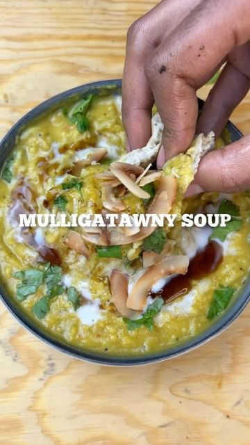{: style="width:100%;height:200px;object-fit: cover;object-position: center;" }](posts/jacobking_15-11-2022_1711.md)  
        **@jacobking** - MULLIGATAWNY SOUP 🇮🇳 a delicious South Indian soup [Read More...](posts/jacobking_15-11-2022_1711.md)
- [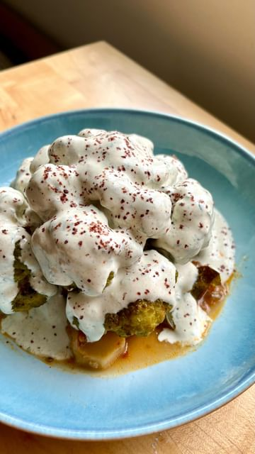{: style="width:100%;height:200px;object-fit: cover;object-position: center;" }](posts/pierceabernathy_15-11-2022_1611.md)  
        **@pierceabernathy** - I got lost in the sauce with this whole braised ca [Read More...](posts/pierceabernathy_15-11-2022_1611.md)
- [{: style="width:100%;height:200px;object-fit: cover;object-position: center;" }](posts/thefoodietakesflight_15-11-2022_1411.md)  
        **@thefoodietakesflight** - This harvest was a year and a half in the making.  [Read More...](posts/thefoodietakesflight_15-11-2022_1411.md)
- [{: style="width:100%;height:200px;object-fit: cover;object-position: center;" }](posts/eatwithafia_13-11-2022_1711.md)  
        **@eatwithafia** - Make your chocolate dessert taste more chocolatey  [Read More...](posts/eatwithafia_13-11-2022_1711.md)
- [{: style="width:100%;height:200px;object-fit: cover;object-position: center;" }](posts/thefoodietakesflight_12-11-2022_1311.md)  
        **@thefoodietakesflight** - Vegan Butter Chickpeas 🫶🏼 [Read More...](posts/thefoodietakesflight_12-11-2022_1311.md)
- [{: style="width:100%;height:200px;object-fit: cover;object-position: center;" }](posts/eatwithafia_11-11-2022_1611.md)  
        **@eatwithafia** - Recipe below! [Read More...](posts/eatwithafia_11-11-2022_1611.md)
- [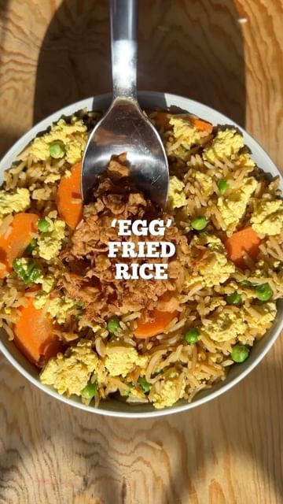{: style="width:100%;height:200px;object-fit: cover;object-position: center;" }](posts/jacobking_09-11-2022_1711.md)  
        **@jacobking** - VEGAN EGG FRIED RICE 🥚 make it with your next Chin [Read More...](posts/jacobking_09-11-2022_1711.md)
- [{: style="width:100%;height:200px;object-fit: cover;object-position: center;" }](posts/eatwithafia_05-11-2022_1511.md)  
        **@eatwithafia** - The easiest gingerbread cookies you will ever make [Read More...](posts/eatwithafia_05-11-2022_1511.md)
- [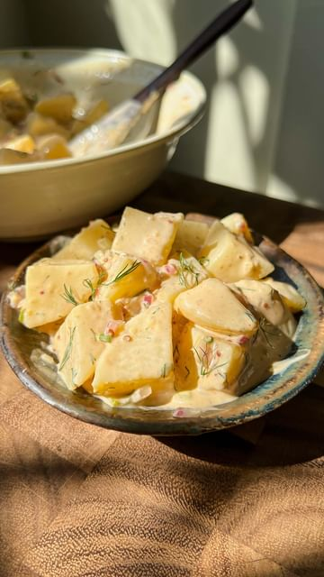{: style="width:100%;height:200px;object-fit: cover;object-position: center;" }](posts/thefoodietakesflight_03-11-2022_2311.md)  
        **@thefoodietakesflight** - 🥔 salad, my way! The full detailed recipe is up on [Read More...](posts/thefoodietakesflight_03-11-2022_2311.md)
- [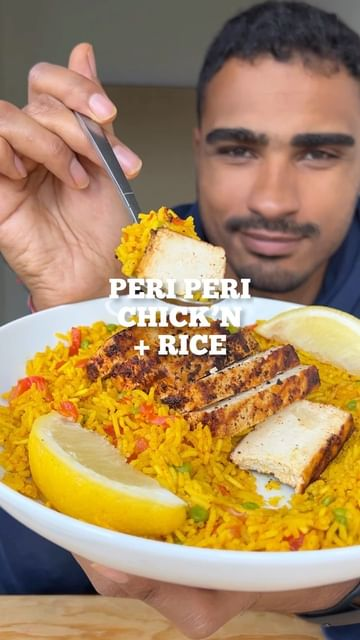{: style="width:100%;height:200px;object-fit: cover;object-position: center;" }](posts/jacobking_02-11-2022_1711.md)  
        **@jacobking** - PERI PERI CHICK’N + RICE🐓 doing up Nandos at home  [Read More...](posts/jacobking_02-11-2022_1711.md)
- [{: style="width:100%;height:200px;object-fit: cover;object-position: center;" }](posts/eatwithafia_31-10-2022_1510.md)  
        **@eatwithafia** - ‼️The most important recipe to master for Ghanaian [Read More...](posts/eatwithafia_31-10-2022_1510.md)
- [{: style="width:100%;height:200px;object-fit: cover;object-position: center;" }](posts/pierceabernathy_31-10-2022_1410.md)  
        **@pierceabernathy** - Tahina rolls! Many variations of these rolls are p [Read More...](posts/pierceabernathy_31-10-2022_1410.md)
- [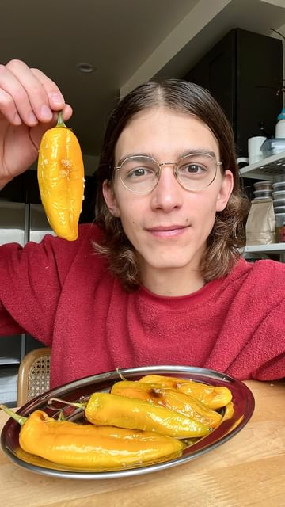{: style="width:100%;height:200px;object-fit: cover;object-position: center;" }](posts/pierceabernathy_25-10-2022_1610.md)  
        **@pierceabernathy** - It’s almost November and there’s somehow still pep [Read More...](posts/pierceabernathy_25-10-2022_1610.md)
- [{: style="width:100%;height:200px;object-fit: cover;object-position: center;" }](posts/vegan_govegan_22-10-2022_2010.md)  
        **@vegan_govegan** - 🥶Why you should be freezing your tofu…and how to m [Read More...](posts/vegan_govegan_22-10-2022_2010.md)
- [{: style="width:100%;height:200px;object-fit: cover;object-position: center;" }](posts/itslizmiu_24-10-2022_0210.md)  
        **@itslizmiu** - Pumpkin porridge 🎃 this was brekky with whatever w [Read More...](posts/itslizmiu_24-10-2022_0210.md)
- [{: style="width:100%;height:200px;object-fit: cover;object-position: center;" }](posts/maxlamanna_19-10-2022_1510.md)  
        **@maxlamanna** - 🍌👵🏼Chocolate Banana Bread [Read More...](posts/maxlamanna_19-10-2022_1510.md)
- [{: style="width:100%;height:200px;object-fit: cover;object-position: center;" }](posts/vivolife_19-10-2022_1310.md)  
        **@vivolife** - Protein packed pancakes in 10 minutes flat! 🥞 [Read More...](posts/vivolife_19-10-2022_1310.md)
- [{: style="width:100%;height:200px;object-fit: cover;object-position: center;" }](posts/pierceabernathy_14-10-2022_1710.md)  
        **@pierceabernathy** - Celeriac steaks with celery leaf salad. I find the [Read More...](posts/pierceabernathy_14-10-2022_1710.md)
- [{: style="width:100%;height:200px;object-fit: cover;object-position: center;" }](posts/itslizmiu_14-10-2022_0210.md)  
        **@itslizmiu** - 2 INGREDIENT KIMCHI PANCAKES 🔥 Crispy, moreish, sa [Read More...](posts/itslizmiu_14-10-2022_0210.md)
- [{: style="width:100%;height:200px;object-fit: cover;object-position: center;" }](posts/thefoodietakesflight_25-08-2022_1308.md)  
        **@thefoodietakesflight** - Silken Tofu with Black Bean Mushroom Sauce - full  [Read More...](posts/thefoodietakesflight_25-08-2022_1308.md)
- [{: style="width:100%;height:200px;object-fit: cover;object-position: center;" }](posts/nomeatdisco_24-08-2022_1608.md)  
        **@nomeatdisco** - CRISPY ZINGY VEGAN HONEY GINGER TOFU CUPS 🥬  [Read More...](posts/nomeatdisco_24-08-2022_1608.md)
- [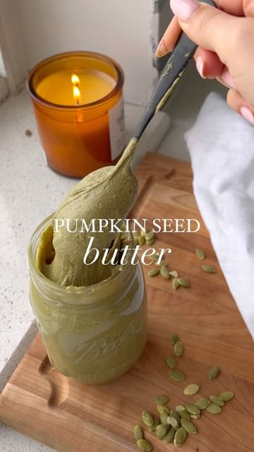{: style="width:100%;height:200px;object-fit: cover;object-position: center;" }](posts/healthygirlkitchen_23-08-2022_2208.md)  
        **@healthygirlkitchen** - Did you know you can turn pumpkin seeds into PUMPK [Read More...](posts/healthygirlkitchen_23-08-2022_2208.md)
- [{: style="width:100%;height:200px;object-fit: cover;object-position: center;" }](posts/pierceabernathy_22-08-2022_1608.md)  
        **@pierceabernathy** - Sweet Potato, peppers and cucumber with corn-infus [Read More...](posts/pierceabernathy_22-08-2022_1608.md)
- [{: style="width:100%;height:200px;object-fit: cover;object-position: center;" }](posts/nomeatdisco_21-08-2022_1608.md)  
        **@nomeatdisco** - 5 MINUTE GOCHUJANG NOODLES 🍜  [Read More...](posts/nomeatdisco_21-08-2022_1608.md)
- [{: style="width:100%;height:200px;object-fit: cover;object-position: center;" }](posts/eatchofood_20-07-2022_1807.md)  
        **@eatchofood** - Spicy Salmon Onigiri 🍙 my favorite thing to make w [Read More...](posts/eatchofood_20-07-2022_1807.md)
- [{: style="width:100%;height:200px;object-fit: cover;object-position: center;" }](posts/pierceabernathy_16-08-2022_1608.md)  
        **@pierceabernathy** - While traveling in Italy recently I ate Pappa al P [Read More...](posts/pierceabernathy_16-08-2022_1608.md)
- [{: style="width:100%;height:200px;object-fit: cover;object-position: center;" }](posts/thefoodietakesflight_16-08-2022_1408.md)  
        **@thefoodietakesflight** - Pan-Fried Tofu with Chili Miso Sauce [Read More...](posts/thefoodietakesflight_16-08-2022_1408.md)
- [{: style="width:100%;height:200px;object-fit: cover;object-position: center;" }](posts/plasticfreeherbivore_02-08-2022_0608.md)  
        **@plasticfreeherbivore** - SATAY BAKED TOFU 🌱  [Read More...](posts/plasticfreeherbivore_02-08-2022_0608.md)
- [{: style="width:100%;height:200px;object-fit: cover;object-position: center;" }](posts/ryannordheimer_12-07-2022_2007.md)  
        **@ryannordheimer** - PEACH PIE 🍑🥧🌞 [Read More...](posts/ryannordheimer_12-07-2022_2007.md)
- [{: style="width:100%;height:200px;object-fit: cover;object-position: center;" }](posts/architlost_02-08-2022_1408.md)  
        **@architlost** - Not a recipe but a magic trick! This 2 ingredient  [Read More...](posts/architlost_02-08-2022_1408.md)
- [{: style="width:100%;height:200px;object-fit: cover;object-position: center;" }](posts/veganezer_11-08-2022_1608.md)  
        **@veganezer** - Bang 2 da bang crispy fried “chick’n” mushrooms  [Read More...](posts/veganezer_11-08-2022_1608.md)
- [{: style="width:100%;height:200px;object-fit: cover;object-position: center;" }](posts/saltnpepperhere_02-08-2022_1208.md)  
        **@saltnpepperhere** - trust me, this sweet corn mochi cake is a must-mak [Read More...](posts/saltnpepperhere_02-08-2022_1208.md)
- [{: style="width:100%;height:200px;object-fit: cover;object-position: center;" }](posts/thefoodietakesflight_12-08-2022_1408.md)  
        **@thefoodietakesflight** - Pan-Fried Scallion & Sesame Buns -  light and fluf [Read More...](posts/thefoodietakesflight_12-08-2022_1408.md)
- [{: style="width:100%;height:200px;object-fit: cover;object-position: center;" }](posts/dadaeats_02-08-2022_1808.md)  
        **@dadaeats** - THE BEST NO-BAKE DESSERT… [Read More...](posts/dadaeats_02-08-2022_1808.md)
- [{: style="width:100%;height:200px;object-fit: cover;object-position: center;" }](posts/jacobking_10-08-2022_1508.md)  
        **@jacobking** - VEGAN TANTANMEN 🍜 a Japanese inspired creamy ramen [Read More...](posts/jacobking_10-08-2022_1508.md)
- [{: style="width:100%;height:200px;object-fit: cover;object-position: center;" }](posts/thefoodietakesflight_10-08-2022_1308.md)  
        **@thefoodietakesflight** - One-Pot Rice Cooker Meal 🍚 - perfect for those bus [Read More...](posts/thefoodietakesflight_10-08-2022_1308.md)
- [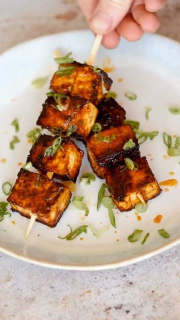{: style="width:100%;height:200px;object-fit: cover;object-position: center;" }](posts/nomeatdisco_09-08-2022_1608.md)  
        **@nomeatdisco** - CAJUN ORANGE TOFU LOLLIPOPS 🍊 🍭 [Read More...](posts/nomeatdisco_09-08-2022_1608.md)
- [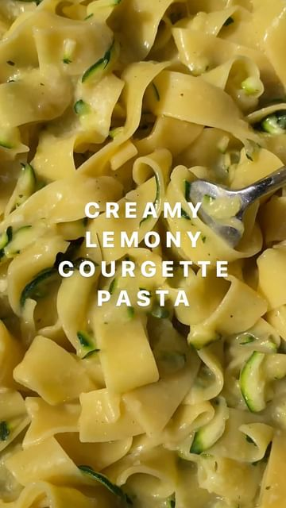{: style="width:100%;height:200px;object-fit: cover;object-position: center;" }](posts/allplants_09-08-2022_1108.md)  
        **@allplants** - With another hot week on the horizon, it's time fo [Read More...](posts/allplants_09-08-2022_1108.md)
- [{: style="width:100%;height:200px;object-fit: cover;object-position: center;" }](posts/glowdiaries____07-06-2022_1006.md)  
        **@glowdiaries___** - Would you try bang bang cauliflower?! Recipe below [Read More...](posts/glowdiaries____07-06-2022_1006.md)
- [{: style="width:100%;height:200px;object-fit: cover;object-position: center;" }](posts/allplants_07-08-2022_1808.md)  
        **@allplants** - You’ll be heatwave ready with this no churn pistac [Read More...](posts/allplants_07-08-2022_1808.md)
- [{: style="width:100%;height:200px;object-fit: cover;object-position: center;" }](posts/nomeatdisco_07-08-2022_1508.md)  
        **@nomeatdisco** - THE CREAMIEST HUMMUS EVER WITH HARISSA JACKFRUIT 🫘 [Read More...](posts/nomeatdisco_07-08-2022_1508.md)
- [{: style="width:100%;height:200px;object-fit: cover;object-position: center;" }](posts/kwokspots_14-07-2022_1607.md)  
        **@kwokspots** - Who doesn’t like some good buns 🥵  [Read More...](posts/kwokspots_14-07-2022_1607.md)
- [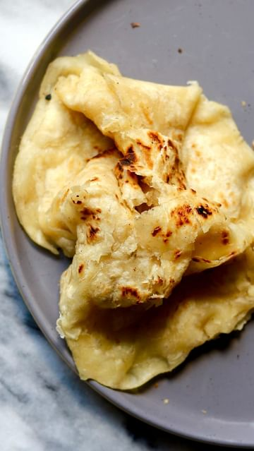{: style="width:100%;height:200px;object-fit: cover;object-position: center;" }](posts/travelandmunchies_27-07-2022_1707.md)  
        **@travelandmunchies** - Buss Up Shut! I have shared this before but here i [Read More...](posts/travelandmunchies_27-07-2022_1707.md)
- [{: style="width:100%;height:200px;object-fit: cover;object-position: center;" }](posts/iankewks_22-07-2022_1307.md)  
        **@iankewks** - Mango sticky rice is a delicious tropical dessert  [Read More...](posts/iankewks_22-07-2022_1307.md)
- [{: style="width:100%;height:200px;object-fit: cover;object-position: center;" }](posts/itslizmiu_21-07-2022_1307.md)  
        **@itslizmiu** - GRAB YOUR BESTIE! WE’RE EXPLORING VEGAN FOOD IN BA [Read More...](posts/itslizmiu_21-07-2022_1307.md)
- [{: style="width:100%;height:200px;object-fit: cover;object-position: center;" }](posts/allplants_02-07-2022_1507.md)  
        **@allplants** - ⁠Val's no-churn cookies and cream ice cream is as  [Read More...](posts/allplants_02-07-2022_1507.md)
- [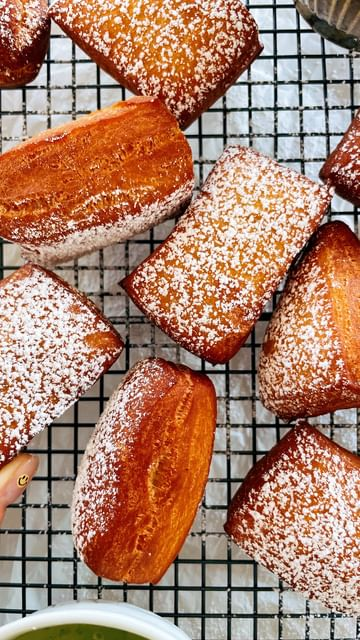{: style="width:100%;height:200px;object-fit: cover;object-position: center;" }](posts/itslizmiu_18-05-2022_2105.md)  
        **@itslizmiu** - BEIGNET BEBOP 🤠 VEGAN BEIGNETS WITH SALTED PANDAN  [Read More...](posts/itslizmiu_18-05-2022_2105.md)
- [{: style="width:100%;height:200px;object-fit: cover;object-position: center;" }](posts/itslizmiu_17-05-2022_2005.md)  
        **@itslizmiu** - One of my most popular recipes! CREAMY MUSHROOM ST [Read More...](posts/itslizmiu_17-05-2022_2005.md)
- [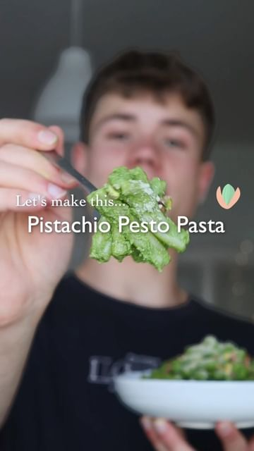{: style="width:100%;height:200px;object-fit: cover;object-position: center;" }](posts/herbifoods_05-05-2022_1405.md)  
        **@herbifoods** - PISTACHIO PESTO PASTA 🌱✨ a super healthy & delicio [Read More...](posts/herbifoods_05-05-2022_1405.md)
- [{: style="width:100%;height:200px;object-fit: cover;object-position: center;" }](posts/carolinagelen_27-04-2022_1804.md)  
        **@carolinagelen** - SALT BAKED POTATOES - the butteriest, creamiest po [Read More...](posts/carolinagelen_27-04-2022_1804.md)
- [{: style="width:100%;height:200px;object-fit: cover;object-position: center;" }](posts/thefoodietakesflight_15-05-2022_1305.md)  
        **@thefoodietakesflight** - Filipino Mushroom Tocino with tofu scramble and si [Read More...](posts/thefoodietakesflight_15-05-2022_1305.md)
- [{: style="width:100%;height:200px;object-fit: cover;object-position: center;" }](posts/veganfeedgram_08-05-2022_1705.md)  
        **@veganfeedgram** - Do you like eggplants? If you do, then take a look [Read More...](posts/veganfeedgram_08-05-2022_1705.md)
- [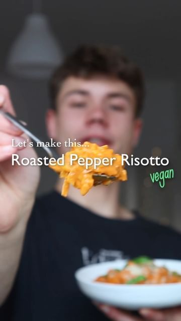{: style="width:100%;height:200px;object-fit: cover;object-position: center;" }](posts/herbifoods_10-05-2022_1505.md)  
        **@herbifoods** - ROASTED PEPPER RISOTTO 🌶👨🏼‍🍳 possibly the best ris [Read More...](posts/herbifoods_10-05-2022_1505.md)
- [{: style="width:100%;height:200px;object-fit: cover;object-position: center;" }](posts/plantbasedly_09-05-2022_1705.md)  
        **@plantbasedly** - YES or NO??? How to start growing cucumbers! 🥒🤩 Tr [Read More...](posts/plantbasedly_09-05-2022_1705.md)
- [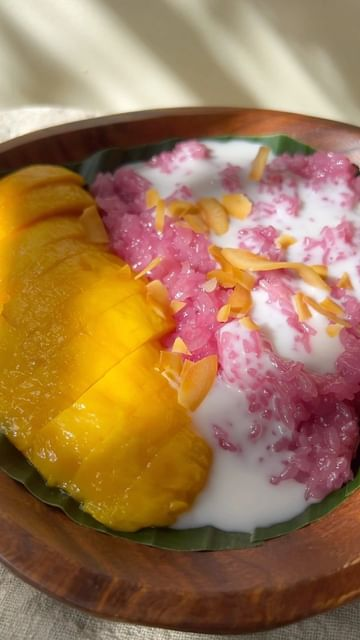{: style="width:100%;height:200px;object-fit: cover;object-position: center;" }](posts/thefoodietakesflight_07-05-2022_1305.md)  
        **@thefoodietakesflight** - My fave Mango Sticky Rice is pink 🎀💗🌸🌺🌷💚#ipanalona [Read More...](posts/thefoodietakesflight_07-05-2022_1305.md)
- [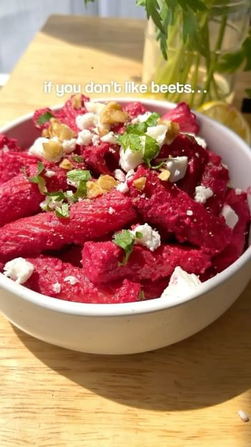{: style="width:100%;height:200px;object-fit: cover;object-position: center;" }](posts/plantyou_11-05-2022_2005.md)  
        **@plantyou** - 🌸 💕✨WOULD YOU TRY THIS PINK PASTA?! BY @plantyou.  [Read More...](posts/plantyou_11-05-2022_2005.md)
- [{: style="width:100%;height:200px;object-fit: cover;object-position: center;" }](posts/veganmeal_recipe_09-05-2022_1205.md)  
        **@veganmeal_recipe** - A classic but a good one! [Read More...](posts/veganmeal_recipe_09-05-2022_1205.md)
- [{: style="width:100%;height:200px;object-fit: cover;object-position: center;" }](posts/brotundsauerteig_14-04-2022_1004.md)  
        **@brotundsauerteig** - Flowers power.  [Read More...](posts/brotundsauerteig_14-04-2022_1004.md)
- [{: style="width:100%;height:200px;object-fit: cover;object-position: center;" }](posts/itslizmiu_10-05-2022_0905.md)  
        **@itslizmiu** - The Nasi Lemak from last week! 🇲🇾 🍚 Fragrant, flav [Read More...](posts/itslizmiu_10-05-2022_0905.md)
- [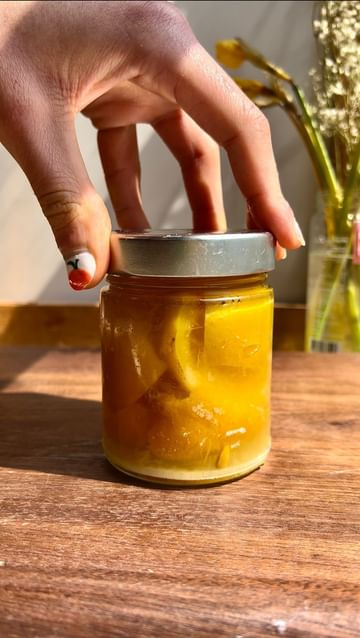{: style="width:100%;height:200px;object-fit: cover;object-position: center;" }](posts/lahbco_06-05-2022_1405.md)  
        **@lahbco** - PRESERVED LEMONS 🍋 are in 🫦 (recipe below) [Read More...](posts/lahbco_06-05-2022_1405.md)
- [{: style="width:100%;height:200px;object-fit: cover;object-position: center;" }](posts/theartyvegan_08-05-2022_1105.md)  
        **@theartyvegan** - ⏰RECIPE:VEGAN FLUFFY CINABONS perfect for a Sunday [Read More...](posts/theartyvegan_08-05-2022_1105.md)
- [{: style="width:100%;height:200px;object-fit: cover;object-position: center;" }](posts/myriadrecipes_02-05-2022_1505.md)  
        **@myriadrecipes** - ONIGIRAZU aka sushi sandwich 😮‍💨  [Read More...](posts/myriadrecipes_02-05-2022_1505.md)
- [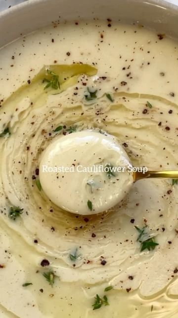{: style="width:100%;height:200px;object-fit: cover;object-position: center;" }](posts/eatinghealthymag_02-05-2022_0405.md)  
        **@eatinghealthymag** - Roasted Cauliflower Soup by @healthyfitbella_ [Read More...](posts/eatinghealthymag_02-05-2022_0405.md)
- [{: style="width:100%;height:200px;object-fit: cover;object-position: center;" }](posts/vegan.tipsvn_08-05-2022_2305.md)  
        **@vegan.tipsvn** - "GET The Complete Plant Based Cookbook - Over 100+ [Read More...](posts/vegan.tipsvn_08-05-2022_2305.md)
- [{: style="width:100%;height:200px;object-fit: cover;object-position: center;" }](posts/lahbco_03-05-2022_1405.md)  
        **@lahbco** - PUT THIS ON EVERYTHING 🫦 (recipe below) [Read More...](posts/lahbco_03-05-2022_1405.md)
- [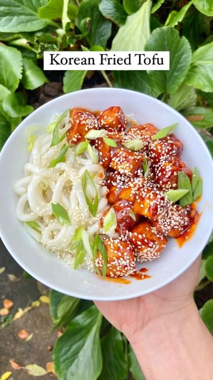{: style="width:100%;height:200px;object-fit: cover;object-position: center;" }](posts/sepps_07-05-2022_1305.md)  
        **@sepps** - Korean Fried Tofu 🥡🥢🔥 STICKY + CRISPY [Read More...](posts/sepps_07-05-2022_1305.md)
- [{: style="width:100%;height:200px;object-fit: cover;object-position: center;" }](posts/foodypopz_03-05-2022_1405.md)  
        **@foodypopz** - Make @rainbowplantlife’s Almond Butter Date Latte  [Read More...](posts/foodypopz_03-05-2022_1405.md)
- [{: style="width:100%;height:200px;object-fit: cover;object-position: center;" }](posts/veganrecipesideas_05-05-2022_0105.md)  
        **@veganrecipesideas** - No-Bake Choc Raspberry Tarts 🍫 by @chloeevegan [Read More...](posts/veganrecipesideas_05-05-2022_0105.md)
- [{: style="width:100%;height:200px;object-fit: cover;object-position: center;" }](posts/eatinghealthyfeed_03-05-2022_1205.md)  
        **@eatinghealthyfeed** - Oatmeal Banana Smoothie🤤 by @bevsbybeverly [Read More...](posts/eatinghealthyfeed_03-05-2022_1205.md)
- [{: style="width:100%;height:200px;object-fit: cover;object-position: center;" }](posts/vegancarnival_06-05-2022_1105.md)  
        **@vegancarnival** - These Garlic noodles turned out soo good!! Been tr [Read More...](posts/vegancarnival_06-05-2022_1105.md)
- [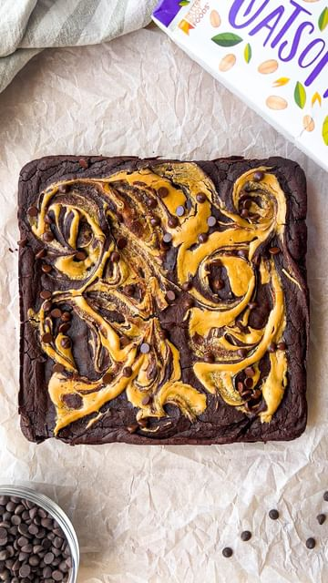{: style="width:100%;height:200px;object-fit: cover;object-position: center;" }](posts/that.veganbabe_22-04-2022_1604.md)  
        **@that.veganbabe** - 🎉😍 Fudgy Protein Borwnies with @oatsomeoatmilk 🙌 # [Read More...](posts/that.veganbabe_22-04-2022_1604.md)
- [{: style="width:100%;height:200px;object-fit: cover;object-position: center;" }](posts/healthygirlkitchen_06-05-2022_1705.md)  
        **@healthygirlkitchen** - bookmark this VEGAN ONE-POT PASTA 🍝 (15-minute din [Read More...](posts/healthygirlkitchen_06-05-2022_1705.md)
- [{: style="width:100%;height:200px;object-fit: cover;object-position: center;" }](posts/pierceabernathy_05-05-2022_1405.md)  
        **@pierceabernathy** - Sunchoke and Porcini pasta. This one is special; a [Read More...](posts/pierceabernathy_05-05-2022_1405.md)
- [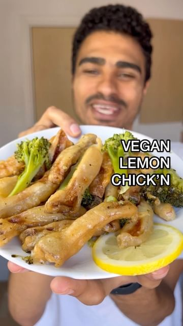{: style="width:100%;height:200px;object-fit: cover;object-position: center;" }](posts/jacobking_05-05-2022_1605.md)  
        **@jacobking** - VEGAN LEMON CHICK’N 🍋🐓 a tangy Chinese takeaway cl [Read More...](posts/jacobking_05-05-2022_1605.md)
- [{: style="width:100%;height:200px;object-fit: cover;object-position: center;" }](posts/vegan.planvn_03-05-2022_0305.md)  
        **@vegan.planvn** - ➡️ If you want to go vegan but have no idea where  [Read More...](posts/vegan.planvn_03-05-2022_0305.md)
- [{: style="width:100%;height:200px;object-fit: cover;object-position: center;" }](posts/healthygirlkitchen_04-05-2022_2305.md)  
        **@healthygirlkitchen** - bookmark this GOLDEN GODDESS SALAD🌞🧡✨episode 11 of [Read More...](posts/healthygirlkitchen_04-05-2022_2305.md)
- [{: style="width:100%;height:200px;object-fit: cover;object-position: center;" }](posts/herbifoods_25-04-2022_1604.md)  
        **@herbifoods** - VEGAN MAC & CHEESE 🧀🌱 you won’t believe it’s vegan [Read More...](posts/herbifoods_25-04-2022_1604.md)
- [{: style="width:100%;height:200px;object-fit: cover;object-position: center;" }](posts/vegan.challenge.club_30-04-2022_1404.md)  
        **@vegan.challenge.club** - "GET The Complete Plant Based Cookbook - Over 100+ [Read More...](posts/vegan.challenge.club_30-04-2022_1404.md)
- [{: style="width:100%;height:200px;object-fit: cover;object-position: center;" }](posts/hermann_15-04-2022_1004.md)  
        **@hermann** - A vegan Saag Paneer, with a handful of wild garlic [Read More...](posts/hermann_15-04-2022_1004.md)
- [{: style="width:100%;height:200px;object-fit: cover;object-position: center;" }](posts/pierceabernathy_03-05-2022_1605.md)  
        **@pierceabernathy** - Asparagus with butter beans, Meyer lemon, and gree [Read More...](posts/pierceabernathy_03-05-2022_1605.md)
- [{: style="width:100%;height:200px;object-fit: cover;object-position: center;" }](posts/tracesoats_11-04-2022_0204.md)  
        **@tracesoats** - These cookies are a game charger for quick morning [Read More...](posts/tracesoats_11-04-2022_0204.md)
- [{: style="width:100%;height:200px;object-fit: cover;object-position: center;" }](posts/avocado_skillet_14-04-2022_1504.md)  
        **@avocado_skillet** - Buffalo Chickpea Stuffed Sweet Potato 🍠  [Read More...](posts/avocado_skillet_14-04-2022_1504.md)
- [{: style="width:100%;height:200px;object-fit: cover;object-position: center;" }](posts/shelbizleee_05-04-2022_1504.md)  
        **@shelbizleee** - Compost = ❤️ Preventing Food Waste = 🥰 [Read More...](posts/shelbizleee_05-04-2022_1504.md)
- [{: style="width:100%;height:200px;object-fit: cover;object-position: center;" }](posts/herbifoods_11-04-2022_1504.md)  
        **@herbifoods** - CRISPY TOFU NUGGETS 🔥 if you think tofu is boring  [Read More...](posts/herbifoods_11-04-2022_1504.md)
- [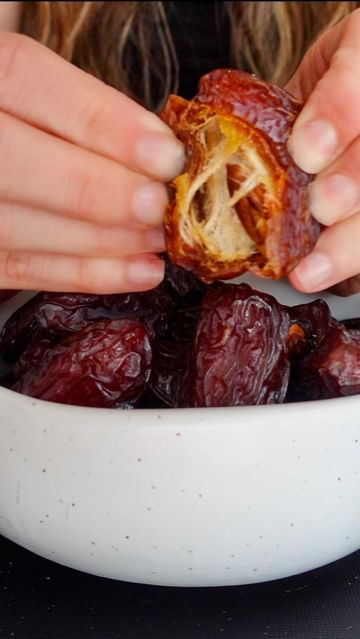{: style="width:100%;height:200px;object-fit: cover;object-position: center;" }](posts/plantyou_06-04-2022_1804.md)  
        **@plantyou** - ☕️💕🌱SCRAPPY COOKING: DATE SEED COFFEE. FOLLOW @pla [Read More...](posts/plantyou_06-04-2022_1804.md)
- [{: style="width:100%;height:200px;object-fit: cover;object-position: center;" }](posts/hermann_08-04-2022_0704.md)  
        **@hermann** - Ep. 01 Local Kitchen - Chickpea Tofu [Read More...](posts/hermann_08-04-2022_0704.md)
- [{: style="width:100%;height:200px;object-fit: cover;object-position: center;" }](posts/healthygirlkitchen_25-04-2022_2204.md)  
        **@healthygirlkitchen** - bookmark this vegan BROWNIE BAKED OATMEAL 🤎✨follow [Read More...](posts/healthygirlkitchen_25-04-2022_2204.md)
- [{: style="width:100%;height:200px;object-fit: cover;object-position: center;" }](posts/jacobking_22-04-2022_1604.md)  
        **@jacobking** - RICE + PEAS 🇯🇲 a Jamaican classic with plenty of f [Read More...](posts/jacobking_22-04-2022_1604.md)
- [{: style="width:100%;height:200px;object-fit: cover;object-position: center;" }](posts/eatinghealthyfeed_19-04-2022_0504.md)  
        **@eatinghealthyfeed** - 🍠🍟 CRISPY Sweet Potato Fries! by @theflexibledieti [Read More...](posts/eatinghealthyfeed_19-04-2022_0504.md)
- [{: style="width:100%;height:200px;object-fit: cover;object-position: center;" }](posts/jacobking_21-04-2022_1604.md)  
        **@jacobking** - KUNG PAO TOFU 🥡 sweet, tangy + will leave your ton [Read More...](posts/jacobking_21-04-2022_1604.md)
- [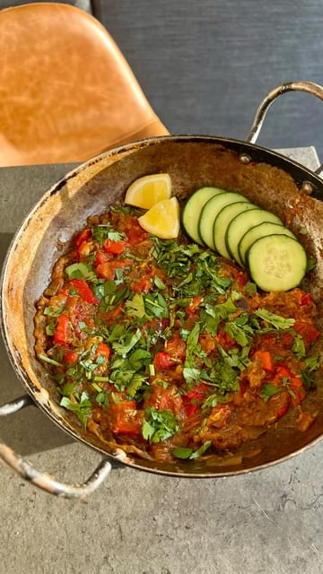{: style="width:100%;height:200px;object-fit: cover;object-position: center;" }](posts/rootedinspice_25-03-2022_2203.md)  
        **@rootedinspice** - mashing eggplants 🤝 every country [Read More...](posts/rootedinspice_25-03-2022_2203.md)
- [{: style="width:100%;height:200px;object-fit: cover;object-position: center;" }](posts/plantyou_29-03-2022_1903.md)  
        **@plantyou** - ☀️🔥💕SPICY GINGER WELLNESS SHOTS by @PLANTYOU! Did  [Read More...](posts/plantyou_29-03-2022_1903.md)
- [{: style="width:100%;height:200px;object-fit: cover;object-position: center;" }](posts/that.veganbabe_11-04-2022_1704.md)  
        **@that.veganbabe** - Let’s make COOKIE DOUGH Nice Cream 🍪🍌 with the hel [Read More...](posts/that.veganbabe_11-04-2022_1704.md)
- [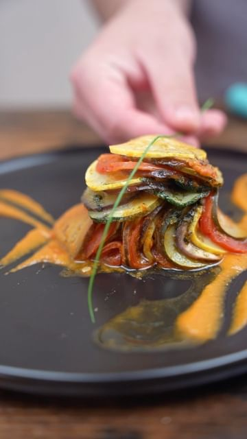{: style="width:100%;height:200px;object-fit: cover;object-position: center;" }](posts/foodsbible_05-04-2022_1504.md)  
        **@foodsbible** - Ratatouille 👀😋 [Read More...](posts/foodsbible_05-04-2022_1504.md)
- [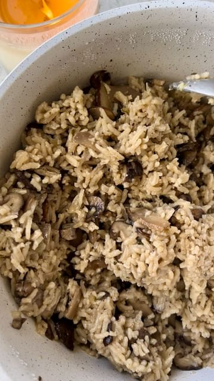{: style="width:100%;height:200px;object-fit: cover;object-position: center;" }](posts/healthygirlkitchen_11-04-2022_2204.md)  
        **@healthygirlkitchen** - bookmark this vegan ONE-POT CREAMY MUSHROOM RICE 🍚 [Read More...](posts/healthygirlkitchen_11-04-2022_2204.md)
- [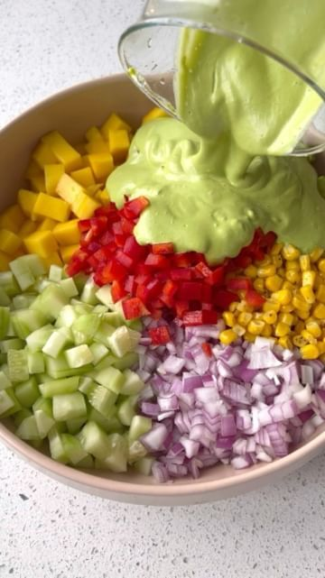{: style="width:100%;height:200px;object-fit: cover;object-position: center;" }](posts/eatinghealthymag_07-04-2022_2004.md)  
        **@eatinghealthymag** - bookmark this vegan mango mama salad 🥭 (with cream [Read More...](posts/eatinghealthymag_07-04-2022_2004.md)
- [{: style="width:100%;height:200px;object-fit: cover;object-position: center;" }](posts/herbifoods_09-04-2022_1404.md)  
        **@herbifoods** - VEGAN MOZZARELLA 🌱🇮🇹 the best recipe I know! [Read More...](posts/herbifoods_09-04-2022_1404.md)
- [{: style="width:100%;height:200px;object-fit: cover;object-position: center;" }](posts/vegan.tips.recipes_09-04-2022_0004.md)  
        **@vegan.tips.recipes** - Follow us @Smoothie.recipe.21day for more tips and [Read More...](posts/vegan.tips.recipes_09-04-2022_0004.md)
- [{: style="width:100%;height:200px;object-fit: cover;object-position: center;" }](posts/healthygirlkitchen_08-04-2022_2104.md)  
        **@healthygirlkitchen** - Save this VEGAN GLUTEN-FREE CARROT CAKE (1-bowl)🥕✨ [Read More...](posts/healthygirlkitchen_08-04-2022_2104.md)
- [{: style="width:100%;height:200px;object-fit: cover;object-position: center;" }](posts/eatinghealthyfeed_08-04-2022_1604.md)  
        **@eatinghealthyfeed** - Pasta Salad🥬 The dressing and feta cheese makes th [Read More...](posts/eatinghealthyfeed_08-04-2022_1604.md)
- [{: style="width:100%;height:200px;object-fit: cover;object-position: center;" }](posts/sweatspace_16-03-2022_0003.md)  
        **@sweatspace** - Creamy Avocado Yoast [Read More...](posts/sweatspace_16-03-2022_0003.md)
- [{: style="width:100%;height:200px;object-fit: cover;object-position: center;" }](posts/theplantbasedmeal_08-04-2022_0104.md)  
        **@theplantbasedmeal** - Pistachio Cake  [Read More...](posts/theplantbasedmeal_08-04-2022_0104.md)
- [{: style="width:100%;height:200px;object-fit: cover;object-position: center;" }](posts/veganrecipesideas_06-04-2022_1304.md)  
        **@veganrecipesideas** - Gnocchi in a creamy white bean alfredo sauce with  [Read More...](posts/veganrecipesideas_06-04-2022_1304.md)
- [{: style="width:100%;height:200px;object-fit: cover;object-position: center;" }](posts/theegyptianplanteater_06-04-2022_1604.md)  
        **@theegyptianplanteater** - GOCHUJANG HUMMUS RIGATONI🍝🌶 [Read More...](posts/theegyptianplanteater_06-04-2022_1604.md)
- [{: style="width:100%;height:200px;object-fit: cover;object-position: center;" }](posts/fitgreenmind_03-04-2022_1904.md)  
        **@fitgreenmind** - PUFFY PITA 🥙 Perfect for dipping into tzatziki! 😋 [Read More...](posts/fitgreenmind_03-04-2022_1904.md)
- [{: style="width:100%;height:200px;object-fit: cover;object-position: center;" }](posts/krishaj_04-04-2022_2304.md)  
        **@krishaj** - I. Want. 💚 [Read More...](posts/krishaj_04-04-2022_2304.md)
- [{: style="width:100%;height:200px;object-fit: cover;object-position: center;" }](posts/itslizmiu_08-04-2022_0604.md)  
        **@itslizmiu** - DULCE DE LECHE REPOSTERO VEGANO aka My Friday apol [Read More...](posts/itslizmiu_08-04-2022_0604.md)
- [{: style="width:100%;height:200px;object-fit: cover;object-position: center;" }](posts/itslizmiu_07-04-2022_2104.md)  
        **@itslizmiu** - (AD) Making some THERAPEUTIC CHOC-COVERED DATE CAR [Read More...](posts/itslizmiu_07-04-2022_2104.md)
- [{: style="width:100%;height:200px;object-fit: cover;object-position: center;" }](posts/ambivertclub_05-04-2022_1804.md)  
        **@ambivertclub** - MOMMMM! [Read More...](posts/ambivertclub_05-04-2022_1804.md)
- [{: style="width:100%;height:200px;object-fit: cover;object-position: center;" }](posts/healthygirlkitchen_05-04-2022_2004.md)  
        **@healthygirlkitchen** - You won’t believe this mac & cheese is vegan 🧀✨fol [Read More...](posts/healthygirlkitchen_05-04-2022_2004.md)
- [{: style="width:100%;height:200px;object-fit: cover;object-position: center;" }](posts/itslizmiu_05-04-2022_2104.md)  
        **@itslizmiu** - ALFAJORES! 😋 A very delicious and popular sandwich [Read More...](posts/itslizmiu_05-04-2022_2104.md)
- [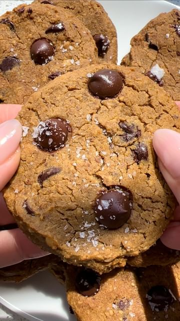{: style="width:100%;height:200px;object-fit: cover;object-position: center;" }](posts/healthygirlkitchen_03-04-2022_1404.md)  
        **@healthygirlkitchen** - Bookmark CHICKPEA CHOCOLATE CHIP COOKIES 🍪✨follow  [Read More...](posts/healthygirlkitchen_03-04-2022_1404.md)
- [{: style="width:100%;height:200px;object-fit: cover;object-position: center;" }](posts/jacobking_03-04-2022_1204.md)  
        **@jacobking** - CREAMY BEANY DIP 💦 it’s like hummus except it’s ma [Read More...](posts/jacobking_03-04-2022_1204.md)
- [{: style="width:100%;height:200px;object-fit: cover;object-position: center;" }](posts/cj.eats__30-03-2022_1903.md)  
        **@cj.eats_** - Bok Choy is one of my favorite vegetables and this [Read More...](posts/cj.eats__30-03-2022_1903.md)
- [{: style="width:100%;height:200px;object-fit: cover;object-position: center;" }](posts/vegancarnival_31-03-2022_0703.md)  
        **@vegancarnival** - Vegan Lotus Biscoff Cheesecake, if you love cookie [Read More...](posts/vegancarnival_31-03-2022_0703.md)
- [{: style="width:100%;height:200px;object-fit: cover;object-position: center;" }](posts/itslizmiu_29-03-2022_2003.md)  
        **@itslizmiu** - VERY CRISPY HASHBROWNS 🥔 I like crispy things and  [Read More...](posts/itslizmiu_29-03-2022_2003.md)
- [{: style="width:100%;height:200px;object-fit: cover;object-position: center;" }](posts/vernahungrybanana_02-03-2022_2303.md)  
        **@vernahungrybanana** - 📍#asmr // Super easy kimchi pajeon, aka kimchi pan [Read More...](posts/vernahungrybanana_02-03-2022_2303.md)
- [{: style="width:100%;height:200px;object-fit: cover;object-position: center;" }](posts/brekkyattiffanys_24-03-2022_0103.md)  
        **@brekkyattiffanys** - MISO PASTA (@nytcooking)—> it’s like… so creamy🍝 c [Read More...](posts/brekkyattiffanys_24-03-2022_0103.md)
- [{: style="width:100%;height:200px;object-fit: cover;object-position: center;" }](posts/jacobking_28-03-2022_1603.md)  
        **@jacobking** - VEGAN ‘DUCK’ PANCAKES 🦆 except there’s no duck + i [Read More...](posts/jacobking_28-03-2022_1603.md)
- [{: style="width:100%;height:200px;object-fit: cover;object-position: center;" }](posts/brekkyattiffanys_18-03-2022_0103.md)  
        **@brekkyattiffanys** - ginger #miso glazed #eggplant (modified recipe fro [Read More...](posts/brekkyattiffanys_18-03-2022_0103.md)
- [{: style="width:100%;height:200px;object-fit: cover;object-position: center;" }](posts/gregsvegangourmet_25-03-2022_1603.md)  
        **@gregsvegangourmet** - Save this for weekend meal inspo! Since you guys l [Read More...](posts/gregsvegangourmet_25-03-2022_1603.md)
- [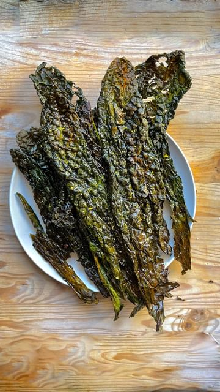{: style="width:100%;height:200px;object-fit: cover;object-position: center;" }](posts/giallozafferano_11-03-2022_0903.md)  
        **@giallozafferano** - Voglia di uno spuntino? Cavolo nero trasformato in [Read More...](posts/giallozafferano_11-03-2022_0903.md)
- [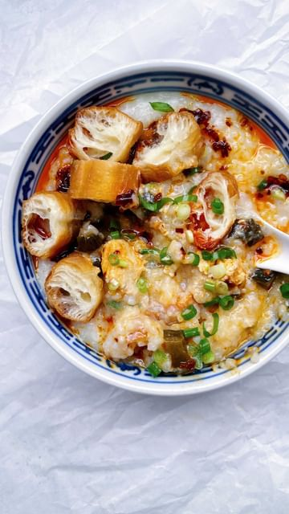{: style="width:100%;height:200px;object-fit: cover;object-position: center;" }](posts/itslizmiu_24-03-2022_2003.md)  
        **@itslizmiu** - Congee or Jook 粥 is just one of the best foods out [Read More...](posts/itslizmiu_24-03-2022_2003.md)
- [{: style="width:100%;height:200px;object-fit: cover;object-position: center;" }](posts/jacobking_22-03-2022_1703.md)  
        **@jacobking** - EXTRA GARLICY PASTA 🧄➕ this one will hurt your bre [Read More...](posts/jacobking_22-03-2022_1703.md)
- [{: style="width:100%;height:200px;object-fit: cover;object-position: center;" }](posts/jacobking_21-03-2022_1703.md)  
        **@jacobking** - TERIYAKI BITES 🥡 a sweet + sticky one still 👀  [Read More...](posts/jacobking_21-03-2022_1703.md)
- [{: style="width:100%;height:200px;object-fit: cover;object-position: center;" }](posts/minimin.eats_02-03-2022_1703.md)  
        **@minimin.eats** - The classic never fails 🤝 Just a regular choccy sp [Read More...](posts/minimin.eats_02-03-2022_1703.md)
- [{: style="width:100%;height:200px;object-fit: cover;object-position: center;" }](posts/jacobking_19-03-2022_1503.md)  
        **@jacobking** - VEGAN CEASER SALAD 🌱🥗 using aquafaba as a dressing [Read More...](posts/jacobking_19-03-2022_1503.md)
- [{: style="width:100%;height:200px;object-fit: cover;object-position: center;" }](posts/brekkyattiffanys_24-02-2022_2302.md)  
        **@brekkyattiffanys** - 5 minute korean silken tofu!!! kiki’s delivery ser [Read More...](posts/brekkyattiffanys_24-02-2022_2302.md)
- [{: style="width:100%;height:200px;object-fit: cover;object-position: center;" }](posts/thrivingonplants_16-03-2022_2103.md)  
        **@thrivingonplants** - Sticky Sesame Soy Cauliflower 😍👏 Battered baked ca [Read More...](posts/thrivingonplants_16-03-2022_2103.md)
- [{: style="width:100%;height:200px;object-fit: cover;object-position: center;" }](posts/veganbowlsrecipes_11-03-2022_1303.md)  
        **@veganbowlsrecipes** - DAN DAN NOODLES (擔擔麵) #VEGAN.🥢Quite possibly one o [Read More...](posts/veganbowlsrecipes_11-03-2022_1303.md)
- [{: style="width:100%;height:200px;object-fit: cover;object-position: center;" }](posts/justemslife_25-01-2022_1301.md)  
        **@justemslife** - The tastiest carrot cake recipe!🥕 [Read More...](posts/justemslife_25-01-2022_1301.md)
- [{: style="width:100%;height:200px;object-fit: cover;object-position: center;" }](posts/maxlamanna_07-03-2022_1803.md)  
        **@maxlamanna** - Tofu Butter Chicken ◻️🧈🐓 [Read More...](posts/maxlamanna_07-03-2022_1803.md)
- [{: style="width:100%;height:200px;object-fit: cover;object-position: center;" }](posts/wellmadebykiley_12-03-2022_0003.md)  
        **@wellmadebykiley** - SINGLE-SERVE GRANOLA BUTTER LAVA CAKE (V + GF) [Read More...](posts/wellmadebykiley_12-03-2022_0003.md)
- [{: style="width:100%;height:200px;object-fit: cover;object-position: center;" }](posts/cleaneatguide_11-03-2022_1003.md)  
        **@cleaneatguide** - Don’t Throw Out Pineapple Peels! 🤩🌱 by @creative_e [Read More...](posts/cleaneatguide_11-03-2022_1003.md)
- [{: style="width:100%;height:200px;object-fit: cover;object-position: center;" }](posts/veganrecipesideas_08-03-2022_1603.md)  
        **@veganrecipesideas** - Spicy Eggplant & Miso Tahini Sauce 👌🏻❤️ I topped i [Read More...](posts/veganrecipesideas_08-03-2022_1603.md)
- [{: style="width:100%;height:200px;object-fit: cover;object-position: center;" }](posts/itslizmiu_14-09-2021_0409.md)  
        **@itslizmiu** - EASY KIMCHI PANCAKES TODAY, FOLKS! 👏🏼👏🏼 Crispy, mo [Read More...](posts/itslizmiu_14-09-2021_0409.md)
- [{: style="width:100%;height:200px;object-fit: cover;object-position: center;" }](posts/cleaneatguide_05-03-2022_1303.md)  
        **@cleaneatguide** - 🌱🍪🎉Chickpea Cookie Skillet!! by @that.veganbabe  [Read More...](posts/cleaneatguide_05-03-2022_1303.md)
- [{: style="width:100%;height:200px;object-fit: cover;object-position: center;" }](posts/veganfeedgram_05-03-2022_1603.md)  
        **@veganfeedgram** - Looks yummy! Have you tried making this? [Read More...](posts/veganfeedgram_05-03-2022_1603.md)
- [{: style="width:100%;height:200px;object-fit: cover;object-position: center;" }](posts/deliciouslyella_05-03-2022_1103.md)  
        **@deliciouslyella** - ingredients [Read More...](posts/deliciouslyella_05-03-2022_1103.md)
- [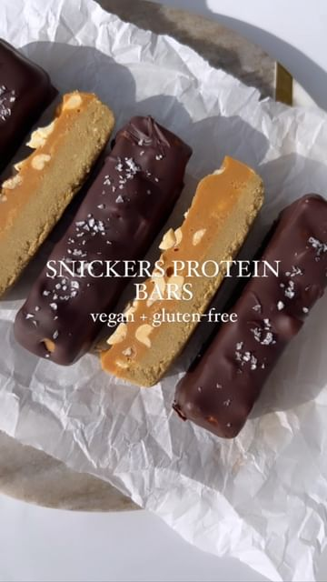{: style="width:100%;height:200px;object-fit: cover;object-position: center;" }](posts/callascleaneats_03-03-2022_1703.md)  
        **@callascleaneats** - SNICKERS PROTEIN BARS 🍫🥜  [Read More...](posts/callascleaneats_03-03-2022_1703.md)
- [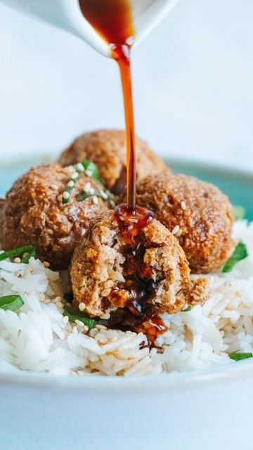{: style="width:100%;height:200px;object-fit: cover;object-position: center;" }](posts/plantbasednews_27-02-2022_1302.md)  
        **@plantbasednews** - Check out these Mouth Melting Meatless Miso Tofu M [Read More...](posts/plantbasednews_27-02-2022_1302.md)
- [{: style="width:100%;height:200px;object-fit: cover;object-position: center;" }](posts/themodernnonna_01-03-2022_0003.md)  
        **@themodernnonna** - Thank you for 6million 🥂The best strawberry green  [Read More...](posts/themodernnonna_01-03-2022_0003.md)
- [{: style="width:100%;height:200px;object-fit: cover;object-position: center;" }](posts/eatmoreplants.no_28-02-2022_1602.md)  
        **@eatmoreplants.no** - Noodle Salad🥗 With a peanut butter, garlic and gin [Read More...](posts/eatmoreplants.no_28-02-2022_1602.md)
- [{: style="width:100%;height:200px;object-fit: cover;object-position: center;" }](posts/frommybowl_26-02-2022_1702.md)  
        **@frommybowl** - Vegan Orange Olive Oil Cake 🍊 This snacking cake i [Read More...](posts/frommybowl_26-02-2022_1702.md)
- [{: style="width:100%;height:200px;object-fit: cover;object-position: center;" }](posts/maxlamanna_28-02-2022_1702.md)  
        **@maxlamanna** - Super Easy Crêpe, only 5-ingredients  [Read More...](posts/maxlamanna_28-02-2022_1702.md)
- [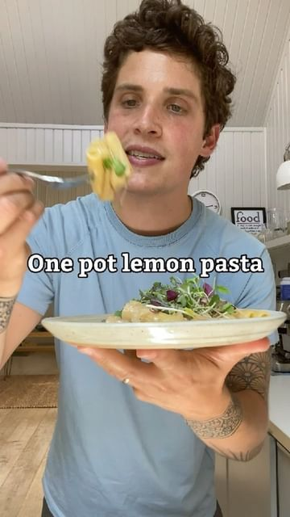{: style="width:100%;height:200px;object-fit: cover;object-position: center;" }](posts/veganbowlsrecipes_26-02-2022_2002.md)  
        **@veganbowlsrecipes** - One Pot 🍋 Pasta by @maxlamanna [Read More...](posts/veganbowlsrecipes_26-02-2022_2002.md)
- [{: style="width:100%;height:200px;object-fit: cover;object-position: center;" }](posts/glowvegan___26-02-2022_2302.md)  
        **@glowvegan__** - ➡️ Get our new vegan cookbook with over 100+ recip [Read More...](posts/glowvegan___26-02-2022_2302.md)
- [{: style="width:100%;height:200px;object-fit: cover;object-position: center;" }](posts/rosslynmaria_23-02-2022_1702.md)  
        **@rosslynmaria** - small-batch peanut butter brownies to satisfy your [Read More...](posts/rosslynmaria_23-02-2022_1702.md)
- [{: style="width:100%;height:200px;object-fit: cover;object-position: center;" }](posts/sovegan_24-02-2022_1102.md)  
        **@sovegan** - You’ll also find this recipe in our APP and on our [Read More...](posts/sovegan_24-02-2022_1102.md)
- [{: style="width:100%;height:200px;object-fit: cover;object-position: center;" }](posts/chez.jorge_23-02-2022_1402.md)  
        **@chez.jorge** - VEGGIE TOFU SOUP 青菜豆腐湯. 🥬 Complex dishes can entic [Read More...](posts/chez.jorge_23-02-2022_1402.md)
- [{: style="width:100%;height:200px;object-fit: cover;object-position: center;" }](posts/glowvegan___16-09-2021_2009.md)  
        **@glowvegan__** - Peanut-Miso Chickpea Salad 😋a plant-based sandwich [Read More...](posts/glowvegan___16-09-2021_2009.md)
- [{: style="width:100%;height:200px;object-fit: cover;object-position: center;" }](posts/tifflovestofu_10-02-2022_1602.md)  
        **@tifflovestofu** - Vietnamese-inspired Sate Sauce (aka Lemongrass chi [Read More...](posts/tifflovestofu_10-02-2022_1602.md)
- [{: style="width:100%;height:200px;object-fit: cover;object-position: center;" }](posts/deliciouslyella_20-02-2022_1002.md)  
        **@deliciouslyella** - Ingredients: [Read More...](posts/deliciouslyella_20-02-2022_1002.md)
- [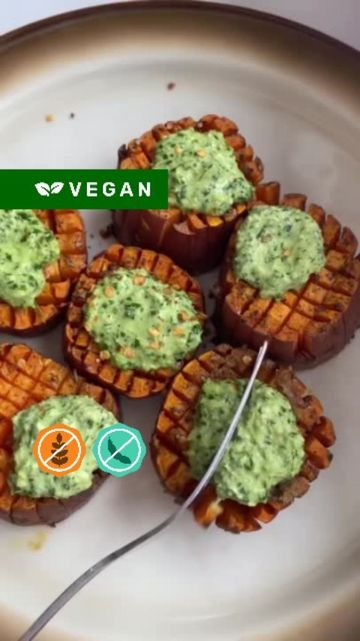{: style="width:100%;height:200px;object-fit: cover;object-position: center;" }](posts/veganfeedgram_22-02-2022_0202.md)  
        **@veganfeedgram** - Sweet Potatoes are the best! Don’t you agree? They [Read More...](posts/veganfeedgram_22-02-2022_0202.md)
- [{: style="width:100%;height:200px;object-fit: cover;object-position: center;" }](posts/bosh.tv_21-02-2022_1302.md)  
        **@bosh.tv** - PEANUT BUTTER TOFU CURRY 🍛  [Read More...](posts/bosh.tv_21-02-2022_1302.md)
- [{: style="width:100%;height:200px;object-fit: cover;object-position: center;" }](posts/nourishing.niki_22-02-2022_1802.md)  
        **@nourishing.niki** - Single-Serve Cinnamon Roll (high protein, vegan) 😍 [Read More...](posts/nourishing.niki_22-02-2022_1802.md)
- [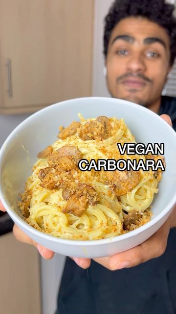{: style="width:100%;height:200px;object-fit: cover;object-position: center;" }](posts/jacobking_22-02-2022_1702.md)  
        **@jacobking** - VEGAN CARBONARA 🌱🍝 a plant based take in an Italia [Read More...](posts/jacobking_22-02-2022_1702.md)
- [{: style="width:100%;height:200px;object-fit: cover;object-position: center;" }](posts/lissa.elle_17-02-2022_1802.md)  
        **@lissa.elle** - 🍣🌿 VEGAN SALMON 🌿🍣  [Read More...](posts/lissa.elle_17-02-2022_1802.md)
- [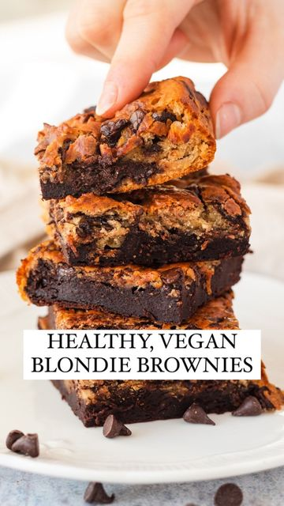{: style="width:100%;height:200px;object-fit: cover;object-position: center;" }](posts/nourishing.niki_17-02-2022_1902.md)  
        **@nourishing.niki** - Easy, Health(ish) Blondie Brownies 😍 (vegan, glute [Read More...](posts/nourishing.niki_17-02-2022_1902.md)
- [{: style="width:100%;height:200px;object-fit: cover;object-position: center;" }](posts/nomeatdisco_14-02-2022_1802.md)  
        **@nomeatdisco** - KOREAN TOFU BITES 🍜  [Read More...](posts/nomeatdisco_14-02-2022_1802.md)
- [{: style="width:100%;height:200px;object-fit: cover;object-position: center;" }](posts/get.plant.ed_14-02-2022_2202.md)  
        **@get.plant.ed** - ADDICTIVELY SPICY CUCUMBERS 🥒 This fancy snack by  [Read More...](posts/get.plant.ed_14-02-2022_2202.md)
- [{: style="width:100%;height:200px;object-fit: cover;object-position: center;" }](posts/maxlamanna_11-02-2022_1702.md)  
        **@maxlamanna** - The perfect dessert for a stay at home date night  [Read More...](posts/maxlamanna_11-02-2022_1702.md)
- [{: style="width:100%;height:200px;object-fit: cover;object-position: center;" }](posts/jacobking_09-02-2022_1702.md)  
        **@jacobking** - WONTON SOUP 🥟🥣 a delicious way to slurp up some du [Read More...](posts/jacobking_09-02-2022_1702.md)
- [{: style="width:100%;height:200px;object-fit: cover;object-position: center;" }](posts/jacobking_03-02-2022_1702.md)  
        **@jacobking** - SPAGHETTI AGLIO OLIO 🧄🛢 a classic Italian dish tha [Read More...](posts/jacobking_03-02-2022_1702.md)
- [{: style="width:100%;height:200px;object-fit: cover;object-position: center;" }](posts/jacobking_05-02-2022_1602.md)  
        **@jacobking** - TOFU BIBIMBAP 🇰🇷🥣 a Korean rice bowl full of flavo [Read More...](posts/jacobking_05-02-2022_1602.md)
- [{: style="width:100%;height:200px;object-fit: cover;object-position: center;" }](posts/maxlamanna_12-04-2021_1604.md)  
        **@maxlamanna** - What I Eat For Dinner (most nights) — Tofu Noodle  [Read More...](posts/maxlamanna_12-04-2021_1604.md)
- [{: style="width:100%;height:200px;object-fit: cover;object-position: center;" }](posts/veganfeedgram_27-01-2022_1601.md)  
        **@veganfeedgram** - Tiramisu Oatmeal  [Read More...](posts/veganfeedgram_27-01-2022_1601.md)
- [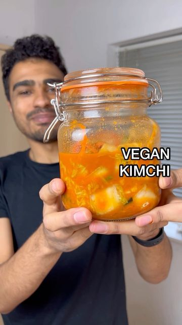{: style="width:100%;height:200px;object-fit: cover;object-position: center;" }](posts/jacobking_27-01-2022_1801.md)  
        **@jacobking** - VEGAN KIMCHI 🇰🇷 a classic Korean side dish 👏🏾 WRIT [Read More...](posts/jacobking_27-01-2022_1801.md)
- [{: style="width:100%;height:200px;object-fit: cover;object-position: center;" }](posts/fitgreenmind_26-01-2022_2101.md)  
        **@fitgreenmind** - MUSHROOM SATAY🥜 Incredibly delicious! 🤗 [Read More...](posts/fitgreenmind_26-01-2022_2101.md)
- [{: style="width:100%;height:200px;object-fit: cover;object-position: center;" }](posts/veganfitrecipes_25-01-2022_0401.md)  
        **@veganfitrecipes** - The simplest vegan rainbow gratin 🤤 Ad | Definitel [Read More...](posts/veganfitrecipes_25-01-2022_0401.md)
- [{: style="width:100%;height:200px;object-fit: cover;object-position: center;" }](posts/caloriechat_24-01-2022_0301.md)  
        **@caloriechat** - refreshing ASIAN CUCUMBER SALAD!🥒🥗 a very versatil [Read More...](posts/caloriechat_24-01-2022_0301.md)
- [{: style="width:100%;height:200px;object-fit: cover;object-position: center;" }](posts/veganfeedgram_24-01-2022_0201.md)  
        **@veganfeedgram** - Vegan Lemon Loaf [Read More...](posts/veganfeedgram_24-01-2022_0201.md)
- [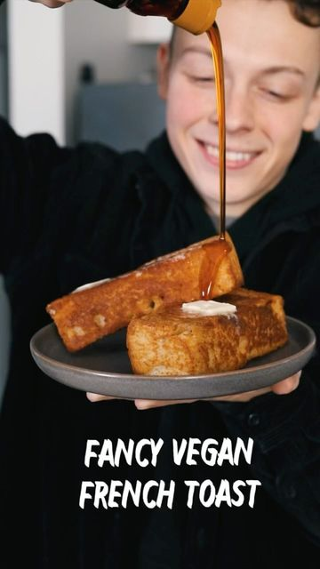{: style="width:100%;height:200px;object-fit: cover;object-position: center;" }](posts/gregsvegangourmet_22-01-2022_1801.md)  
        **@gregsvegangourmet** - Fancy French Toast! Save this video and share for  [Read More...](posts/gregsvegangourmet_22-01-2022_1801.md)
- [{: style="width:100%;height:200px;object-fit: cover;object-position: center;" }](posts/veggieanh_21-01-2022_1701.md)  
        **@veggieanh** - Chickpea Tofu (2-ingredient recipe) [Read More...](posts/veggieanh_21-01-2022_1701.md)
- [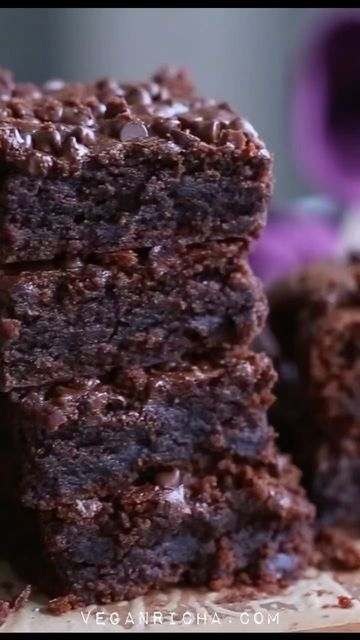{: style="width:100%;height:200px;object-fit: cover;object-position: center;" }](posts/vegancarnival_20-01-2022_0901.md)  
        **@vegancarnival** - 🍫Lentil Brownies! Yes you can put any legume in a  [Read More...](posts/vegancarnival_20-01-2022_0901.md)
- [{: style="width:100%;height:200px;object-fit: cover;object-position: center;" }](posts/healthygirlkitchen_20-01-2022_1701.md)  
        **@healthygirlkitchen** - add this vegan lasagna to this weekend’s dinner me [Read More...](posts/healthygirlkitchen_20-01-2022_1701.md)
- [{: style="width:100%;height:200px;object-fit: cover;object-position: center;" }](posts/jacobking_11-01-2022_1701.md)  
        **@jacobking** - VEGAN ‘HONEY’ GARLIC WINGS 🍯🧄 delicious + no need  [Read More...](posts/jacobking_11-01-2022_1701.md)
- [{: style="width:100%;height:200px;object-fit: cover;object-position: center;" }](posts/poorlondonvegan_06-01-2022_1601.md)  
        **@poorlondonvegan** - Chilli garlic lunchtime noodles 🍜⠀ [Read More...](posts/poorlondonvegan_06-01-2022_1601.md)
- [{: style="width:100%;height:200px;object-fit: cover;object-position: center;" }](posts/fitgreenmind_08-12-2021_2012.md)  
        **@fitgreenmind** - VEGAN BBQ RIBS 🌱😍 Super easy, super tasty! 😋 [Read More...](posts/fitgreenmind_08-12-2021_2012.md)
- [{: style="width:100%;height:200px;object-fit: cover;object-position: center;" }](posts/veganrecipesideas_04-12-2021_1612.md)  
        **@veganrecipesideas** - Pretzel Bites 🥨 by @that.veganbabe [Read More...](posts/veganrecipesideas_04-12-2021_1612.md)
- [{: style="width:100%;height:200px;object-fit: cover;object-position: center;" }](posts/plantbasedvegans_06-12-2021_1512.md)  
        **@plantbasedvegans** - Please Support & Follow 👉 @thecooking.feed [Read More...](posts/plantbasedvegans_06-12-2021_1512.md)
- [{: style="width:100%;height:200px;object-fit: cover;object-position: center;" }](posts/the.veganrecipe_06-12-2021_1512.md)  
        **@the.veganrecipe** - Please Support & Follow 👉 @thecooking.feed [Read More...](posts/the.veganrecipe_06-12-2021_1512.md)
- [{: style="width:100%;height:200px;object-fit: cover;object-position: center;" }](posts/healthyeatingfeed_27-11-2021_0811.md)  
        **@healthyeatingfeed** - Roast Carrot Soup🥕 by @healthyfitbella_  [Read More...](posts/healthyeatingfeed_27-11-2021_0811.md)
- [{: style="width:100%;height:200px;object-fit: cover;object-position: center;" }](posts/vegan_govegan_27-11-2021_1411.md)  
        **@vegan_govegan** - You can’t taste the chickpeas at all. You need the [Read More...](posts/vegan_govegan_27-11-2021_1411.md)
- [{: style="width:100%;height:200px;object-fit: cover;object-position: center;" }](posts/veganfeedgram_26-11-2021_0911.md)  
        **@veganfeedgram** - Lazy noodles 🍝 5-minute meal here we go! 🤓 by @fit [Read More...](posts/veganfeedgram_26-11-2021_0911.md)
- [{: style="width:100%;height:200px;object-fit: cover;object-position: center;" }](posts/plantbasedrd_20-11-2021_1511.md)  
        **@plantbasedrd** - Want the flavor to actually get into your tofu? Th [Read More...](posts/plantbasedrd_20-11-2021_1511.md)
- [{: style="width:100%;height:200px;object-fit: cover;object-position: center;" }](posts/that.veganbabe_19-11-2021_1911.md)  
        **@that.veganbabe** - 🌱🍪🎉Chickpea Cookie Skillet!! [Read More...](posts/that.veganbabe_19-11-2021_1911.md)
- [{: style="width:100%;height:200px;object-fit: cover;object-position: center;" }](posts/jacobking_17-11-2021_1711.md)  
        **@jacobking** - DAHL & COCONUT RICE 🥥🥥🥥 a delicious curry and rice [Read More...](posts/jacobking_17-11-2021_1711.md)
- [{: style="width:100%;height:200px;object-fit: cover;object-position: center;" }](posts/veganfeedgram_16-11-2021_1411.md)  
        **@veganfeedgram** - 🌮TACO “MEAT” [Read More...](posts/veganfeedgram_16-11-2021_1411.md)
- [{: style="width:100%;height:200px;object-fit: cover;object-position: center;" }](posts/foodandrefreshments_19-11-2021_0611.md)  
        **@foodandrefreshments** - Homemade fries recipe 🍟 [Read More...](posts/foodandrefreshments_19-11-2021_0611.md)
- [{: style="width:100%;height:200px;object-fit: cover;object-position: center;" }](posts/veganfeedgram_11-11-2021_1111.md)  
        **@veganfeedgram** - SPICY GARLIC TOFU 🧄 the recipe that might turn you [Read More...](posts/veganfeedgram_11-11-2021_1111.md)
- [{: style="width:100%;height:200px;object-fit: cover;object-position: center;" }](posts/fitgreenmind_09-11-2021_2011.md)  
        **@fitgreenmind** - CLASSIC FALAFEL 🧆 The best way to use chickpeas…😋 [Read More...](posts/fitgreenmind_09-11-2021_2011.md)
- [{: style="width:100%;height:200px;object-fit: cover;object-position: center;" }](posts/veganbarrel_06-11-2021_1811.md)  
        **@veganbarrel** - 2 INGREDIENT SWEET POTATO TORTILLAS! [Read More...](posts/veganbarrel_06-11-2021_1811.md)
- [{: style="width:100%;height:200px;object-fit: cover;object-position: center;" }](posts/fitgreenmind_07-11-2021_2011.md)  
        **@fitgreenmind** - APPLE CINNAMON ROLLS 🍎🥰 The taste of winter…😋 [Read More...](posts/fitgreenmind_07-11-2021_2011.md)
- [{: style="width:100%;height:200px;object-fit: cover;object-position: center;" }](posts/fitgreenmind_04-11-2021_2011.md)  
        **@fitgreenmind** - SMOKY EGGPLANT DIP 😍 Don’t skip the dip guys! 😉 [Read More...](posts/fitgreenmind_04-11-2021_2011.md)
- [{: style="width:100%;height:200px;object-fit: cover;object-position: center;" }](posts/foodypopz_01-11-2021_0711.md)  
        **@foodypopz** - BABA GANOUSH 🍆👀 by @sovegan One of the greatest di [Read More...](posts/foodypopz_01-11-2021_0711.md)
- [{: style="width:100%;height:200px;object-fit: cover;object-position: center;" }](posts/veganfeedgram_30-10-2021_0910.md)  
        **@veganfeedgram** - What I Eat For Dinner (most nights) — Tofu Noodle  [Read More...](posts/veganfeedgram_30-10-2021_0910.md)
- [{: style="width:100%;height:200px;object-fit: cover;object-position: center;" }](posts/fitgreenmind_31-10-2021_2010.md)  
        **@fitgreenmind** - CREAMY MUSHROOM PASTA 🍝 Life is just better with p [Read More...](posts/fitgreenmind_31-10-2021_2010.md)
- [{: style="width:100%;height:200px;object-fit: cover;object-position: center;" }](posts/foodypopz_31-10-2021_0710.md)  
        **@foodypopz** - MUHAMMARA🔥 by @sovegan When we first tried this tr [Read More...](posts/foodypopz_31-10-2021_0710.md)
- [{: style="width:100%;height:200px;object-fit: cover;object-position: center;" }](posts/woon.heng_28-10-2021_1410.md)  
        **@woon.heng** - This Vegan Luncheon Roll🤩 is absolutely TASTY😋 and [Read More...](posts/woon.heng_28-10-2021_1410.md)
- [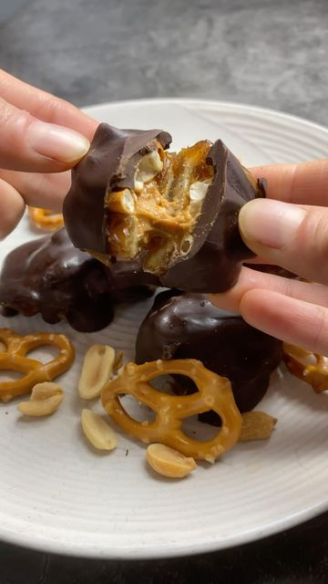{: style="width:100%;height:200px;object-fit: cover;object-position: center;" }](posts/wholesomehedonista_30-10-2021_1610.md)  
        **@wholesomehedonista** - Take 5s are slept on  [Read More...](posts/wholesomehedonista_30-10-2021_1610.md)
- [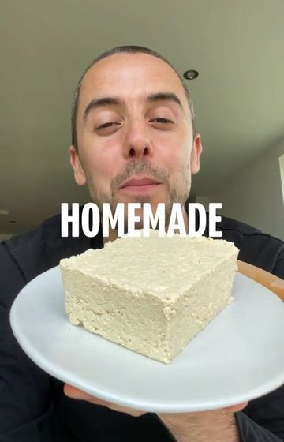{: style="width:100%;height:200px;object-fit: cover;object-position: center;" }](posts/foodypopz_29-10-2021_0610.md)  
        **@foodypopz** - HOMEMADE TOFU 😮 by @sovegan We always assumed maki [Read More...](posts/foodypopz_29-10-2021_0610.md)
- [{: style="width:100%;height:200px;object-fit: cover;object-position: center;" }](posts/veganfeedgram_26-10-2021_0510.md)  
        **@veganfeedgram** - BROWNIE BAKED OATMEAL 🍫 Aka. an excuse to eat cake [Read More...](posts/veganfeedgram_26-10-2021_0510.md)
- [{: style="width:100%;height:200px;object-fit: cover;object-position: center;" }](posts/veganfeedgram_27-10-2021_0910.md)  
        **@veganfeedgram** - 🍌No-waste Banana Bread by @maxlamanna [Read More...](posts/veganfeedgram_27-10-2021_0910.md)
- [{: style="width:100%;height:200px;object-fit: cover;object-position: center;" }](posts/bestfruitvideos_26-10-2021_1610.md)  
        **@bestfruitvideos** - APPLE ROSE TARTE TATIN - all you need for this lux [Read More...](posts/bestfruitvideos_26-10-2021_1610.md)
- [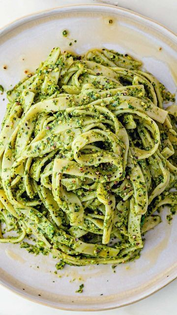{: style="width:100%;height:200px;object-fit: cover;object-position: center;" }](posts/vegancommunity_25-10-2021_0910.md)  
        **@vegancommunity** - Pistachio Pesto Pasta by @sovegan! 😋 [Read More...](posts/vegancommunity_25-10-2021_0910.md)
- [{: style="width:100%;height:200px;object-fit: cover;object-position: center;" }](posts/humormedia_hq_23-10-2021_1810.md)  
        **@humormedia_hq** - More crispy potatoes!  [Read More...](posts/humormedia_hq_23-10-2021_1810.md)
- [{: style="width:100%;height:200px;object-fit: cover;object-position: center;" }](posts/herbifoods_25-10-2021_1610.md)  
        **@herbifoods** - VEGAN BRIOCHE BURGER BUNS 🍔🌱 so soft and delicious [Read More...](posts/herbifoods_25-10-2021_1610.md)
- [{: style="width:100%;height:200px;object-fit: cover;object-position: center;" }](posts/vegancarnival_24-10-2021_1010.md)  
        **@vegancarnival** - 🔥😍💕EP 6: SCRAPPY COOKING - crispy potato skins. [Read More...](posts/vegancarnival_24-10-2021_1010.md)
- [{: style="width:100%;height:200px;object-fit: cover;object-position: center;" }](posts/that.veganbabe_24-10-2021_1910.md)  
        **@that.veganbabe** - 🌱🍠🍫 Sweet Potato Brownies! [Read More...](posts/that.veganbabe_24-10-2021_1910.md)
- [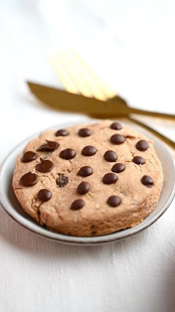{: style="width:100%;height:200px;object-fit: cover;object-position: center;" }](posts/mattsfitchef_30-09-2021_1209.md)  
        **@mattsfitchef** - PROTEIN CHOCOLATE CHIP COOKIE FOR ONE🤯 (Vegan & pr [Read More...](posts/mattsfitchef_30-09-2021_1209.md)
- [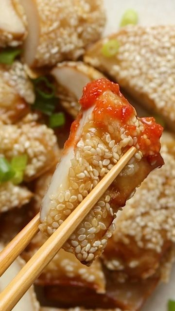{: style="width:100%;height:200px;object-fit: cover;object-position: center;" }](posts/woon.heng_23-10-2021_1510.md)  
        **@woon.heng** - Vegan Sesame 'Chicken'😋made from king oyster mushr [Read More...](posts/woon.heng_23-10-2021_1510.md)
- [{: style="width:100%;height:200px;object-fit: cover;object-position: center;" }](posts/fu.fighters_22-10-2021_1310.md)  
        **@fu.fighters** - + We make soy-free chickpea tofu. [Read More...](posts/fu.fighters_22-10-2021_1310.md)
- [{: style="width:100%;height:200px;object-fit: cover;object-position: center;" }](posts/veganbarrel_22-10-2021_2110.md)  
        **@veganbarrel** - HOMEMADE PICKLES!🥒 Follow @veganbarrel for more ex [Read More...](posts/veganbarrel_22-10-2021_2110.md)
- [{: style="width:100%;height:200px;object-fit: cover;object-position: center;" }](posts/veganbarrel_22-10-2021_1410.md)  
        **@veganbarrel** - Typed up a huge list of all the fall recipes I wan [Read More...](posts/veganbarrel_22-10-2021_1410.md)
- [{: style="width:100%;height:200px;object-fit: cover;object-position: center;" }](posts/veganbarrel_21-10-2021_2110.md)  
        **@veganbarrel** - Homemade Sourdough Focaccia in 30 seconds? Here we [Read More...](posts/veganbarrel_21-10-2021_2110.md)
- [{: style="width:100%;height:200px;object-fit: cover;object-position: center;" }](posts/veganbarrel_21-10-2021_1410.md)  
        **@veganbarrel** - 🌱🎉💪 Easy Red Lentil Lentil Wraps - High Protein!!! [Read More...](posts/veganbarrel_21-10-2021_1410.md)
- [{: style="width:100%;height:200px;object-fit: cover;object-position: center;" }](posts/that.veganbabe_19-10-2021_1810.md)  
        **@that.veganbabe** - 🙌😍 How to Make CRISPY TOFU!!! [Read More...](posts/that.veganbabe_19-10-2021_1810.md)
- [{: style="width:100%;height:200px;object-fit: cover;object-position: center;" }](posts/veganfeedgram_22-09-2021_1109.md)  
        **@veganfeedgram** - SEARED NAPA CABBAGE with miso butter or  SMASHED B [Read More...](posts/veganfeedgram_22-09-2021_1109.md)
- [{: style="width:100%;height:200px;object-fit: cover;object-position: center;" }](posts/veganfeedgram_18-10-2021_0610.md)  
        **@veganfeedgram** - CHIMICHURRI SMASHED POTATOES 🇦🇷 by @sovegan Golden [Read More...](posts/veganfeedgram_18-10-2021_0610.md)
- [{: style="width:100%;height:200px;object-fit: cover;object-position: center;" }](posts/plant_basedrecipe_19-10-2021_1010.md)  
        **@plant_basedrecipe** - TERIYAKI TOFU 😋✨ Tofu is boring? NAAAH!  [Read More...](posts/plant_basedrecipe_19-10-2021_1010.md)
- [{: style="width:100%;height:200px;object-fit: cover;object-position: center;" }](posts/herbifoods_16-10-2021_1510.md)  
        **@herbifoods** - CREAMY VEGAN LEMON PASTA 🍋 quick & easy pasta sauc [Read More...](posts/herbifoods_16-10-2021_1510.md)
- [{: style="width:100%;height:200px;object-fit: cover;object-position: center;" }](posts/woon.heng_16-10-2021_1810.md)  
        **@woon.heng** - Roti Pisang (Banana) with sweet caramelized banana [Read More...](posts/woon.heng_16-10-2021_1810.md)
- [{: style="width:100%;height:200px;object-fit: cover;object-position: center;" }](posts/veganfeedgram_17-10-2021_0710.md)  
        **@veganfeedgram** - ROASTED RED PEPPER PASTA 🍝 by @sovegan A classic S [Read More...](posts/veganfeedgram_17-10-2021_0710.md)
- [{: style="width:100%;height:200px;object-fit: cover;object-position: center;" }](posts/veganbarrel_13-10-2021_2010.md)  
        **@veganbarrel** - Here are 2 healthy recipes to silence your #sweett [Read More...](posts/veganbarrel_13-10-2021_2010.md)
- [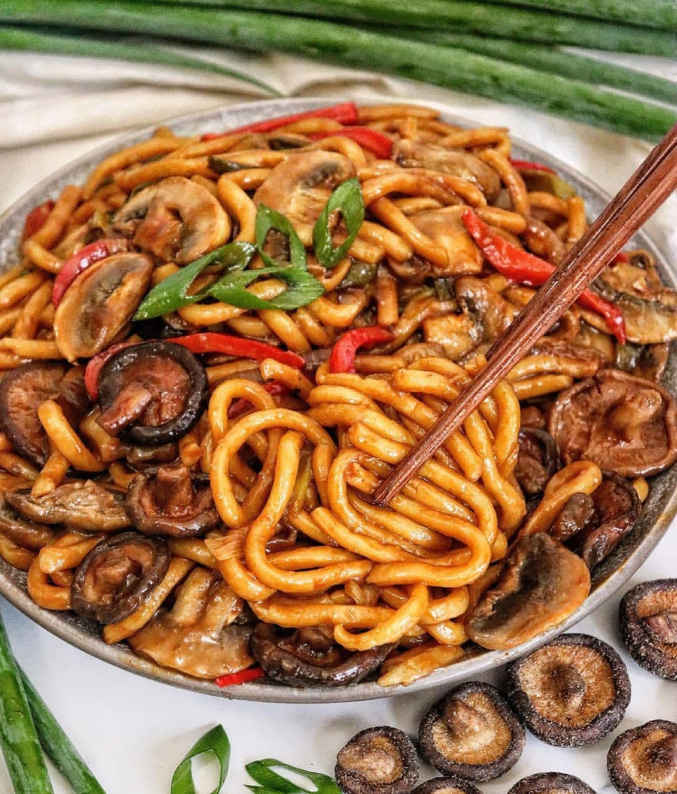{: style="width:100%;height:200px;object-fit: cover;object-position: center;" }](posts/veganrecipesideas_14-10-2021_1410.md)  
        **@veganrecipesideas** - TERIYAKI MUSHROOM UDON NOODLE STIR-FRY 🍜 😍 by @run [Read More...](posts/veganrecipesideas_14-10-2021_1410.md)
- [{: style="width:100%;height:200px;object-fit: cover;object-position: center;" }](posts/veganfeedgram_13-10-2021_0610.md)  
        **@veganfeedgram** - EAT or PASS on these VEGAN GYOZAS? 🥟😍 by @fitgreen [Read More...](posts/veganfeedgram_13-10-2021_0610.md)
- [{: style="width:100%;height:200px;object-fit: cover;object-position: center;" }](posts/vegancarnival_13-10-2021_2110.md)  
        **@vegancarnival** - Vegan Unagi (Eel)😋素鳗鱼 with an unbelievable scrumpt [Read More...](posts/vegancarnival_13-10-2021_2110.md)
- [{: style="width:100%;height:200px;object-fit: cover;object-position: center;" }](posts/fitgreenmind_08-10-2021_1910.md)  
        **@fitgreenmind** - BABA GANOUSH 😋 Is it better than hummus? 😌 [Read More...](posts/fitgreenmind_08-10-2021_1910.md)
- [{: style="width:100%;height:200px;object-fit: cover;object-position: center;" }](posts/veganfeedgram_07-10-2021_0810.md)  
        **@veganfeedgram** - These crispy Rice Paper Dumplings have become my n [Read More...](posts/veganfeedgram_07-10-2021_0810.md)
- [{: style="width:100%;height:200px;object-fit: cover;object-position: center;" }](posts/rabbitandwolves_18-03-2019_2103.md)  
        **@rabbitandwolves** - This #vegan Creamy Polenta and Red Wine Mushrooms  [Read More...](posts/rabbitandwolves_18-03-2019_2103.md)
- [{: style="width:100%;height:200px;object-fit: cover;object-position: center;" }](posts/veganpopping_18-03-2019_0103.md)  
        **@veganpopping** - idk how you feelin about this whole monday thing r [Read More...](posts/veganpopping_18-03-2019_0103.md)
- [{: style="width:100%;height:200px;object-fit: cover;object-position: center;" }](posts/rabbitandwolves_14-03-2019_2003.md)  
        **@rabbitandwolves** - This #vegan and #glutenfree General Tso’s broccoli [Read More...](posts/rabbitandwolves_14-03-2019_2003.md)
- [{: style="width:100%;height:200px;object-fit: cover;object-position: center;" }](posts/pbnfood_12-03-2019_1203.md)  
        **@pbnfood** - Do you struggle to make your tofu taste delicious? [Read More...](posts/pbnfood_12-03-2019_1203.md)
- [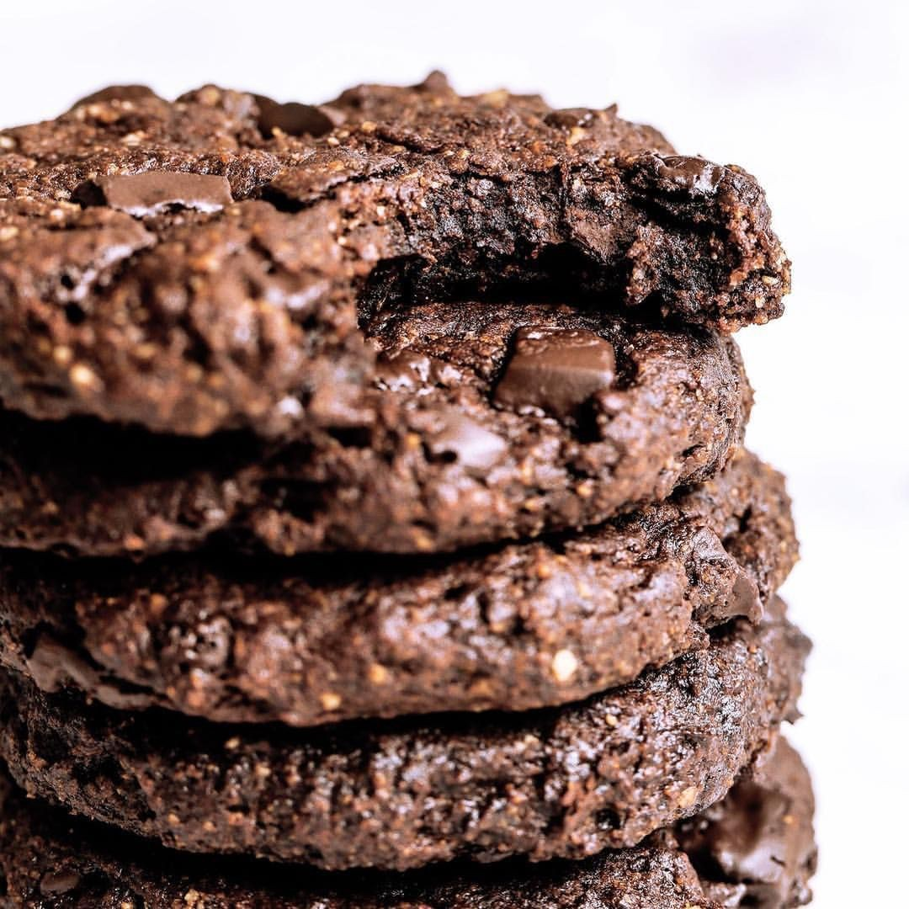{: style="width:100%;height:200px;object-fit: cover;object-position: center;" }](posts/pbnfood_04-03-2019_1203.md)  
        **@pbnfood** - Check out these delicious chocolate fudge cookies  [Read More...](posts/pbnfood_04-03-2019_1203.md)
- [{: style="width:100%;height:200px;object-fit: cover;object-position: center;" }](posts/theguthealthmd_28-02-2019_0002.md)  
        **@theguthealthmd** - You scream, I scream we all scream for NICE CREAM! [Read More...](posts/theguthealthmd_28-02-2019_0002.md)
- [{: style="width:100%;height:200px;object-fit: cover;object-position: center;" }](posts/pbnfood_22-02-2019_1202.md)  
        **@pbnfood** - Are you a nut-butter fan? Then you will LOVE this  [Read More...](posts/pbnfood_22-02-2019_1202.md)
- [{: style="width:100%;height:200px;object-fit: cover;object-position: center;" }](posts/pbnfood_21-02-2019_1302.md)  
        **@pbnfood** - Do you miss omelettes on a plant-based diet? Then  [Read More...](posts/pbnfood_21-02-2019_1302.md)
- [{: style="width:100%;height:200px;object-fit: cover;object-position: center;" }](posts/happyskinkitchen_08-02-2019_1502.md)  
        **@happyskinkitchen** - Happy Friday everyone!🎉A weekend brunch is always  [Read More...](posts/happyskinkitchen_08-02-2019_1502.md)
- [{: style="width:100%;height:200px;object-fit: cover;object-position: center;" }](posts/nutrition_facts_org_13-02-2019_2302.md)  
        **@nutrition_facts_org** - Here’s a delicious way to start the day tomorrow!  [Read More...](posts/nutrition_facts_org_13-02-2019_2302.md)
- [{: style="width:100%;height:200px;object-fit: cover;object-position: center;" }](posts/annelinawaller_09-06-2018_0706.md)  
        **@annelinawaller** - Yeees guys we made it, it's weekend <3. What are y [Read More...](posts/annelinawaller_09-06-2018_0706.md)
- [{: style="width:100%;height:200px;object-fit: cover;object-position: center;" }](posts/pbnfood_16-12-2018_1512.md)  
        **@pbnfood** - Don’t miss out on a delicious centrepiece this Chr [Read More...](posts/pbnfood_16-12-2018_1512.md)
- [{: style="width:100%;height:200px;object-fit: cover;object-position: center;" }](posts/pbnfood_25-11-2018_2111.md)  
        **@pbnfood** - Homemade sweet potato gnocchi with fried chestnut  [Read More...](posts/pbnfood_25-11-2018_2111.md)
- [{: style="width:100%;height:200px;object-fit: cover;object-position: center;" }](posts/pbnfood_29-11-2018_1711.md)  
        **@pbnfood** - Do you like tahini, chocolate, and brownies?...the [Read More...](posts/pbnfood_29-11-2018_1711.md)
- [{: style="width:100%;height:200px;object-fit: cover;object-position: center;" }](posts/pbnfood_13-12-2018_1212.md)  
        **@pbnfood** - Cinnamon rolls filled with plant-based Nutella any [Read More...](posts/pbnfood_13-12-2018_1212.md)
- [{: style="width:100%;height:200px;object-fit: cover;object-position: center;" }](posts/bakeritablog_25-11-2018_2011.md)  
        **@bakeritablog** - Is it time for Christmas cookies yet?! If so...let [Read More...](posts/bakeritablog_25-11-2018_2011.md)
- [{: style="width:100%;height:200px;object-fit: cover;object-position: center;" }](posts/megunprocessed_26-10-2018_1910.md)  
        **@megunprocessed** - Sweet Potato Brownies 😍 [Read More...](posts/megunprocessed_26-10-2018_1910.md)
- [{: style="width:100%;height:200px;object-fit: cover;object-position: center;" }](posts/nimai_delgado_10-12-2018_1612.md)  
        **@nimai_delgado** - 🤤Smash or pass? [Read More...](posts/nimai_delgado_10-12-2018_1612.md)
- [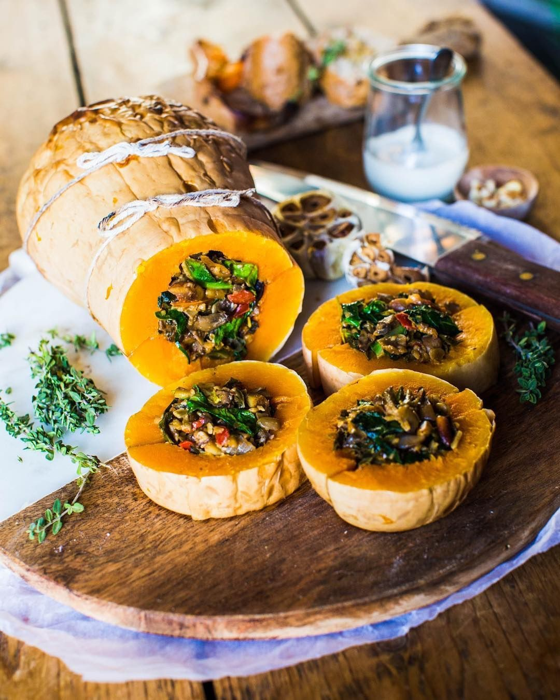{: style="width:100%;height:200px;object-fit: cover;object-position: center;" }](posts/pbnfood_08-12-2018_1212.md)  
        **@pbnfood** - Check out this delicious baked butternut squash st [Read More...](posts/pbnfood_08-12-2018_1212.md)
- [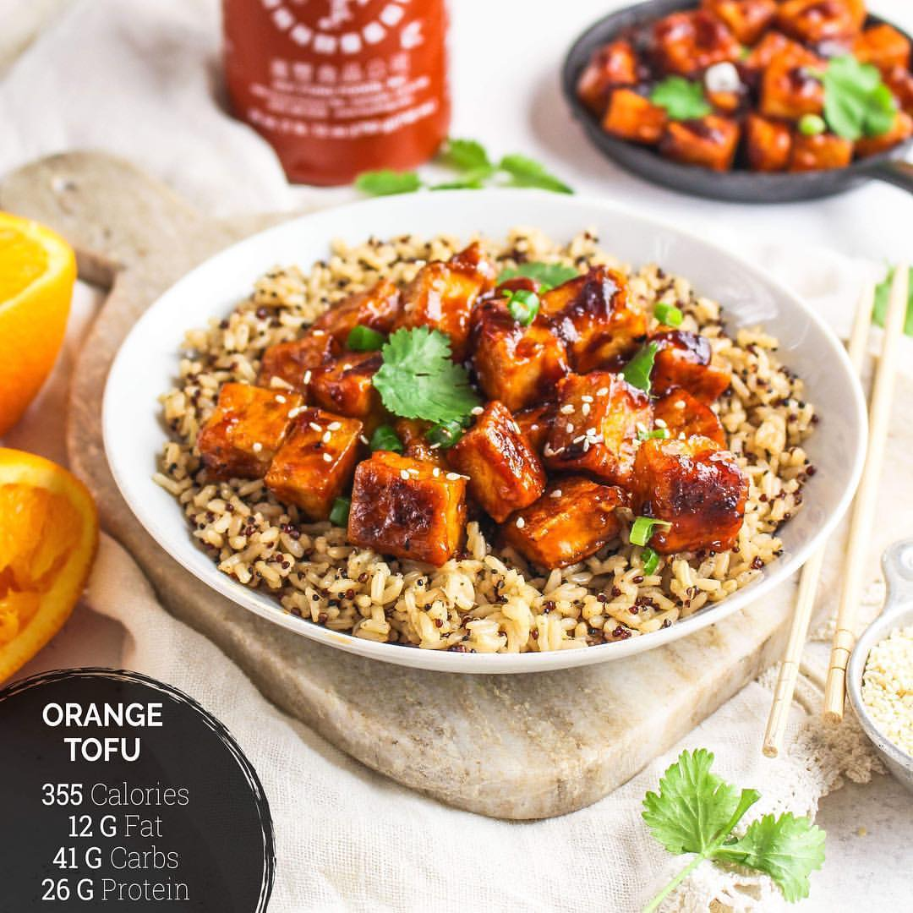{: style="width:100%;height:200px;object-fit: cover;object-position: center;" }](posts/everyday.vegan.food_03-11-2018_1611.md)  
        **@everyday.vegan.food** - Orange tofu! 🔥🙌🏼 It’s so good that I’m not ashamed [Read More...](posts/everyday.vegan.food_03-11-2018_1611.md)
- [{: style="width:100%;height:200px;object-fit: cover;object-position: center;" }](posts/the_balanced_kitchen_20-11-2018_1611.md)  
        **@the_balanced_kitchen** - BLACK BEAN, TAHINI & MOLASSES CHOCOLATE BROWNIES  [Read More...](posts/the_balanced_kitchen_20-11-2018_1611.md)
- [{: style="width:100%;height:200px;object-fit: cover;object-position: center;" }](posts/pbnfood_01-12-2018_1212.md)  
        **@pbnfood** - Check out these chocolate filled choc-chip cookies [Read More...](posts/pbnfood_01-12-2018_1212.md)
- [{: style="width:100%;height:200px;object-fit: cover;object-position: center;" }](posts/pbnfood_05-12-2018_1212.md)  
        **@pbnfood** - Check out this high protein tempeh, pesto and butt [Read More...](posts/pbnfood_05-12-2018_1212.md)
- [{: style="width:100%;height:200px;object-fit: cover;object-position: center;" }](posts/pbnfood_03-12-2018_2112.md)  
        **@pbnfood** - Check out this plant based take on traditional mac [Read More...](posts/pbnfood_03-12-2018_2112.md)
- [{: style="width:100%;height:200px;object-fit: cover;object-position: center;" }](posts/pbnfood_13-11-2018_2111.md)  
        **@pbnfood** - Fancy an impressive dessert this weekend? These  t [Read More...](posts/pbnfood_13-11-2018_2111.md)
- [{: style="width:100%;height:200px;object-fit: cover;object-position: center;" }](posts/pbnfood_01-12-2018_2112.md)  
        **@pbnfood** - Check out these superfood cocoa fudge bites! The p [Read More...](posts/pbnfood_01-12-2018_2112.md)
- [{: style="width:100%;height:200px;object-fit: cover;object-position: center;" }](posts/everyday.vegan.food_22-10-2018_1610.md)  
        **@everyday.vegan.food** - Ginger #Tempeh Bowl! 🥒😍 Add rice or quinoa and a s [Read More...](posts/everyday.vegan.food_22-10-2018_1610.md)
- [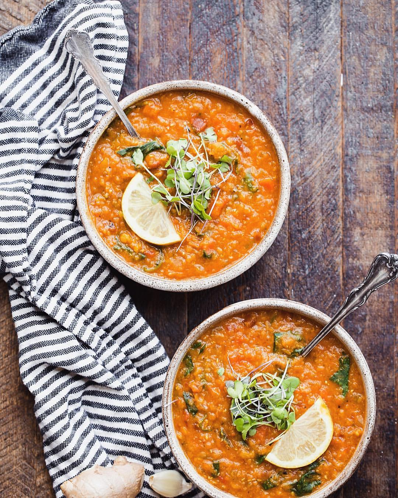{: style="width:100%;height:200px;object-fit: cover;object-position: center;" }](posts/bakeritablog_26-11-2018_1711.md)  
        **@bakeritablog** - I don’t know about you guys, but I need to reset w [Read More...](posts/bakeritablog_26-11-2018_1711.md)
- [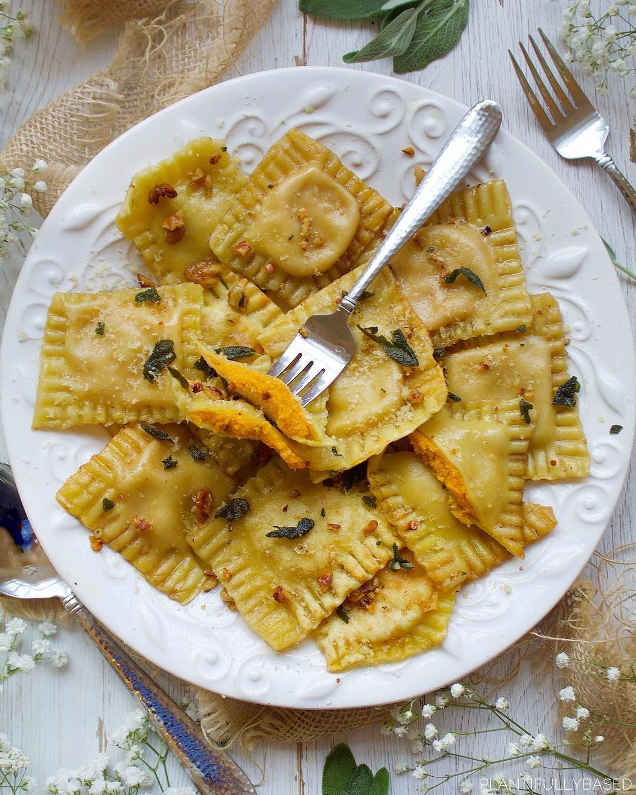{: style="width:100%;height:200px;object-fit: cover;object-position: center;" }](posts/pbnfood_15-12-2018_2112.md)  
        **@pbnfood** - Check out this butternut squash ravioli! A perfect [Read More...](posts/pbnfood_15-12-2018_2112.md)
- [{: style="width:100%;height:200px;object-fit: cover;object-position: center;" }](posts/pbnfood_14-12-2018_1212.md)  
        **@pbnfood** - It’s officially the Christmas season, and what bet [Read More...](posts/pbnfood_14-12-2018_1212.md)

