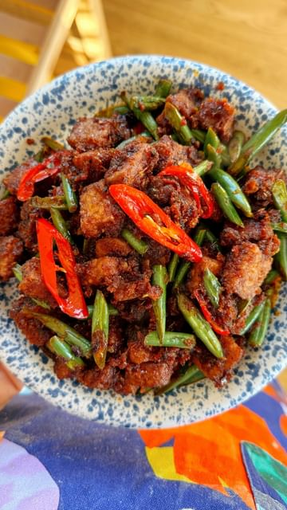

# SAMBAL GORENG TEMPE(H) by @itslizmiu 🇮🇩 If you don’t like tempe, try it a more traditional way! Growing up I always knew tempe to be fried til crispy and often coated in a sticky or spicy sauce, which is the way the Indonesians do it (my Nini is from Java)! It’s often served alongside meat dishes - and all Indonesians know and love it, not just the vegetarian or vegan ones! So I say - more tempe for everyone! If you’ve tried it and didn’t like it - give it another chance with this easy and delicious Sambal Goreng Tempe!  

> recipe by [@abc_everyday](https://www.instagram.com/abc_everyday/) 
(ABC Everyday) - [see original post](https://instagram.com/p/CsF8gQiPCTQ)

  
PASTE  
5 shallots  
1 stalk lemongrass, core only  
4 garlic cloves  
1 inch chunk galangal  
1 tomato   
1/4 cup water  
  
OTHER  
100g Green Beans  
1 large red chilli, optional  
300g tempe  
Oil, for frying  
4-5 small makrut lime leaves  
2 tbsp sambal olek   
2 tsp tamarind paste  
1-2 tbsp kecap manis  
Salt and sugar, to taste  
Steamed rice, to serve  
  
\#ABCEveryday \#Tempe \#Tempeh \#SambalGorengTempe \#PlantBasedRecipes   