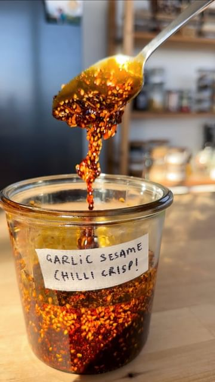

# Homemade Garlic and Sesame Chilli Crisp to put on anything and everything with @itslizmiu! 🌶   

> recipe by [@abclifestyle](https://www.instagram.com/abclifestyle/) 
(ABC Lifestyle) - [see original post](https://instagram.com/p/CtgHxsoLxop)

  
Making homemade chilli oil is easier than you think and it’s even better with little bits of crispy garlic!  
  
CHILLI OIL  
8 cloves garlic, sliced thin  
2 slices ginger  
1 cup peanut oil  
1 tsp Sichuan peppercorns, crushed  
1/4 cup Korean red pepper flakes  
2 tbsp toasted sesame seeds  
1/2 tsp salt  
1/2 tsp sugar  
1/2 tsp msg  
2 Star anise  
2 bay leaves  
1/2 tsp chinese five spice  
1 Cinnamon stick  
  
Place sichuan peppercorns, korean pepper flakes, sesame, salt, sugar, msg, star anise, bay leaves, cinnamon stick and Chinese five spice into a large bowl with high sides and mix. In a small saucepan heat up 1 cup of peanut oil - adding the sliced garlic while the oil is cold as it can burn quickly. Stir garlic frequently and keep and eye on it to prevent burning. Remove garlic when a little lighter than golden brown. Turn the heat of the oil up and add the ginger slices and fry until they crisp up. Carefully pour the smoking hot oil over the spices and chilli flakes in the bowl and allow to cool completely before removing the chunky spices. Stir crispy garlic back in and keep in a clean jar!  
  
\#ChilliOil \#ChilliCrisp \#HomemadeChilliOil   