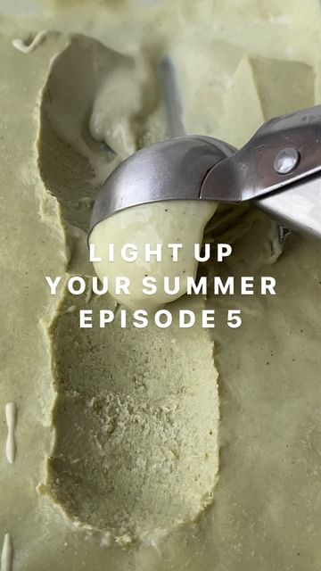

# You’ll be heatwave ready with this no churn pistachio ice cream. 🍨 It’s so easy but tastes like it came from an Italian gelateria.  

> recipe by [@allplants](https://www.instagram.com/allplants/) 
(allplants) - [see original post](https://instagram.com/p/Cg9-3ccj4NY)

Ingredients:
500ml Oatly cream
200g Pistachio Butter
90g sugar
80ml plant-based milk
1/2 teaspoon of salt

1/ Mix the cream, pistachio butter and sugar into a bowl until smooth
2/ Then whisk in plant-based milk and a teaspoon of salt.
3/ Decant into a heat proof dish and freeze for 4-5 hours.

Top tip: leave for 15 mins before serving to get that creamy, glossy consistency.

\#pistachio \#plantbased \#nochurnicecream \#icecream \#easyrecipe \#simplefood \#foodie \#delicious \#vegan \#creamy \#oatmilk \#oatly \#sweettooth \#gelato \#italian \#dessert \#food \#foodstagram \#healthyfood \#natural \#heatwave \#summerrecipe \#summer 