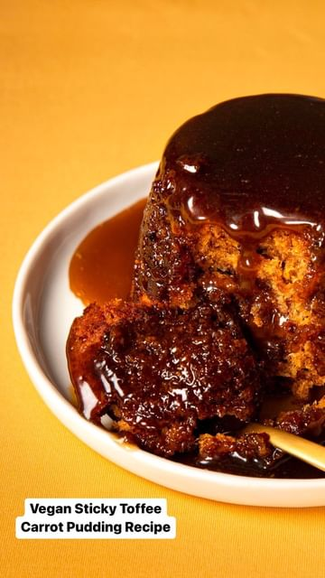

# The star of the show 🌟  

> recipe by [@allplants](https://www.instagram.com/allplants/) 
(allplants) - [see original post](https://instagram.com/p/CmeTAA1OTt2)

Impress your family & friends this festive season with our deliciously rich, Vegan Sticky Toffee Carrot Pudding recipe, here’s what you’ll need:
• 215g dates, pitted and chopped
• 200g plant based milk of your choice 
• 115g plant based butter
• 120g brown sugar 
• 200g plain flour
• 1 ½ tsp baking powder
• 1 tsp baking soda
• 2 carrots, grated 
• 80g pecans, chopped

& for the toffee sauce 👇🏻
• 75ml plant based cream
• 230g brown sugar
• 115g plant based butter
• ¼ tsp salt

No time on the big day? Tap the link in our bio to shop our delicious desserts 👆

\#allplants \#newpower \#vegan \#dessert \#vegandessert \#veganrecipe \#instafood \#stickytoffeepudding \#foodie \#explore 