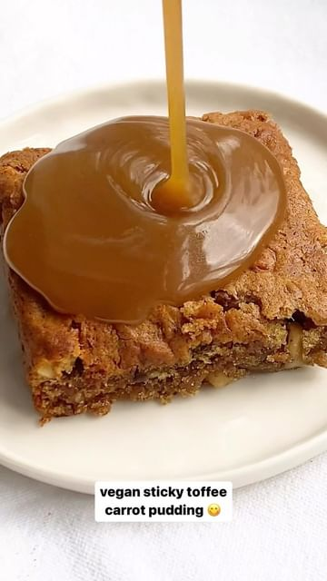

# There’s always room for dessert, especially on #StickyToffeePudding day 😋 

> recipe by [@allplants](https://www.instagram.com/allplants/) 
(allplants) - [see original post](https://instagram.com/p/CnwwmSbPsu0)

(p.s. this recipe even contributes to your 30 different plants a week, you’re already onto a winner!)  
  
Start your week with a plant based treat & try this delicious Sticky Toffee Carrot Pudding👇  
• 215g dates, pitted and chopped  
• 200g plant based milk of your choice  
• 115g plant based butter  
• 120g brown sugar  
• 200g plain flour  
• 1 ½ tsp baking powder  
• 1 tsp baking soda  
• 2 carrots, grated  
• 80g pecans, chopped  
  
& for the toffee sauce 😋  
• 75ml plant based cream  
• 230g brown sugar  
• 115g plant based butter  
• ¼ tsp salt  
  
Tap the link in our bio & head over to our Planted blog for the full recipe 🌱  
  
\#allplants \#newpower \#internationalstickytoffeepuddingday \#stickytoffeepudding \#vegandessert \#veganrecipe \#recipe \#instafood \#foodie \#explore   