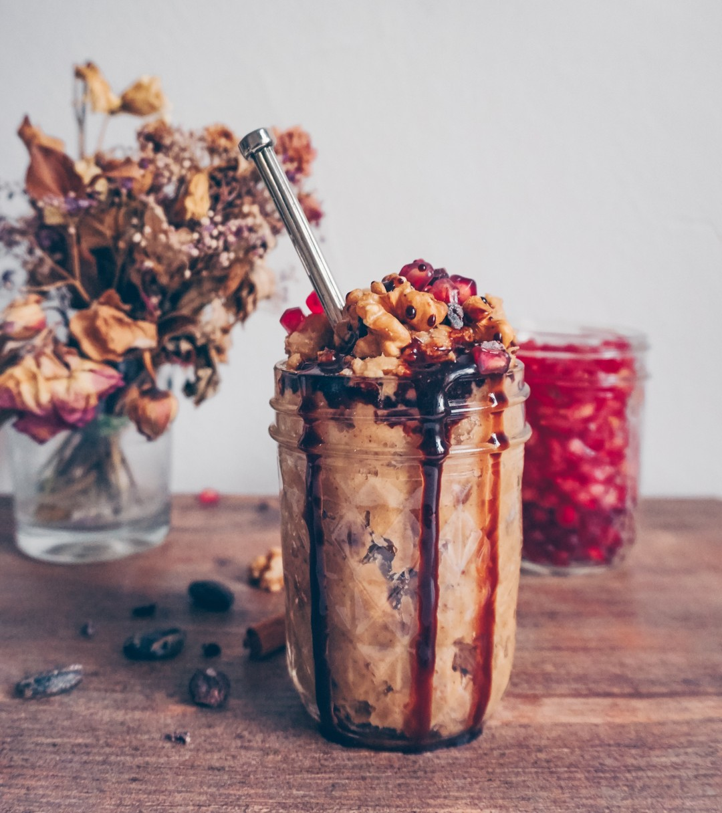

# Yeees guys we made it, it's weekend <3. What are your plans? I'll go to the Urban Fit days here in Berlin and guess what's waiting for me in the fridge when I'm back. It's yummy, easy, protein-rich and simple to make. You'll need 5 ingredients, 5 minutes, some love and my recipe which is on my Blog to make this:  

> recipe by [@annelinawaller](https://www.instagram.com/annelinawaller/) 
(Annelina - Plantbased Yogi) - [see original post](https://instagram.com/p/Bjy3jJTDf-y)

APPLE STRUDEL Cookie dough. It's the only one I'm making so far. Let me know your thoughts if you make it <3 Seeending love!   
\#postworkout \#cookiedough \#yum \#vegannoms   
\#beautifulcuisines \#feedfeed \#veganfoodshare \#glutenfree \#healthy \#plantbased \#vegan \#vegangermany \#foodie \#fitkitchen \#fitgirl \#yoga \#fitfood \#simplefood \#plantpower \#happyfood \#eattherainbow \#moodfood \#bestofvegan \#platter \#vegetables \#cookiedough   