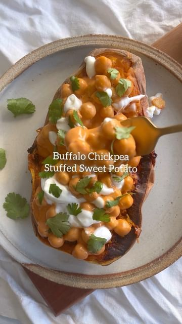

# Buffalo Chickpea Stuffed Sweet Potato 🍠  

> recipe by [@avocado_skillet](https://www.instagram.com/avocado_skillet/) 
(Kristi Roeder) - [see original post](https://instagram.com/p/CcVg8uzAISF)

  
This is one of my favorite recipes. The spicy and sweet combo is out of this world.   
INGREDIENTS  
  
This makes 2-3 servings depending on how hungry you are  
  
Sweet Potato  
  
1 medium or large sweet potato, cut in half long ways  
Chickpeas  
  
1 can chickpeas – drained  
1/2 tsp garlic powder  
1/2 tsp smoked paprika  
1/2 tsp cumin  
salt/pepper to taste  
Buffalo Sauce  
  
1/4 cup hot sauce  
1 tbsp culinary vinegar (ie apple cider vinegar)  
2 tbsp tahini or cashew butter  
1/2 tsp maple syrup  
1 tbsp soy sauce or aminos  
+ optional toppings: ranch, cilantro, scallions or vegan yogurt  
  
INSTRUCTIONS  
  
Preheat oven to 400 degrees.  
Place sweet potato halves face down on a sheet pan lined with parchment paper. Roast for 20 minutes.  
While sweet potato is cooking, toss chickpeas in spices and a light coating of oil. After the 20 minutes is up, add chickpeas to the sheet pan with the sweet potato. Roast for 25 more minutes.  
In a bowl, mix together all sauce ingredients. After the chickpeas are done roasting, toss them in the buffalo sauce.  
Let sweet potatoes cool for 5 minutes and then top with chickpeas. Add your favorite toppings and dig in.  
  
\#chickpea \#healthyveganfood \#vegandinner \#healthyrecipes \#plantbasedrecipes   