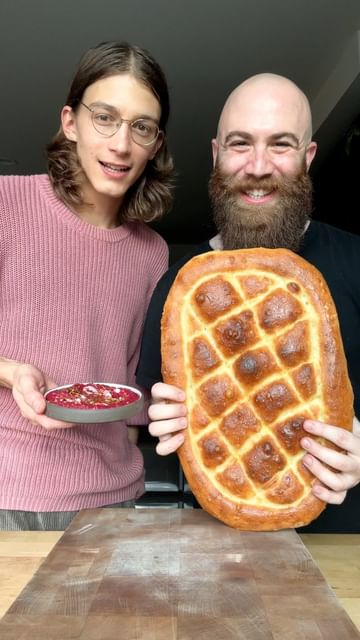

# Armenian Matnakash 🇦🇲 

> recipe by [@bengingi](https://www.instagram.com/bengingi/) 
(BenGingi | Baker) - [see original post](https://instagram.com/p/Cnzc-VusAuP)

  
Full recipe is on my website (link in bio💃🏽)  
  
Another beautiful creation by Pierce and I. This time we made an Armenian bread called Matnakash which is very similar in shape to Ramazan Pidesi (recipe for that will come out closer to Ramadan) and focaccia. It has a great thin crust and soft chewy crumb. We paired it with an amazing beet & labaneh cheese dip spiced with Calabrian chili paste. They go so well together. I encourage you guys to try this bread recipe as it is very simple easy going dough to make and super forgiving in shaping.  
  
YASSS!  
  
We are all BREAD!  
  
\#armenia \#armenian \#armenianbread \#bread \#baking \#fromscratch \#bakingfromscratch \#recipes \#easyrecipes \#dip   