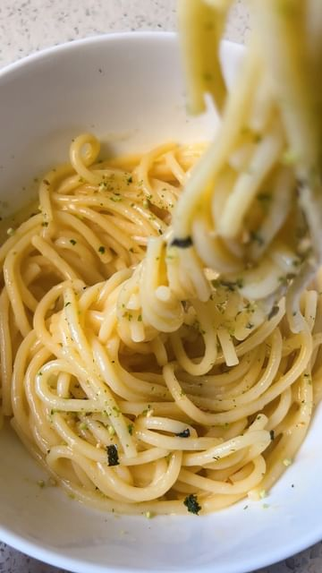

# MISO PASTA (@nytcooking)—> it’s like… so creamy🍝 cooking instructions are in the video, measurements + ingredients are listed below 

> recipe by [@brekkyattiffanys](https://www.instagram.com/brekkyattiffanys/) 
(tiff | san francisco) - [see original post](https://instagram.com/p/Cbd7h_ZAQBl)

   
• 2-3 servings spaghetti noods  
• 3 tbsp butter (i’m using kerrygold)  
• 1-2 tbsp of miso (i’m using 2)  
• 1/2 cup parmesan cheese  
• 1/2 cup pasta water  
• top with furikake (optional)  
   
\#misorecipes \#miso \#misosoup \#misopasta \#japanesefood \#japaneserecipe \#misoglazed \#easyrecipes \#asianrecipes \#asianfood \#asiancooking   