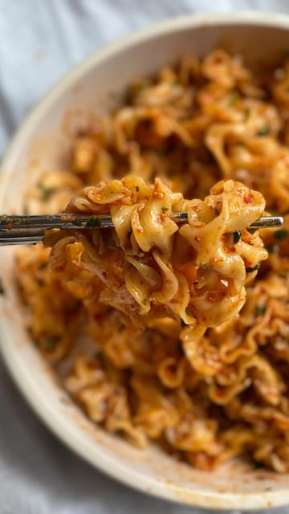

# cilantro lime chilli noodles 🌿🌶 yes please! it's also vegan with a gluten free option ✨ 

> recipe by [@browngirlvegan_](https://www.instagram.com/browngirlvegan_/) 
(Ramya | vegan recipes ✨) - [see original post](https://instagram.com/p/CcF1M-RDlg-)

\
This is another rendition of my peanut chilli noodles, but instead I wanted something that was zesty, tangy and spicy all at the same time. And let's just take a moment to appreciate knife cut noodles...the texture and taste is insane! you've got to try it 😍\
\
I used mild pepper chilli flakes but feel free to use any spice level you'd like! For a gluten free option, you can either you brown rice noodles or rice noodles. More \#dEATs below: \
\
Ingredients: \
1 packet of knife-cut noodles\
Handful of cilantro \
1 tbsp red pepper flakes (mild/hot) - i used gochugaru\
1 tbsp sesame oil \
1 tbsp soy sauce\
1/2 tbsp rice vinegar\
1/2 tbsp lime juice \
1 tsp maple syrup \
2 tsp noodle water\
Toasted sesame seeds (for topping)\
\
Directions: Boil knife cut noodles according to package instructions and rinse with cold water. Combine gochugaru with cilantro. Add heated sesame oil to the mixture. Add the rest of the ingredients and give it a good mix. Pour over noodles, mix and top with toasted sesame seeds. Heat it up gently, and it's ready to serve!\
\
\#vegan \#vegansg \#veganfood \#veganrecipes \#vegannoodles \#noodlerecipes \#noodlerecipe \#vegansofig \#vegansofinsta \#vegansofinstagram \#veganfoodshare \#veganshare \#veganshares \#kalesalad \#tofusalad \#plantbased \#plantbasedrecipes \#healthyfood \#healthyrecipes \#easyrecipes \#easymeals 