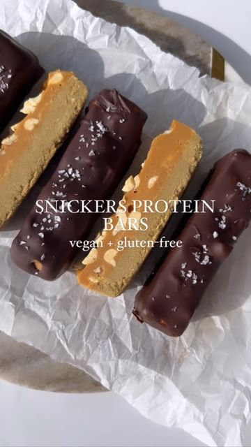

# SNICKERS PROTEIN BARS 🍫🥜  

> recipe by [@callascleaneats](https://www.instagram.com/callascleaneats/) 
(Calla Ramont) - [see original post](https://instagram.com/p/Capkh76JSem)

  
A higher protein, lower sugar, gluten-free, vegan version of the fave you grew up with and tbh, they taste even better 😏 makes 7 bars!   
  
Layer 1  
2/3 cup vanilla protein powder   
1/2 cup almond flour   
2 tbsp maple syrup   
6 tbsp non-dairy milk (start with less and add until you reach the consistency shown in the video because it will depend on your protein!)   
  
Layer 2   
1/2 cup peanut butter (or nut/seed butter of choice)   
2 tbsp coconut oil (melted)   
2 tbsp maple syrup  
Pinch salt   
1/3 cup peanuts (+ more for topping)   
  
Chocolate coating   
1.5 cups chocolate chips   
1.5 tbsp coconut oil   
  
1) add layer 1 ingredients to a bowl and mix well. Press into parchment paper-lined loaf pan and set in the freezer  
2) add layer 2 ingredients (except peanuts) to a bowl and mix well. Stir in peanuts and pour over layer 1. Add extra peanuts on top. Set in the freezer 1-2 hours   
3) melt chocolate and coconut oil over the stovetop or in 30 second intervals in the microwave (stir between each)   
4) remove bars from loaf pan and slice. Dip each bar into melted chocolate and place on a plate or tray. Top with sea salt. Set back in the freezer to harden and enjoy!   
.  
.  
.  
\#glutenfree \#glutenfreerecipes \#vegan \#veganrecipes \#vegandessert \#vegansnacks \#proteinbars \#snickers \#healthy \#healthyfood \#lowsugar \#healthydessert \#healthyrecipes \#easyrecipes \#cleaneating \#chocolatelover \#fitness \#postworkout \#dairyfree \#snackideas \#snickersbar \#healthierme \#nobake \#candybar   