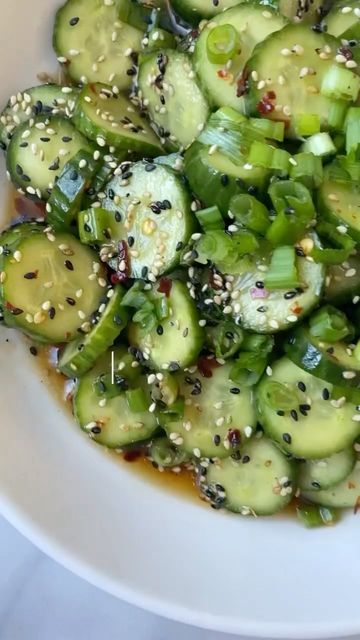

# refreshing ASIAN CUCUMBER SALAD!🥒🥗 a very versatile side to any meal! but seriously, so delish- I could gulp this on its own. Inspired by traditional Korean and Japanese cucumber salads- you’re going to love this spin on the simple vinaigrette! Grab the deets below👇🏼 

> recipe by [@caloriechat](https://www.instagram.com/caloriechat/) 
(Caloriechat🍴) - [see original post](https://instagram.com/p/CZGPY4GlrPw)

\
Credit: @thedishonhealthy 💚\
\
~6 mini cucumbers or Persian cucumbers, sliced \
1/2 teaspoon sea salt\
3 Tbsp rice wine vinegar\
1 Tbsp sesame oil\
1.5 Tbsp tamari or soy sauce\
1 Tbsp honey\
1/4 cup of green chives, chopped \
~1/4 tsp red pepper flakes\
~1/2 Tbsp sesame seeds\
\
Instructions 🌟🌟🌟🌟🌟\
Slice cucumbers; traditionally they’re sliced very thinly- but I like mine with a bit of thickness and crunch. Sprinkle them with sea salt and toss. \
\
KEY STEP: let cucumbers sit with the salt for ~15 mins and they’ll release their excess moisture. Press down and squeeze any excess water into the sink. This is the best tip- as the dressing/vinaigrette won’t get watered down. Add: vinegar, sesame oil, soy or tamari, honey, red pepper flakes, sesame seeds and chives. Toss well to coat. I top mine with a few more chives and sesame seeds for the win! You can also add 2 crushed garlic cloves and a teaspoon of gochujang paste. Enjoy every bite!\
.\
.\
\#vegetarianfood \#saladlove \#salad \#vegetarian \#recipes \#cucumbers \#cucumbersalad \#vegetarianrecipes \#healthyrecipes \#recipes \#healthysides 