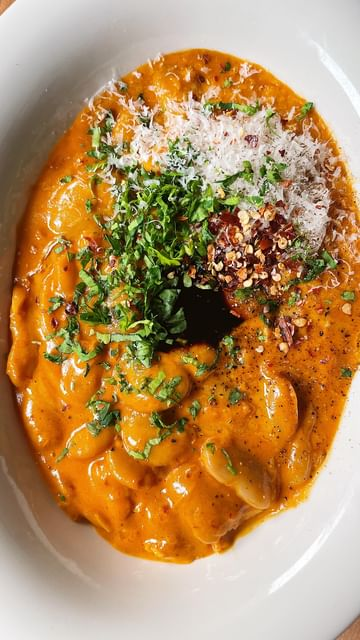

# BEANS ALLA VODKA, just like penne alla vodka, but beans - creamy butter beans coated in a silky, spicy vodka sauce served with garlic-rubbed toast, a 20-minute dinner that feels like a hug in a bowl. Find the full recipe in the link in my bio  

> recipe by [@carolinagelen](https://www.instagram.com/carolinagelen/) 
(Carolina Gelen) - [see original post](https://instagram.com/p/CnFp3mSLe6k)

  
\#penneallavodka \#vodkasauce \#beans \#butterbeans \#quickdinner \#vegetarianrecipes \#cookingvideo \#food \#comfortfood \#easyrecipes  
  
1 shallot, finely chopped  
1 heaping tablespoon tomato paste  
4 garlic cloves, thinly sliced  
1/2 teaspoon chile flakes, plus more to taste  
A splash of vodka, can be substituted with water  
1/2 cup heavy cream, can be substituted with full-fat coconut milk  
1/2 cup water  
1 x 15 oz (500 g) can butter beans, drained and rinsed  
1/4 cup freshly grated Parmigiano Reggiano, plus more for topping  
A knob of butter, optional  
Kosher salt and pepper  
Extra-virgin olive oil  
Fresh parsley and balsamic vinegar for topping  
  
1. Add a glug (about 3 tablespoons) of olive oil to a pan on medium heat. Add the finely chopped shallot and cook for about 3 minutes, or until softened and translucent. Add the heaping tablespoon of tomato paste. Mix it with the shallot and cook for 3 to 4 minutes mixing occasionally, or until fragrant and darker in color (you’re looking for a dark-ish red). Reduce the heat to medium low and add more olive oil if needed. Add the garlic, chile flakes and cook for 1 minute, until softened and fragrant. Carefully add a splash of vodka or water to the pan, and mix.  
  
2. Pour in the heavy cream (or coconut milk) and mix to combine. Bring to a boil and cook for 2 minutes. Add the water, beans and mix until combined. Simmer everything until the sauce looks smooth and glossy, for about  2 to 3 minutes. Add more water until the sauce reaches your desired consistency.  
Add the freshly grated cheese, a knob of butter and season everything with salt and pepper to taste.  
  
3. Serve right away with a drizzle of good-quality olive oil on top, freshly grated Parm, chile flakes, parsley and balsamic vinegar. Serve with garlic-rubbed toast on the side.   