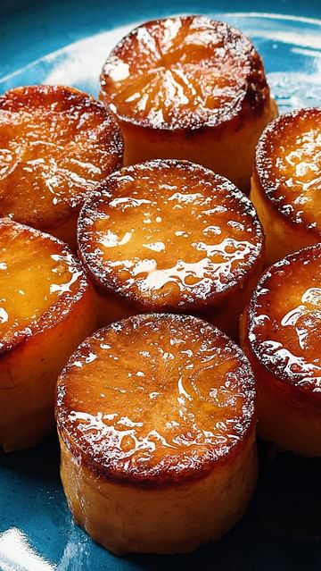

# follow @carolinagelen for more recipes  

> recipe by [@carolinagelen](https://www.instagram.com/carolinagelen/) 
(Carolina Gelen) - [see original post](https://instagram.com/p/Cq1QgWyPGOz)

  
FONDANT POTATOES or MELTING POTATOES - tender, custardy potatoes seared in butter and cooked in stock, they’re so flavorful and jammy, they melt in your mouth   
  
Ingredients (makes 12 to 18 potato rounds)  
  
6 medium Russet or Yukon Gold potatoes  
Neutral oil for frying, such as avocado, grapeseed oil, etc.   
4 tablespoons butter, vegan butter works as well  
2/3 cup stock, such as vegetable, chicken, beef etc.   
1 head of garlic, cut in half crosswise  
3 rosemary sprigs   
Kosher salt   
  
Instructions   
  
1. Slice the potatoes into 2 or 3 round pieces. Evenly cut the rounds using a 2-inch (5 cm) cookie cutter, making sure they’re the same hight. Trim excess height with a knife. Store potatoes under cold water. Save potato scraps for hashbrowns, roasted potatoes or mashed potatoes.   
  
2. In an oven proof skillet over medium heat, add a 2 to 3 tablespoons of neutral oil. Dry the potatoes using a kitchen or paper towel. Season with salt. Sear the potato rounds on 3 to 4 minutes, or until they developed a golden brown crust.   
  
3. Carefully add the butter, garlic, cut side down, and rosemary to the pan and baste the potatoes (spoon hot butter over them). Remove the pan from the heat until cooler (if you’d add the stock right now, it would splash everywhere).   
  
4. Heat the oven to 400°F (205°C).   
  
5. Carefully pour the stock over the potatoes and bring to a simmer, over medium heat. Once they come to simmer, place the pan in the oven. Cook for 20 to 30 minutes, or until most (about 70%) of the liquid in the pan has been reduced and the potatoes at fork tender (a fork can easily poke through them).   
  
6. Check the potatoes halfway through to make sure they’re not browning too fast on top. If they’re browning too fast, cover with a sheet of aluminum foil (no need to wrap around the pan, just loosely cover the potatoes).   
  
7. Once cooked, carefully squeeze out the garlic in the sauce, season with more salt if needed and serve right away.   
  
\#potatoes \#potato \#cooking \#food   