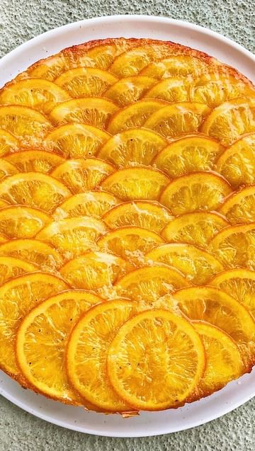

# ORANGE CARDAMOM OLIVE OIL CAKE - this upside down cake olive oil is the best dessert you’ll make all season, perfect for Hanukkah, the holidays, or the New Years Eve, it’s so delicious, festive, yet easy to make.  

> recipe by [@carolinagelen](https://www.instagram.com/carolinagelen/) 
(Carolina Gelen) - [see original post](https://instagram.com/p/CmCxM0CrBaA)

  
I developed this recipe over a year ago and it hasn’t stopped receiving love from you ever since. It’s been such an honor seeing you make this recipe, so I decided to give it a little upgrade technique-wise.   
  
I created step by step guides to help you visualize the process a little better. The recipe remains pretty much the same, but I redesigned it to fit a bigger pan (as per your request).  
  
Can’t wait to see all the new versions of this well-loved dessert. Check out the link in my bio to get the recipe from my website.   
  
\#baking \#oliveoilcake \#oliveoil \#cake \#orange \#orangecake \#upsidedown \#dessert \#holidayrecipes \#hanukkah \#asmr \#cookingvideo   