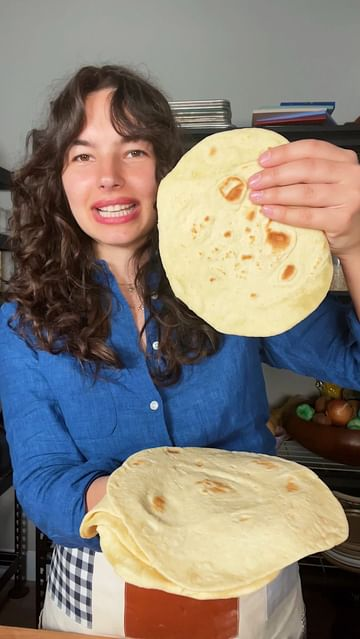

# follow @carolinagelen for more recipes  

> recipe by [@carolinagelen](https://www.instagram.com/carolinagelen/) 
(Carolina Gelen) - [see original post](https://instagram.com/p/CspdiX7uAOX)

  
HOMEMADE FLOUR TORTILLAS - all you need is 5 ingredients to make flour tortillas at home that are so much better than the ones you can buy at a store   
  
2 ¼ cups (280 g) all-purpose flour, plus more for dusting  
½ teaspoon (3 g) baking powder  
2 teaspoons (7 g) Diamond crystal kosher salt  
3 tablespoons (24 g) oil   
¾ cup (150 g) warm water  
   
In a bowl, mix the flour (to measure the flour, whisk in the flour container with a dry whisk to aerate the flour), the baking powder, the salt and the oil. Add the warm water and mix using a fork or Dutch whisk until the dough looks shaggy and feels sticky to the touch. Dust your work surface with a little bit more flour and place the dough in the middle. Knead the dough until smooth, for 2 to 3 minutes. Place the dough back in the bowl and rest for 10 to 15 minutes, covered.  
   
Divide the dough into eight equal pieces. Shape each piece into a ball by rolling it with your hand against the work surface. Cover the dough balls with a clean kitchen towel while preheating the pan: place a cast-iron skillet over medium heat, and heat for 4 to 5 minutes or until smoking.  
   
Roll each ball of dough into an 8 to 9 inch circle, aim for thin tortilla, and dust your work surface with flower as needed. Cook the tortilla in the skillet for 10 to 20 seconds on each side, and flip once the tortilla is very bubbly on top.   
   
Place a damp towel on a plate. Place to cook tortilla in the middle and wrap the towel around it. Cook and stack the remaining tortillas on top. The towel will keep them nice and soft.  
  
Store the tortillas in a ziplock bag, in the fridge for up to a week.   
  
\#tortilla \#tortillas \#cooking \#food   