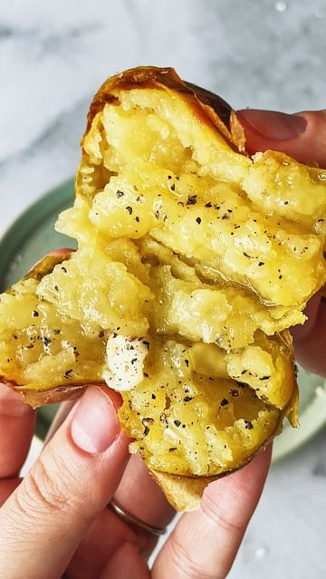

# SALT BAKED POTATOES - the butteriest, creamiest potatoes you’ll ever try. 

> recipe by [@carolinagelen](https://www.instagram.com/carolinagelen/) 
(Carolina Gelen) - [see original post](https://instagram.com/p/Cc3ToNauzaF)

You know how baked potatoes can turn really dry? All the moisture’s gone and you’re left with this crumbly, dry, potato fluff? These salt baked potatoes are the opposite of that!

You’ve probably seen this cooking technique applied to fish or meat, but it works great with potatoes too (or other root vegetables). You’re essentially creating a tight salt oven that traps in all the moisture, concentrating the flavor of the potatoes, and leading them to the creamiest texture possible. 

It might not be an everyday recipe, but it’s the perfect go-to recipe for a dinner party center piece. Imagine bringing this to your guests and cracking it in front of them, c’monnn

Reuse the salt for the same purpose, for up to 1 week (if using egg white) rehydrating it as needed. After that, use it as a scrub for pots and pans or as a pie weight.

Ingredients (2 servings)
1.5 lb (700 grams) petite gold potatoes, or another small waxy potato type
4-5 cups (2 to 2 1/2 lbs) kosher salt (don’t use Diamond Crystal salt, buy a cheaper one, just for this)
3-4 egg whites OR 1/2 cup water OR 1/2 cup aquafaba, plus more as needed (you’ll need more!)
Fresh herbs

Instructions 

1. Combine the salt, herbs, and egg whites (or water, or aquafaba). Mix until it reaches the texture of wet sand. Add more water, aquafaba or egg whites if necessary. 

2. Heat the oven at 400°F or 205°C. 

3. Evenly spread 1/3 of the mixture on a skillet, cake pan, or baking sheet. Pat it down using your hands.

4. Place the potatoes over the salt, then cover with the remaining 2/3 of the mixture. Tightly pack the salt using your hands, covering all potatoes.

5. Bake the potatoes for 1 hour in the oven, or until the salt look light brown and it’s hard to the touch. 

6. Knock the salt off the potatoes using a meat pounder, rolling pin, or any other tool. 

7. Serve the potatoes right away.

\#potato \#potatoes \#newpotatoes \#potatochips \#bakedpotato \#bakedpotatoes \#saltbaked \#baking \#potatobake \#pommes \#pommesdeterre \#dinnerparty \#dinnerpartyideas \#asmr \#asmrfood \#asmrsounds \#cookingvideos \#cookingvideo \#vegan \#veganrecipes \#sidedish \#summerfood 