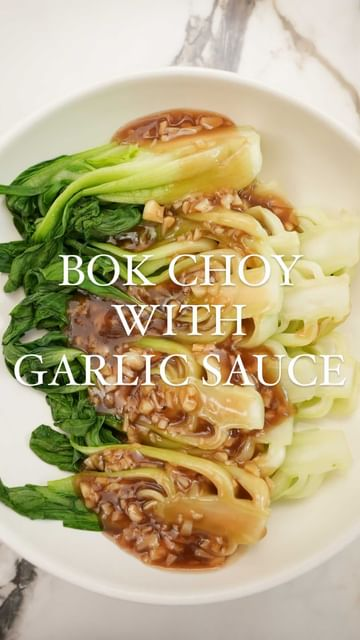

# Bok Choy is one of my favorite vegetables and this Bok Choy with Garlic Sauce is inspired by the multitude of Chinese banquet restaurants my family and I would eat at together. The bok choy is crisp, tender and SO good with that savory garlic sauce. It’s a quick and easy side dish that pairs well with so many amazing dishes. I hope you enjoy!  #cjeatsrecipes 

> recipe by [@cj.eats_](https://www.instagram.com/cj.eats_/) 
(CJ | Easy Recipes by Chris Joe) - [see original post](https://instagram.com/p/CbvWOaylTSA)

  
The full written recipe with all my tips is up on the blog now - link in bio! Or at https://www.cjeatsrecipes.com/post/bok-choy-with-garlic-sauce  
  
\#bokchoy \#chinesefood \#vegetables \#easyrecipes \#chinesetakout   