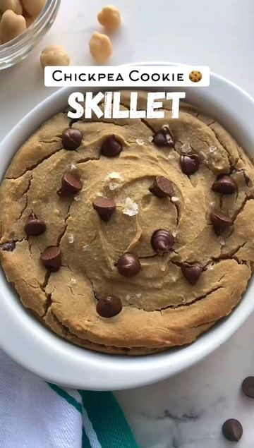

# 🌱🍪🎉Chickpea Cookie Skillet!! by @that.veganbabe  

> recipe by [@cleaneatguide](https://www.instagram.com/cleaneatguide/) 
(Clean Eating Guide) - [see original post](https://instagram.com/p/CauSKiljUlA)

👌The perfect healthier dessert option with only 8 simple ingredients! The dough can also be eaten raw! 🤤 

🔖 Save this recipe for your midnight snack! 😉 

✨INGREDIENTS✨
1 cup cooked chickpeas
3 tbsp peanut butter
1/4 cup maple syrup
1.5 tsp vanilla
1/4 tsp baking powder
1/4 tsp baking soda
2 tbsp vegan chocolate chips
Flakey salt for topping 

😋 Blend your chickpeas, peanut butter, maple syrup & vanilla until smooth. 

💜Add in your baking powder & soda and blend for 20-30 seconds. 

🧊 If your cookie dough is warm let it cool for 5 minutes in the freezer, otherwise the chocolate chips will melt. 

🍫 Mix in your chocolate chips & place into a greased skillet. Top with more chocolate & flakey salt. 

🔥 Bake @350f for 15 minutes until the top is golden 

🍦Top with vegan ice cream & enjoy!!

.
.
.
.
.
.
.
.
.
\#eatwellfeelwell \#eatwholefoods \#eatwithme \#eatwhatyoulove \#eatwelllivewell \#eatwellbewell \#healthyrecipes \#healthyrecipe \#healthyfoodie \#healthyfoodrecipes \#healthyfoodideas \#healthyfoodblog \#healthyfoodlover \#healthyfoodchoicebycherith 