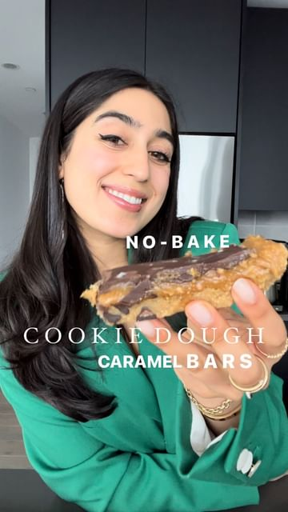

# THE BEST NO-BAKE DESSERT… 

> recipe by [@dadaeats](https://www.instagram.com/dadaeats/) 
(Samah Dada) - [see original post](https://instagram.com/p/CgxDi-vFyPj)

@dadaeats NO-BAKE SALTED CARAMEL COOKIE DOUGH BARS (vegan, gluten-free)! 🥹✨  
  
Follow @dadaeats for more 🤝  
  
I am OBSESSED. I make a lot of no-bake desserts but this one might be my new favorite…and they’re SO easy to make!  
  
you’ve got a chewy cookie dough base, a luscious vegan salted caramel, topped off with some chocolate and sea salt. Pop it in the fridge and you’ve got the most INSANE (oven-less) dessert at the ready! Tag me when you make it - enjoy! ✨❄️  
  
INGREDIENTS  
  
COOKIE DOUGH  
3/4 cup creamy peanut butter (sub favorite nut/seed butter)  
1/4 cup maple syrup  
1 tsp vanilla extract  
3/4 cup almond flour  
Chocolate chips (I measure with my soul, but I guess about 1/2 cup)  
  
SALTED CARAMEL  
1/2 cup peanut butter  
1/4 cup maple syrup  
Pinch salt  
  
CHOCOLATE  
1/2 cup chocolate chips  
1/2 tbsp coconut oil  
Flaky salt to top  
  
Line a 9x5 loaf pan with parchment paper. In a medium bowl, combine all of the cookie dough ingredients. Press down into the loaf pan using your hands until evenly packed & distributed. Place in fridge to set while you make the caramel. In a separate medium bowl, mix together the ingredients for the salted caramel. Remove the cookie dough layer from fridge and add the caramel. Use a spoon to ensure it’s evenly distributed. Place in fridge to set for 15 minutes. Melt the chocolate chips and coconut oil together in your microwave in 15 second increments, stirring between intervals until completely glossy and smooth. Pour melted chocolate on top of the caramel and smooth until even. Add flaky salt on top and place back into the fridge for about 30 minutes to set or until the chocolate has hardened. Slice into bars and enjoy immediately!  
  
\#dadaeats \#nobake \#nobakedessert \#cookiedough \#chocolate \#hack \#veganrecipes \#easyrecipe \#cookinghacks \#cookingvideos \#healthyfood \#holisticnutrition \#holistichealth \#aestheticfood   