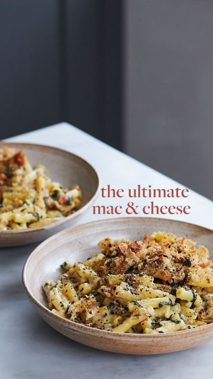

# ingredients 

> recipe by [@deliciouslyella](https://www.instagram.com/deliciouslyella/) 
(Deliciously Ella) - [see original post](https://instagram.com/p/CauGqSWDT_P)

- 400g macaroni pasta  
- 400ml almond milk  
- 2 large handfuls spinach, roughly chopped  
- 50g nutritional yeast, plus 1 tablespoon for the topping  
- 50g tapioca flour  
- 2 tablespoons of Dijon mustard  
- juice of 1 lemon  
- 2 slices of good-quality sourdough bread  
- Pinch of salt  
- Drizzle of olive oil  
- 1 clove of garlic  
- Lot of black pepper   
  
method  
1. Preheat the oven to 200C (390F), grill setting.  
  
2. Cook the macaroni pasta according to the instructions on the pack, adding the chopped spinach in the last minute. Once cooked, drain and leave to one side until needed.  
  
3. Make the white sauce by placing the tapioca flour, lemon juice, nutritional yeast, mustard, almond milk and a pinch of salt into a pan over a medium heat. Cook until the mixture begins to bubble, continuously whisking to ensure the mixture stays smooth and doesn’t form any lumps. You may want to add a dash more almond milk if the sauce ever becomes too thick.  
  
4. Once the sauce comes together and is piping hot, stir the pasta through the sauce, grate in the garlic, season to taste and spoon into a baking dish.  
  
5. Make the topping by placing the bread and 1 tablespoon of nutritional yeast into a food processor and blending until it reaches a bread crumb like consistency.  
  
6. Scatter the breadcrumb mixture over the top of the macaroni and cook in the oven for 5-10 minutes until the top turns golden.   