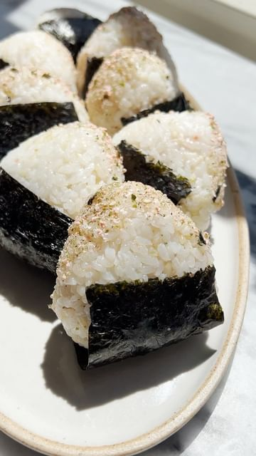

# Spicy Salmon Onigiri 🍙 my favorite thing to make with leftover salmon! I love to take these on hikes or on a strenuous walk to the backyard for a sunny lunch/snack break. 

> recipe by [@eatchofood](https://www.instagram.com/eatchofood/) 
(Kristina Cho) - [see original post](https://instagram.com/p/CgPqEfPO0gy)

  
Freestyle with this recipe however you want, use leftovers and give them a second rice ball life.  
  
If you’re making salmon specifically for these, brush an 8oz filet of salmon with a mixture of 2 tbsp sriracha, 1 tbsp hoisin, 2 tsp honey, 1 tsp sesame oil, 1/2 tsp salt, and 1/4 tsp white pepper. Broil for about 12 minutes! I added another squirt of sriracha and some kewpie for the filling too!   