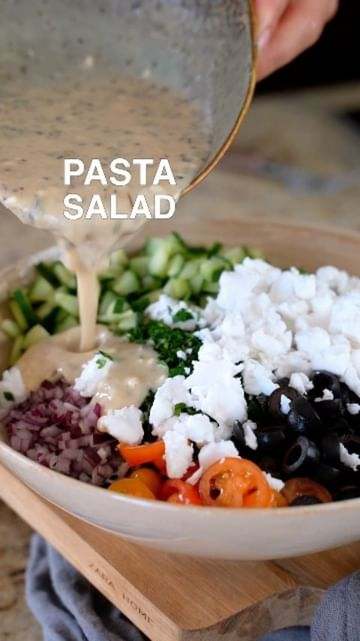

# Pasta Salad🥬 The dressing and feta cheese makes this salad!! I will be making this every week from now on🤤 by @eatmoreplants.no  

> recipe by [@eatinghealthyfeed](https://www.instagram.com/eatinghealthyfeed/) 
(Eating Healthy) - [see original post](https://instagram.com/p/CcGK4ORDqsZ)

\
Ingredients (4 servings)\
170g dry pasta of choice\
1 cucumber\
1 cup cherry tomatoes\
0.5 cup olives\
1/2 cup fresh cilantro\
1/2 cup diced red onion\
3 cloves garlic, minced\
1/2 cup vegan feta (I used @vivolife) \
\
Dressing: \
2 tbsp olive oil\
2 tbsp water\
3 tbsp tahini\
2 garlic cloves\
2 tbsp lemon juice\
2 tbsp white wine vinegar\
1 tsp maple syrup\
1 tsp oregano\
1 tsp basil\
0.5 tsp salt\
Salt & pepper to taste \
\
Instructions:\
1. Cook your pasta according to package instructions.\
2. Chop up all the veggies.\
3. Mix the ingredients for the dressing in a small bowl.\
4. Assemble your salad and enjoy!
\
1 Serving: cal : 383/ Protein: 10g/ Carbs: 37g/ Fat: 20g\
\
.\
.\
.\
.\
.\
.\
.\
.\
.\
.\
.\
\#mealprep \#healthyfoodvideos\
\#healthyfood \#foodprep\
\#healthyeating \#eatright\
\#mealpreppin \#mealprepmonday\
\#healthyfoodporn \#mealprepsunday\
\#mealpreplife \#sundaymealprep\
\#mealprepideas \#mealplanning\
\#mealplans 