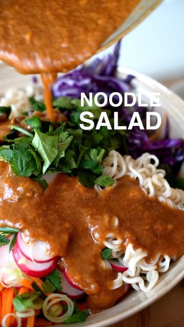

# Noodle Salad🥗 With a peanut butter, garlic and ginger dressing. It’s a good combo! 

> recipe by [@eatmoreplants.no](https://www.instagram.com/eatmoreplants.no/) 
(Jenny | eatmoreplants) - [see original post](https://instagram.com/p/CahuD23KX6c)

Ingredients (2-3 servings)
Salad:
185g noodles
1 large carrot
5 radishes
0.25 red cabbage head
0.5 cup fresh cilantro
2 green onions

Dressing:
2 tbsp peanut butter
1 tbsp sesame oil
1 tbsp agave or maple syrup
1 tbsp sriracha
2 tbsp rice vinegar
4 tbsp soy sauce
1 garlic clove
1 tsp ginger

Instructions
1. Cook the noodles according to package instructions. Rinse in cold water and set aside.
2. Chop the carrot and red cabbage into thin sticks. Thinly slice the radishes, and green onions.
3. Mince the ginger and garlic. Make the dressing by mixing all the ingredients in a small bowl.
4. Now add the noodles and veggies to a big bowl and pour the dressing over the salad. Mix well, and enjoy!

\#salad \#salads \#noodles \#plantbaseddiet \#peanutbutter 