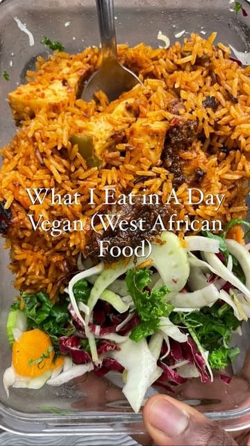

# What I eat in a day as a vegan who enjoys food from across West African. I love making recipes from across this part of Africa so they form the bulk of the food I eat  

> recipe by [@eatwithafia](https://www.instagram.com/eatwithafia/) 
(AfiaAA) - [see original post](https://instagram.com/p/CnFmTx8O5Nm)

  
Breakfast: Fonuo porridge with cabbage, suya mushrooms, @justegg and @gardien breakfast sausages. The recipe for the fonio porridge is already on my blog. My homemade suya mix is available through my ebook (all the links are in my bio)  
  
Lunch: jollof rice, @thefirstmess garlicky winter crunch salad, baked tofu and vegan shitɔ. I have two jollof rice recipes on my blog as well as the recipe for the vegan shitɔ  
  
Dinner; okra stew and ɛwɔkplɛ. The full recipe for the okra stew is on the first page of my blog. Again link in bio   
  
For those who will ask, the multivitamin I take is @ritual. It’s great because it’s vegan and is traceable but the mint flavour is not my favourite.   