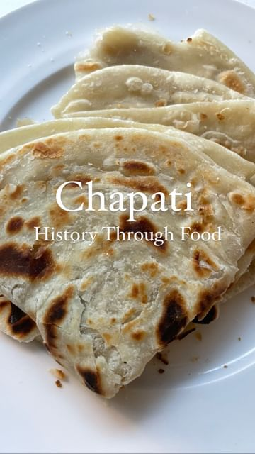

# Recipe below! 

> recipe by [@eatwithafia](https://www.instagram.com/eatwithafia/) 
(Afia (previously thecanadianafrican)) - [see original post](https://instagram.com/p/Ck07pVsN6pl)

  
Food is the canvas in which we tell history and stories   
  
The Indian Ocean has, for centuries, been a vibrant route for trade whether you are talking about the Swahili coast, right down to Madagascar, the islands found around the Indian Ocean and even the Indian subcontinent. Through sea routes, food, culture and language were shared. Colonialism disrupted this trade system but out of people resilience, we get different cuisine that still told the stories of diverse peoples. Chapati has found a it’s way to different parts of the world because of colonialism but it tells the story of resilence of indentured Indian labourers who left their home to far away lands. I only experienced this in Tanzania but I know the stories are vastly different depending on where you are in east Africa let alone places with large Indian populations  
  
Recipe — there are so many recipes on YouTube so please also look to see what the variations are like   
210g/ 1.5 cups flour   
5g/ 1 tsp salt   
3g/ 1 tsp sugar  
25g/ 2 tbsp oil  
100g/ 0.5cups lukewarm water   
  
Mix all the ingredients together   
Let the dough rest for an hour  
Divide the dough into three  
Roll each dough out thin, brush oil on top, sprinkle some flour then roll it up. Roll the log on itself till you get a spiral   
Repeat for all three balls and let rest  
Roll each ball out thin but not too thin  
Heat a non stick pan to medium heat and put the chapati in. Wait till it starts to puff up then flip  
Wait another 2 mins then add about 2 tsp oil to the pan. Flip the chapati and let it cook for another minute or two. Add another tsp of oil and flip. It’s like you are frying the chapati in oil.   
Once both sides are nice and brown, it’s ready, remove and repeat with the rest of the chapati   