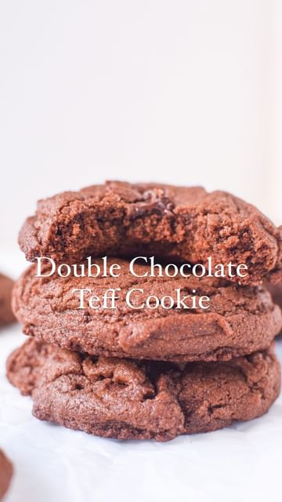

# Make your chocolate dessert taste more chocolatey with this secret ingredient 

> recipe by [@eatwithafia](https://www.instagram.com/eatwithafia/) 
(Afia (previously thecanadianafrican)) - [see original post](https://instagram.com/p/Ck6ORfGJklB)

Teff is an ancient grain indigenous to the Horn of Africa (most point specifically to present day Ethiopia and Eritrea) it has a deep earthy flavour, similar to whole wheat. It is also the smallest grain in the world! Like most ancient grains from the African continent it is packed with nutrients and holds a lot of significance to the people who eat it.

This double chocolate cookies is such a great representation of the complexity of teff. The full recipe is on my blog! 