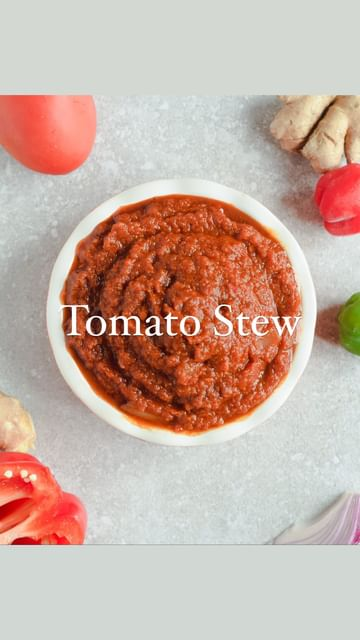

# ‼️The most important recipe to master for Ghanaian cooking‼️ 

> recipe by [@eatwithafia](https://www.instagram.com/eatwithafia/) 
(Afia (previously thecanadianafrican)) - [see original post](https://instagram.com/p/CkYgGwsJmyN)

\
This week I am sharing some of my favourite recipes from my ebook and why not start with a foundational recipe. Tomato stew forms the base for many Ghanaian dishes with slight variations giving you up to 5 different sauces. Getting it right might mean the difference between bland jollof and exceptional jollof. So it was only natural for me to include this in my ebook \
\
‼️most importantly‼️ \
\
You do not need ANY specialty ingredients. A delicious tomato stew can be made with ingredients found in any grocery store with onions, tomatoes, ginger, garlic and basic spices forming the basis of this dish \
\
The full recipe is in my ebook! 