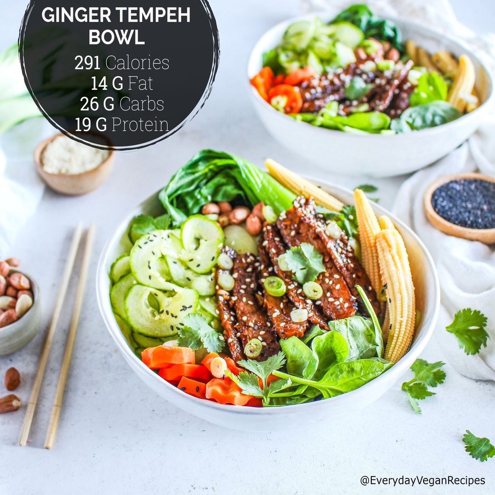

# Ginger #Tempeh Bowl! 🥒😍 Add rice or quinoa and a sauce of your choice, to turn this into a buddha bowl if you'd like.😋 Or keep it as is, for a light lunch! 🌿 Or, you could add more greens instead and turn this into a salad with a dressing of your choice. (Even just kale massaged with lemon juice and mixed with avocado would be amazing!) ⠀ 

> recipe by [@everyday.vegan.food](https://www.instagram.com/everyday.vegan.food/) 
(Everyday Vegan Food) - [see original post](https://instagram.com/p/BpPceYPFYdz)

The recipe:⠀
Ginger Tempeh:⠀
1/2 block tempeh (4oz/113g) ⠀
1/4 cup (60ml/2oz) Coconut Aminos⠀
1 tsp (5ml) Chili Garlic Sauce⠀
1/2 tsp (2g) Sesame Oil⠀
2 tsp (5g) Freshly minced Ginger⠀
1 tsp (3g) Freshly minced Garlic⠀
.⠀
Other Ingredients:⠀
245g bok choy⠀
128g baby sweet corn⠀
154g sliced or spiralized cucumber⠀
110g sliced carrots⠀
34g spinach⠀
10g sliced green onions⠀
25g peanuts (Optional)⠀
⠀
⠀
For the tempeh:⠀
1. Slice the half tempeh block in thin slices lengthwise.⠀
2. In a small bowl, combine the tempeh slices and the coconut aminos, chili garlic sauce, sesame oil, ginger and garlic. Mix to coat the tempeh well. ⠀
3. Heat a pan on medium-low heat, add the tempeh and the rest of the marinade to the pan. Cook until the tempeh is caramelized on both sides. About 10-15 minutes.⠀
Other Ingredients:⠀
1. Lightly steam the carrots (3-4 minutes), as well as the bok choy (1 minute).⠀
2. Assemble the bowls with the cooked tempeh and veggies and serve.⠀ 