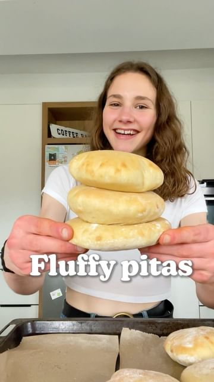

# PUFFY PITA 🥙 Perfect for dipping into tzatziki! 😋 

> recipe by [@fitgreenmind](https://www.instagram.com/fitgreenmind/) 
(Maya // vegan recipes) - [see original post](https://instagram.com/p/Cb5pVhKq8n-)

  
Those pitas are so easy to make and you can use them as a pocket for various filling or simply for dipping into delicious dips (I recommend this tzatziki 😉).   
Btw you can also use wohlegrain flour. 👍 
Much love  
Maya ✨  
RECIPE (6 pitas each 217cal/6P/38C/3F):  
Pita:  
-2 1/3 cup (335g) flour  
-1 Tbsp salt  
-3/4 cup + 1 Tbsp (205ml) lukewarm water  
-1 Tbso Instant yeast  
-1 Tbsp sugar  
-1 Tbsp olive oil  
MIX water, sugar and yeast/KNEAD in flour, salt and oil until it’s a soft dough/LET it REST 1-2h/SHAPE the dough into 6 discs/REST 30mins/BAKE at 250C/480F for 4-5mins until fluffy  
Tzatziki:  
-1/2 cucumber (grated and squeezed)  
-half a bunch parsley and dill, chopped  
-2 cloves garlic, minced  
-1/2 cup (150g) vegan yogurt  
-a glug of olive oil  
-1/2 lemon, juiced  
-salt and pepper to taste  
MIX  
-  
FLUFFIGE PITA 🥙 Perfekt zum Dippen in Tzatziki! 😋  
  
Diese Pitas sind so einfach zu machen und eignen sich perfekt zum Füllen oder einfach zum Dippen.☺️  
Übrigens kannst du auch Vollkornmehl verwenden. 👍 
Alles liebe   
Maya ✨  
REZEPT (6 Pitas je 217kcal/6P/38K/3F):  
Pita:  
-335g Mehl  
-1 El Salz  
-205ml lauwarmes Wasser   
-1 Päckchen Trockenhefe   
-1 El Zucker  
-1 El Öl  
MIXE Wasser, Hefe und Zucker/VERKNETE es mit Mehl, Salz und Öl zu einem weichen Teig/LASSE ihn 1-2h gehen/MACHE aus dem Teig 6 Fladen/30min gehen lassen/BACKE sie bei 250Grad für 4-5min fluffig   
Tzatziki:  
-1/2 Gurke (geraspelt und ausgedrückt)  
-ein halbes Bund Dill und Petersilie, gehackt  
-ein Schuss Olivenöl   
-Saft einer halben Zitrone   
-Salz und Pfeffer nach Geschmack   
-150g veganer Joghurt  
-2 Zehen Knoblauch, gehackt   
MISCHEN  
\#makeitmaya   