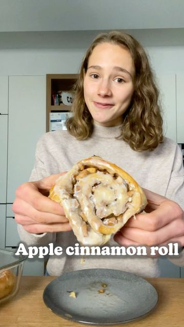

# APPLE CINNAMON ROLLS 🍎🥰 The taste of winter…😋 

> recipe by [@fitgreenmind](https://www.instagram.com/fitgreenmind/) 
(Maya // vegan recipes) - [see original post](https://instagram.com/p/CV_RjQfqg4_)

Those cinnamon rolls are PHENOMENAL! 
They’re soo soft, fluffy and gooey with the perfect cinnamon flavour and those lovely apple pieces! 😍
An absolute Must-try, especially now that it’s getting colder…❄️

Ad 💙 I’ve added a scoop Smacktastic by @rockanutrition to the frosting for a vanilla flavour, but it’s optional.
Much love
Maya✨
RECIPE (12 rolls each 265cal/4P/46C/5F):
Dough:
-1 cup (250ml) lukewarm plant milk
-2 1/4 Tsp instant yeast
-1 Tbsp sugar
-3 1/2 to 4 Cups (455g-500) flour (I used wheat flour)
-4 Tbsp apple sauce
-4 Tbsp softened vegan butter
KNEAD/LET IT REST for 1h
Filling:
-3 medium apples
-1/2 cup (100g) brown sugar
-1/4 cup (50g) sugar
-1 Tbsp cinnamon
MIX/SPREAD vegan butter on the dough/ADD the filling/ROLL IT UP/CUT INTO 12 rolls/LET IT REST for 30mins/BAKE at 175C/350F for 25-30mins
-
APFEL ZIMTSCHNECKEN 🍎🥰 Das sind sogar schon „ZimtSCHNEGGEN“ 😉

Diese Apfel Zimtschnecken sind einfach KLASSE! 
So schön weich und fluffig mit dieser süßen Apfel-Zimt-Füllung…zum Dahinschmelzen! 😍

Werbung 💙 Ich hab in das Frosting noch etwas Smacktastic von @rockanutrition getan für den Vanillegeschmack.
Alles liebe 
Maya ✨
REZEPT (12 Schneggen je 265kcal/4P/46K/5F):
Teig:
-250ml lauwarme Pflanzenmilch
-2 1/4 Tl Trockenhefe 
-1 El Zucker
-455-500g Mehl
-4 El Apfelmus
-4 El weiche Margarine
KNETEN/1h gehen lassen
Füllung:
-3 mittelgroße Äpfel
-100g brauner Zucker
-50g Zucker
-1 El Zimt
VERMISCHEN/Margarine auf dem Teig verteilen/FÜLLUNG darauf verteilen/AUFROLLEN und in 12 Schnecken schneiden/30min gehen lassen/BEI 175 Grad Ober-Unterhitze für 25-30min backen 
\#makeitmaya 