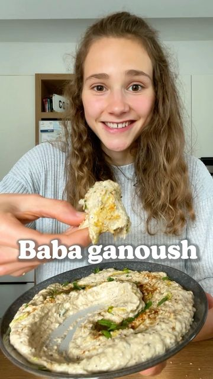

# BABA GANOUSH 😋 Is it better than hummus? 😌 

> recipe by [@fitgreenmind](https://www.instagram.com/fitgreenmind/) 
(Maya / plant-based food and recipes) - [see original post](https://instagram.com/p/CUx7ZS7AlDM)

  
Baba Ganoush is an Arabic creamy eggplant dip and tastes absolutely incredible! 😍  
Usually I’m not a big fan of eggplants but this dip made me fall in love with them…the combo of that smokiness, with the creamy, nutty tahini…love it! 🥰  
  
👩‍🍳 I used homemade simit (sort of „Turkish bagels“) for dipping, the recipes is in my feed.   
Much love  
Maya✨  
RECIPE (3 servings each 160cal/6P/9C/10F):  
-2 eggplants (plus salt to sprinkle)  
-2 cloves garlic  
-4 Tbsp tahini  
-1 Tbsp lemon juice  
-salt and pepper to taste  
SPRINKLE the eggplant with salt/LET SIT 5mins/PAT DRY it/ROAST at 220C/440F for 40mins/BLEND all ingredients  
-  
BABA GANOUSH 😋 Ist es besser als Hummus? 😌  
  
Baba Ganoush ist ein arabischer Auberginen Dip und schmeckt unfassbar gut! 🥰  
Ich bin normalerweise kein riesen Auberginen-Fan, aber dieser Dip hat mich es besseren belehrt…die Kombi aus diesem leicht gerösteten, dem cremig, nussigen Tahini…ich lieb‘s! 🥰  
  
👩‍🍳 Ich hab selbstgemachte Simit (türkische Sesamkringel) zum Dippen benutzt, das Rezept findet ihr in meinem Feed.  
Alles liebe  
Maya ✨  
REZEPT (3 Portionen je 160kcal/6P/9K/10F):  
-2 Auberginen  
-4 El Tahini  
-1 El Zitronensaft   
-Salz und Pfeffer nach Geschmack   
-2 Zehen Knoblauch   
BESTREUE die Aubergine mit etwas Salz/LASSE es 5min ziehen und tupfe sie ab/RÖSTE sie bei 220Grad für 40min/MIXE alles  
\#makeitmaya   