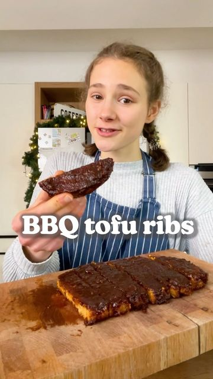

# VEGAN BBQ RIBS 🌱😍 Super easy, super tasty! 😋 

> recipe by [@fitgreenmind](https://www.instagram.com/fitgreenmind/) 
(Maya // vegan recipes) - [see original post](https://instagram.com/p/CXPFnNtqP0b)

\
Those vegan „ribs“ are mainly made of Tofu thus they’re gluten free but nevertheless really good…🙌\
I used my homemade BBQ sauce for the coating (see last post) but you can use any of your choice. ☺️\
Much love\
Maya ✨\
RECIPE (3 servings each 295cal/15P/33C/9F):\
-200g tofu \
CRUMBLE in a bowl\
-2/3 Cup (80g) chickpea flour (or another flour\
-1 Tsp each salt, garlic powder, onion powder, paprika\
-1 Tbsp vegan Worcestershire sauce\
KNEAD/ROLL into a rectangle\
-1 Tbsp smoked paprika\
-1/2 Tbsp cumin and garlic powder\
USE as rub/FRY in oil for 3mins each side\
-1/2 cup (150g) vegan BBQ sauce\
COAT the tofu steak/BAKE at 180C/360F for 30mins, flip halfway through\
-\
 VEGANE BBQ RIPPCHEN🌱😍 Super einfach, aber doch super lecker! 😋\
\
Diese „Rippchen“ sind hauptsächlich aus Tofu, aber schmecken trotzdem echt genial…🙌\
Ich habe meine selbstgemachte BBQ Sauce genutzt (siehe letzter Post), aber du kannst auch jede andere verwenden! ☺️\
Alles liebe \
Maya ✨\
REZEPT (3 Portionen je 295kcal/15P/33K/9F):\
-200g Tofu\
ZERKRÜMELN\
-80g Kichererbsenmehl (oder anderes Mehl)\
-je 1 Tl Salz, Knoblauchpulver, Zwiebelpulver, Paprikapulver \
-1 El Vegane Worcestershire sauce\
KNETEN/RECHTECK formen\
-1 El Räucherpaprika \
-1/2 El Kumin und Knoblauchpulver \
TOFU STEAK einreiben/ANBRATEN für 3min pro Seite\
-150g vegane BBQ sauce\
AUF TOFU STEAK verteilen/BACKEN bei 180C für 30min, nach der Hälfte umdrehen\
\#makeitmaya 