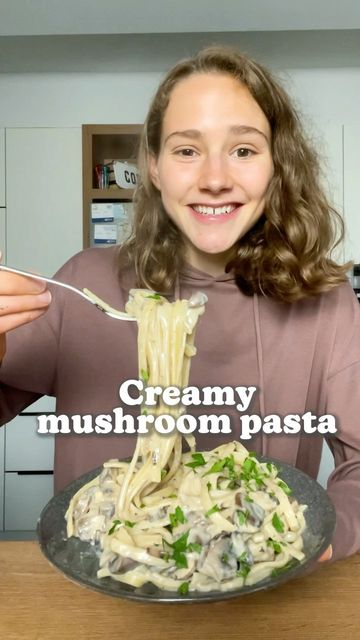

# CREAMY MUSHROOM PASTA 🍝 Life is just better with pasta…😋 

> recipe by [@fitgreenmind](https://www.instagram.com/fitgreenmind/) 
(Maya // vegan recipes) - [see original post](https://instagram.com/p/CVtLYlDKJtp)

\
I haven’t posted a pasta recipe for too long, therefore this is a really really good one! \
My entire family loved it! It’s creamy, it’s flavoursome, it’s simply delicious! 🤗\
Btw if you hate mushrooms, you can leave them out.\
Much love \
Maya ✨\
RECIPE (3 servings each 512cal/26P/64C/10F):\
-500g mushrooms\
-1 onion\
-3 cloves garlic\
FRY until softened\
-3 Tbsp flour\
-3/4 cup (180ml) white wine or veg stock\
-1 3/4 cup (430ml) plant milk\
-salt and pepper to taste\
-250g pasta (cook and save some pasta water)\
ADD flour to the mushrooms, onions, garlic/DEGLAZE with wine and plant milk/SEASON and let it simmer 10mins/STIR IN pasta\
-\
CREMIGE PILZ PASTA 🍝 Das Leben ist schöner mit Nudeln…😋\
\
Ich hab schon viel zu lange kein Pastarezept mehr mit euch geteilt, dafür ist das hier aber ein extreeem Gutes! \
Meine ganze Familie hat es geliebt, die Nudeln schmecken einfach so schön cremig und sahnig…😋\
Übrigens falls du Pilze gar nicht magst, kannst du sie auch weglassen.\
Alles liebe \
Maya ✨\
REZEPT (3 Portionen je 512kcal/26P/64K/10F):\
-500g Pilze\
-1 Zwiebel\
-3 Zehen Knoblauch \
ANBRATEN bis es weich ist\
-3 El Mehl\
-180ml Weißwein\
-430ml Pflanzendrink \
-Salz und Pfeffer nach Geschmack \
-250g Pasta (kochen und etwas Pastawasser aufheben)\
Mehl zu Pilzen, Knobi und Zwiebeln geben/ABLÖSCHEN mit Wein und Pflanzendrink/WÜRZEN und 10min köcheln/Nudeln einrühren\
\#makeitmaya 