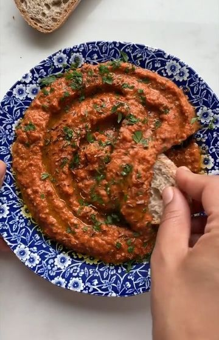

# MUHAMMARA🔥 by @sovegan When we first tried this traditional Syrian dip, we nearly cried with joy. It’s actually incredible. It’s a spicy and hearty dip made using roasted red peppers and walnuts. Muhammara is also traditionally made using Aleppo pepper, which we struggle to find so we use regular chilli flakes. You can enjoy this as part of a mezze or just dig in with some crusty bread or flatbreads. Unbelievable 😍 

> recipe by [@foodypopz](https://www.instagram.com/foodypopz/) 
(Foody Popz) - [see original post](https://instagram.com/p/CVrxs6uKU4E)

   
Full recipe is below👇  
   
🌿 3 red peppers  
🌿 1/2 cup walnuts  
🌿 1 tsp cumin seeds, plus extra for decoration  
🌿 4 tbsp breadcrumbs (we use leftover stale bread), or gluten-free breadcrumbs  
🌿 2 tbsp olive oil (we use extra virgin olive oil)  
🌿 2 tbsp pomegranate molasses  
🌿 1/4 tsp chilli flakes  
🌿 1 garlic cloves, peeled  
🌿 1 tbsp lemon juice  
🌿 salt  
🌿 1 small handful parsley leaves, chopped (optional)  
   
1️⃣ Preheat the oven to 200°C fan / 428°F. Then place the red peppers on a baking tray and bake for 35 minutes until charred and black.  
   
2️⃣ Meanwhile add the walnuts and cumin seeds (plus some extra seeds for decoration) to a pan on a medium heat and toast for 5 minutes until fragrant. Reserve some cumin seeds for decoration, then add the remaining walnuts and cumin seeds to a food processor along with the breadcrumbs, olive oil, pomegranate molasses, chilli flakes, garlic, lemon juice and a big pinch of salt.  
   
3️⃣ Remove the red peppers from the oven and leave them to cool until they’re ok to touch. Then, using your hands, peel and discard their skins. Next, tear the peppers in half and remove the tops and seeds. Add the flesh of the peppers to the food processor and process everything until smooth.  
   
4️⃣ Transfer the muhammara to a serving dish and top with a little extra olive oil, salt, cumin seeds and chopped parsley.   