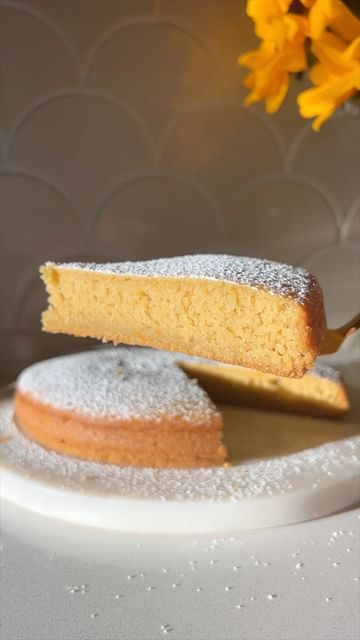

# Vegan Orange Olive Oil Cake 🍊 This snacking cake is the perfect way to celebrate citrus season! It has a tender crumb, is packed with bright citrus flavor, and has a lovely floral note thanks to (optional) almond extract.  

> recipe by [@frommybowl](https://www.instagram.com/frommybowl/) 
(From My Bowl | by Caitlin S) - [see original post](https://instagram.com/p/CacuDSMFl-J)

  
If life’s a little challenging for you right now I hope this video helps you to pause, take a deep breath, and find a reason to smile. Sending you a virtual hug! 🤗  
  
Full recipe is on From My Bowl 🧡 \#plantbased \#orangecake \#seasonaleats   