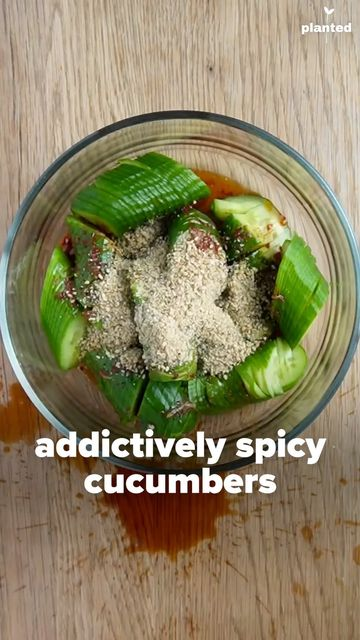

# ADDICTIVELY SPICY CUCUMBERS 🥒 This fancy snack by @mila_the_vegan.2 is both healthy AND delicious! Each savory bite is full of important electrolytes that can help prevent dehydration and maintain optimal digestion. Plus, cucumbers are also rich in substances that may help lower blood sugar and regulate insulin release, and they contain a variety of vitamins and minerals as well. If you're trying to add more veggies to your life, we highly recommend this recipe!⁠ 

> recipe by [@get.plant.ed](https://www.instagram.com/get.plant.ed/) 
(planted) - [see original post](https://instagram.com/p/CZ-WUz3lC2D)

⁠
What you'll need 🌶⁠
- 4 small cucumbers ⁠
- 2 tbsp sesame oil ⁠
- 2 tsp soy sauce ⁠
- 2 tsp vinegar ⁠
- 1 clove garlic⁠
- ½-1 ts chili ⁠
- 2 tbs grind sesame⁠
⁠
How to put it together 🥗⁠
- Cut cucumbers into 2-inch blocks and make a deep cuts on each of them without cutting through⁠
- Repeat on the opposite side.⁠
- Mix sesame oil, soy sauce, vinegar, garlic and chili and pour over cucumbers⁠
- Crush sesame seeds in a mortar to release the flavor, then mix into cucumber salad⁠
.⁠
.⁠
—————————————————⁠
FOLLOW - @get.plant.ed 🌎💪💪🏾💪🏼⁠
—————————————————⁠
.⁠
.⁠
📹 @mila_the_vegan.2⁠
ℹ️ Medical News Today⁠
.⁠
.⁠
\#GetPlanted \#cucumbers \#spicyvegan \#veganvibes \#veganfoodshare \#veganfoodie \#veganchef \#cucumber \#cucumbersalad \#vegansalad \#veganinspo \#wfpb \#wholefoodsplantbased \#wholefoodsplantbaseddiet 