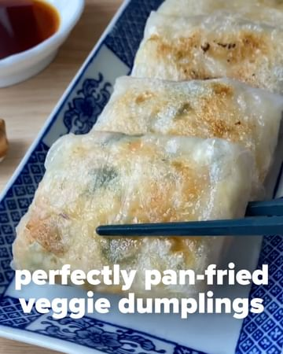

# Crispy on the outside and perfectly chewy on the inside! You're gonna LOVE these rice paper dumplings by @okonomikitchen 🥟 Best of all, they're 100% plant-based so you can make this recipe as often as you like without contributing to the cruel and eco-destructive meat and dairy industries 🙌 

> recipe by [@get.plant.ed](https://www.instagram.com/get.plant.ed/) 
(planted) - [see original post](https://instagram.com/p/CbuwYp9hQey)

⁣
Check out @okonomikitchen or okonomikitchen.com [https://okonomikitchen.com/rice-paper-dumplings/] for the full recipe!

What you'll need 
- 80g momen (soft/traditional) tofu ⁣
- ⅛ cabbage, shredded ⁣
- ¼ carrot, shredded⁣
- 1 green onion, chopped⁣
- ½ tbsp sesame oil⁣
- ½ tbsp soy sauce⁣
- 1 tsp grated garlic⁣
- 1 tsp grated ginger⁣
- Salt and pepper⁣
- 12 rice papers (18cm rounds)⁣
.
.
—————————————————
FOLLOW - @get.plant.ed 🌎💪💪🏾💪🏼
—————————————————
.
.
📹 @okonomikitchen
.
.
\#GetPlanted \#gyoza \#dumplings \#vegandumplings \#easydumplings \#japaneserecipes \#japanesefood  \#japanesevegan \#veganrecipes \#panfrieddumplings \#veganjapanese \#eatplantsnotanimals \#veganized \#veganfortheanimals \#veganfortheplanet \#veganrecipe \#letscookvegan \#plantbased \#plantbasedrecipes \#veggiedumplings 