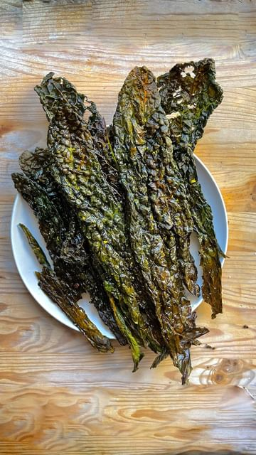

# Voglia di uno spuntino? Cavolo nero trasformato in deliziose e super croccanti chips al forno! 🙃🌿🤪 @andreacapodanno 

Ingredienti:

2 cucchiai di Olio EVO
1 pizzico di Sale 
Scorza di Limone BIO
1 spicchio d’aglio schiacciato

Procedimento:

Pulisco il cavolo nero tirandolo dalla base, sfilando dal gambo solo la foglia. Lavo le foglie di cavolo nero sotto acqua corrente e le asciugo poi con un panno pulito (non buttare via i gambi, sono ottimi nel brodo vegetale) Preparo il condimento versando l’olio in una ciotolina e aggiungo il sale, l’aglio schiacciato e la scorza di un limone bio grattugiata. Spennello la superficie delle foglie di cavolo nero su entrambi i lati e cuocio in forno. Basteranno 10 minuti a 180 gradi per rendere le vostre chips croccantissime!

#giallozafferano #giallozafferanocreators #gz #andreacapodanno #chips #cavolonero #kale #chipsdicavolonero #antipasti #aperitivo #spuntino #verdure #light #ricettelight #foodie #food #foodie #delicious #amazing #wow #delicious #foodvibes #foodlover #foodlovers 

> recipe by [@giallozafferano](https://www.instagram.com/giallozafferano/) 
(Giallozafferano) - [see original post](https://instagram.com/p/Ca9Uqk3AB-U)

 