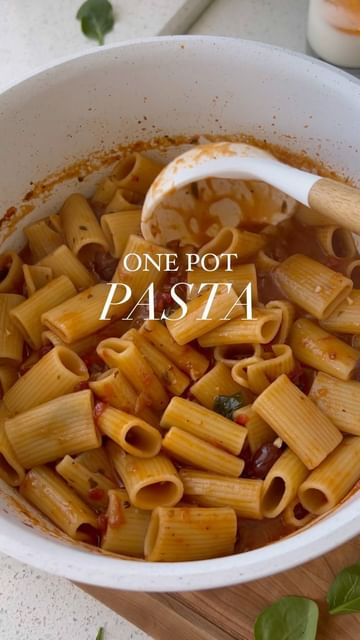

# bookmark this VEGAN ONE-POT PASTA 🍝 (15-minute dinner idea)✨follow @healthygirlkitchen for more!  

> recipe by [@healthygirlkitchen](https://www.instagram.com/healthygirlkitchen/) 
(Danielle Brown | vegan recipes) - [see original post](https://instagram.com/p/CdOb2aTpfTm)

  
ingredients:  
16 oz rigatoni  
2.5 cups marinara sauce  
4.5 cups water   
1/3 cup sun dried tomatoes  
1/2 cup kalamata olives  
1 tbsp fresh minced garlic   
2 cups spinach   
1 tsp dried basil   
1 tsp dried oregano  
1/2 tsp salt  
  
garnish: vegan Parmesan and fresh basil   
  
instructions: add everything into a large pot, bring to boil them cook on medium for 10-15 until pasta is tender! If the liquid is fully absorbed and the pasta is still hard gradually add 1/2 cup water until the pasta is cooked to your liking.   
  
*this doesn’t work AS well with gf pasta! Baked one pot pastas are better with gf pasta.   
  
\#veganrecipes \#onepotmeal \#onepot \#pastarecipe \#pasta \#mealprep \#easydinner \#dinneridea \#dinnerrecipes \#pastapasta \#pastalover \#plantbaseddiet \#plantbased \#plantbasedfood \#veganfoodshare \#dairyfree \#healthymeal \#healthydinner \#healthylifestyle   