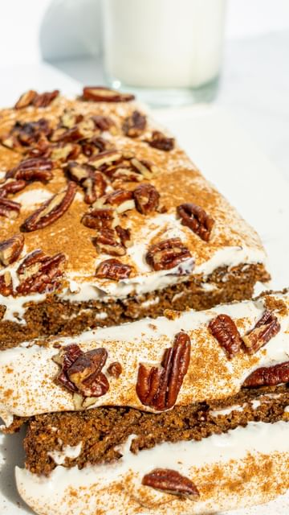

# Save this VEGAN GLUTEN-FREE CARROT CAKE (1-bowl)🥕✨follow  @healthygirlkitchen for more recipes!  

> recipe by [@healthygirlkitchen](https://www.instagram.com/healthygirlkitchen/) 
(Danielle Brown | vegan recipes) - [see original post](https://instagram.com/p/CcGvjpqBfTY)

for the full recipe click link in my bio or go to healthygirlkitchen.com 

shopping list: 
applesauce
olive or macadamia oil 
ground flax
dairy-free yogurt
almond flour
gf all purpose flour
vanilla
carrots
coconut sugar
cinnamon
nutmeg 
cloves
baking soda
baking powder 
pecans 

Frosting:
vegan cream cheese
maple syrup 

\#veganrecipes \#carrotcake \#dessertporn \#vegandessert \#dairyfree \#bakinglove \#veganfoodshare \#plantbased \#glutenfreebaking \#glutenfreevegan \#glutenfree \#healthycake \#healthybaking \#easybaking \#plantbaseddiet 