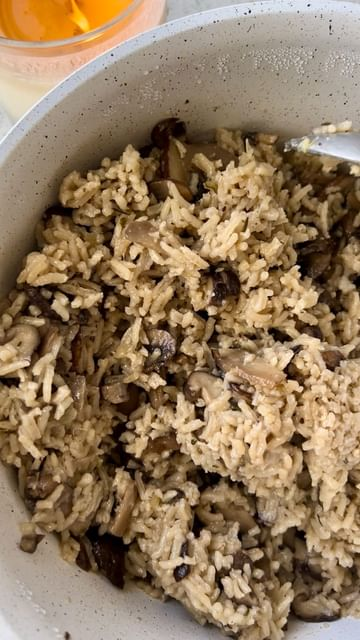

# bookmark this vegan ONE-POT CREAMY MUSHROOM RICE 🍚✨follow @healthygirlkitchen for more healthy recipes!  

> recipe by [@healthygirlkitchen](https://www.instagram.com/healthygirlkitchen/) 
(Danielle Brown | vegan recipes) - [see original post](https://instagram.com/p/CcOkDyrpHkD)

\
ingredients: \
3 tbsp olive oil\
1 cup diced yellow onion\
2 tsp minced garlic\
2 cups shiitake mushrooms\
3 cups baby portobello mushrooms\
1 cup jasmine rice\
2 cups veggie broth\
1/3 cup full fat coconut milk\
1 tsp salt\
1/4 tsp pepper\
1/2 tsp thyme \
\
instructions: \
1. Sauté olive oil, onion, garlic and mushrooms in a pot for 5 min. \
2. Add rice, veggie broth and spices. Stir and bring to boil. \
3. Cover and simmer for 20 min until all liquid is absorbed. *these directions are for jasmine rice or basmati rice.\
4. Once ready stir in coconut milk. Enjoy! \
5. Serve with something like tofu and broccoli for a full meal! \
\
tag your healthy bestie! \
\
\#veganrecipes \#veganfood \#veganfoodshare \#mushrooms \#onepotmeal \#healthymeal \#sidedish \#mealprep \#healthyfood \#glutenfree \#plantbased \#plantbaseddiet \#plantbasedmeals \#plantbasedrecipes \#easyrecipes \#healthyrecipes \#healthydinner \#glutenfreevegan 