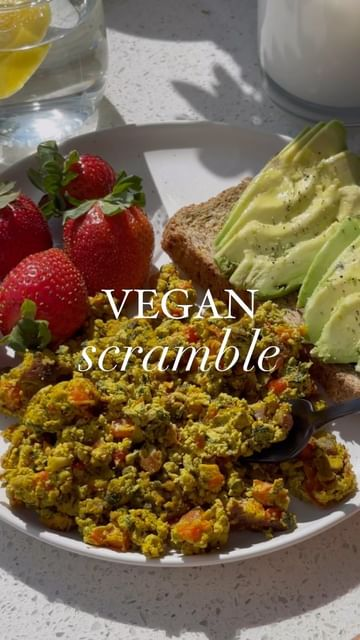

# bookmark how to make VEGAN SCRAMBLED EGGS using pumpkin seeds 🍳✨Follow @healthygirlkitchen for more vegan recipes! #gorawpartner 

> recipe by [@healthygirlkitchen](https://www.instagram.com/healthygirlkitchen/) 
(Danielle Brown | vegan recipes) - [see original post](https://instagram.com/p/ClJa2npjt1H)

ingredients: (2 servings) 
1 cup organic sprouted pumpkin seeds (I use @go_raw ) 
1 cup water
1 tbsp almond milk
1/2 tsp salt
1/2 tsp turmeric
pinch of pepper 
1/2 tsp baking powder 
diced veggies of choice 

Instructions:
	1.	Blend all ingredients in a blender until smooth except baking powder.
	2.	Add scramble into a bowl then stir in baking powder quickly. 
	3.	Use a nonstick pan for this scramble!!! Sauté veggies first. Then add the pumpkin seed egg to the pan on medium heat. let it sit and bubble up for a minute before moving it around in the pan. Saute until a scramble texture (will take 10 min). 
	4.	Serve and enjoy!

\#vegan \#eggs \#healthymeal \#healthybreakfast \#healthylifestyle \#plantbased \#plantbaseddiet \#meatfree \#eggfree \#healthyfood \#thatgirl \#healthychoices \#easycooking \#easymeals \#veganfood \#veganfoodshare \#veganfoodie \#veganbreakfast 