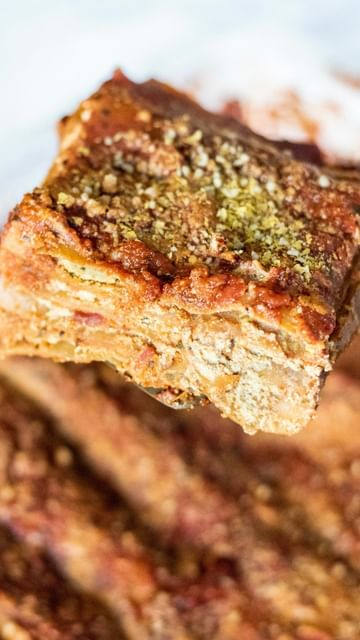

# add this vegan lasagna to this weekend’s dinner menu ♥️✨follow @healthygirlkitchen for more vegan recipes!  

> recipe by [@healthygirlkitchen](https://www.instagram.com/healthygirlkitchen/) 
(Danielle Brown | vegan recipes) - [see original post](https://instagram.com/p/CY9ZvlSBQNS)

\
ingredients:\
1-2 packages lasagna noodles (par-boil for 5-6 min to make oven time shorter)\
2 jars tomato sauce\
1 batch tofu ricotta\
3 cups baby spinach \
vegan mozzarella for topping I use @miyokoscreamery \
basil for garnish \
\
tofu ricotta: \
1 block firm tofu\
1/4 cup nutritional yeast \
1 tsp salt\
1 tsp garlic\
2 tbsp lemon juice\
1 tbsp dried basil\
1/4 cup unsweetened plant milk\
\
*I used @jovialfoods brown rice lasagna noodles! But use any kind you want. \
\
How to: \
1. Preheat oven to 400 F. \
2. Par-boil noodles (optional: it cuts cooking time)\
3. Add sauce to bottom of 9x13 casserole dish.\
4. Layer on noodles, then tofu ricotta, sauce, then spinach.\
5. Layer until you reach the top of the pan then add vegan mozz if u want or any vegan cheese (or extra tofu ricotta).\
6. Cover with foil and bake for 30 min covered and 15 uncovered. Broil for 5 min to get the cheese brown if u want! \
7. A fork should easily go through the layers when it’s done! \
8. Try to use up both jars of the marinara sauce! If u like a drier lasagna use 1 jar. \
9. Top with basil + enjoy besties!😘\
\
\#veganfoodshare \#lasagna \#veganfood \#veganmeal \#dairyfree \#glutenfree \#healthyfood \#healthydinner \#easydinner \#easyvegan \#plantbaseddiet \#plantbasedfood \#plantbasedvegan \#dairyfreerecipes 