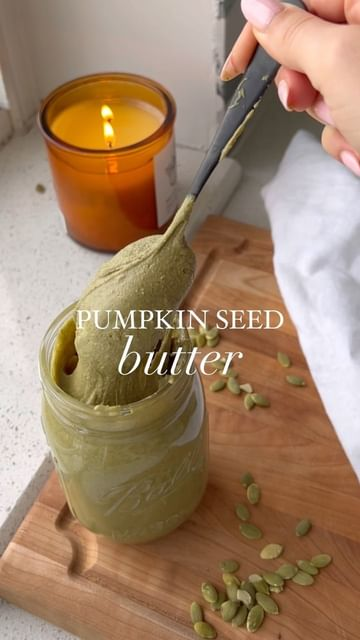

# Did you know you can turn pumpkin seeds into PUMPKIN SEED BUTTER 💕✨Follow @healthygirlkitchen for more! 

> recipe by [@healthygirlkitchen](https://www.instagram.com/healthygirlkitchen/) 
(Danielle Brown | vegan recipes) - [see original post](https://instagram.com/p/ChnmBJtJDrq)

\#GoRawPartner\
\
Ingredients:\
3 cups pumpkin seeds I use @Go_raw\
1 tsp cinnamon\
1 tsp pumpkin pie spice\
1 tbsp maple syrup\
1 tsp vanilla optional\
Pinch salt\
\
1. On a baking sheet lined with parchment, bake pumpkin seeds for 5 minutes at 350F. \
2. Pour pumpkin seeds into food processor and blend until almost smooth, pausing every 2 minutes, scraping down the sides (10 minutes). Be patient. It will work.\
3. Add the rest of the ingredients for extra flavor.\
4. Continue to blend until completely smooth and runny.\
5. Takes up to 20 minutes. \
\
I love putting it on toast with jam! \
\
\#vegan \#plantbaseddiet \#healthy \#cookingathome \#mealprep \#vegetarian \#glutenfree \#nutfree \#dairyfree \#healthyeating \#healthyeats \#healthylifestyle \#healthyfood \#healthychoices \#pumpkinseeds \#fallfood \#fallrecipes 