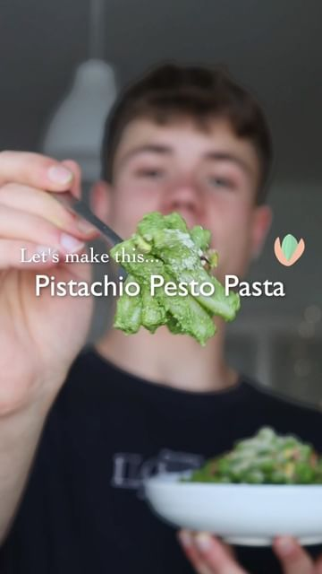

# PISTACHIO PESTO PASTA 🌱✨ a super healthy & delicious pesto with a twist! 

> recipe by [@herbifoods](https://www.instagram.com/herbifoods/) 
(Paul Köber) - [see original post](https://instagram.com/p/CdLgaiPK4TS)

••  
Pistachios are one of the most underrated nuts in my opinion 🙏🏼 If you like pesto, you’ve got try this version:  
⠀  
RECIPE (3 portions)  
- 300g pasta of choice  
- 70 g pistachios (or more for a more prominent flavor)  
- 30 g other nuts or seeds  
- 2 handfuls of spinach  
- 1/2 lemon, juiced  
- 1 garlic clove  
- 2 tbsp nutritional yeast  
- 1 handful of fresh basil  
- 2 tbsp olive oil  
- salt & pepper  
⠀  
❶ Toast the nuts and seeds until slightly browned from all sides.  
❷ Blend all ingredients for the pesto/sauce. Blend it as fine or corse as you like.  
❸ Cook the pasta according to packaging.  
❹ Add the pesto/sauce to a pan, loosen with some pasta water, then add in the pasta.  
❺ Serve with some crushed pistachios and vegan parmesan - enjoy!  
Tag me if you make it 💚 I love seeing your remakes!  
⠀  
TIPS  
- If you use a mortar you can adjust the consistency a bit more easily - the pesto is best when left a little more rough!  
- You can use any other nuts you like, walnuts, almonds, pine nuts - whatever you prefer!  
⠀   
MACROS (per portion)  
669 kcal  
27 g protein  
71 g carbohydrates  
28 g fats  
16 g fiber  
••  
Follow @herbifoods for more easy to follow vegan recipes!  
Much love to all of you, Paul 👋💚  
⠀  
\#easyrecipes \#healthyrecipes \#healthyfood \#vegan   