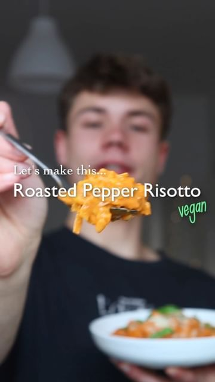

# ROASTED PEPPER RISOTTO 🌶👨🏼‍🍳 possibly the best risotto I’ve ever tried! 

> recipe by [@herbifoods](https://www.instagram.com/herbifoods/) 
(Paul Köber) - [see original post](https://instagram.com/p/CdYgtlPFTg-)

••  
This is my favorite risotto recipe, it’s creamy, rich, bursting with flavor, but at the same time fresh and light 🤤 the recipe is inspired by @sortedfood:  
⠀  
RECIPE (3 portions)  
For the sauce:  
- 2 red peppers  
- 3-4 medium tomatoes  
- 1 eggplant  
- 1 very small garlic bulb or 4 cloves  
- salt and pepper  
- 1-2 tbsp olive oil  
- 50g cashews (or vegan cream)  
- a splash of water, to blend  
⠀  
- 1-2 leeks  
- fresh thyme or herbs of choice  
- 300 g risotto rice  
- 250 ml white wine  
- vegetable broth, as needed  
- vegan parmesan (optional)  
⠀  
❶ Add peppers, tomatoes, eggplant and garlic to a baking tray. Sesaon with salt and pepper and drizzle with olive oil. Roast at 220°C for about 30 minutes.  
❷ In a pan sauté leek in a little bit of oil for 8-10 minutes, then add thyme and the risotto rice.   
❸ Deglaze the pan with white wine and gradually add in the broth, whenever needed.  
❹ When the veggies are done, blend with a handful of cashews and a splash of water until creamy.  
❺ When the risotto is almost done, add the veggies and cook for a few more minutes.  
❻ Serve with some vegan parmesan or however you prefer and enjoy!  
Tag me if you make it 💚 I love seeing your remakes!  
⠀   
MACROS (per portion)  
465 kcal  
10 g protein  
58 g carbohydrates  
13 g fats  
9 g fiber  
••  
Follow @herbifoods for more easy to follow vegan recipes!  
Much love to all of you, Paul 👋💚  
⠀  
\#vegan \#easyrecipes \#healthyrecipes \#veganfood   