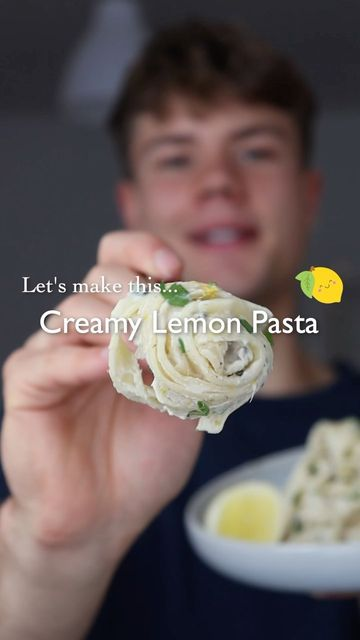

# CREAMY VEGAN LEMON PASTA 🍋 quick & easy pasta sauce!  

> recipe by [@herbifoods](https://www.instagram.com/herbifoods/) 
(Paul Köber) - [see original post](https://instagram.com/p/CVGA96hql9X)

⠀  
The dear @rosakochtgruen recommended me this pasta sauce when we met a couple of weeks ago and I wanted to try it ever since! I have adjusted the recipe a little bit and used cashews instead of vegan cream, but man why didn't I try this sooner? 😍 Here is the recipe:  
⠀  
RECIPE (3 portions)  
- 300 g (whole wheat) pasta  
- 1-2 tbsp olive oil  
- 1 medium onion  
- 3-5 cloves of garlic  
- 1 tbsp parsley stems  
- 1 tsp lemon zest  
- 1/2 cup (80 g) cashews  
- 1/2 cup (120 ml) veggie broth  
- 4 tbsp nutritional yeast, optional for cheesy flavor  
- juice of 1-2 lemons to taste  
- fresh herbs (I used parsley and basil)  
- salt and pepper  
Optional to serve:  
- vegan parmesan  
- toasted nuts  
- fresh herbs  
- more veggies or chickpeas  
⠀  
❶ Soak the cashews in hot water for at least 10 minutes.  
❷ In a pan sauté the onion until translucent, add the garlic, parsley stems and lemon zest and cook for a few more minutes. Deglaze with a splash of lemon juice and release all the flavors from the pan.  
❸ In a blender or food processor blend the ingredients for the sauce.  
❹ Pour sauce back to the pan and add some fresh herbs such as parsley or basil.  
❺ Cook pasta according to packaging until al dente. Save some pasta water.  
❻ Add cooked pasta to the sauce, mix well and add pasta water until it reaches your desired consistency.  
Try it yourself and tag me @herbifoods ✨ I just love seeing your remakes so much!  
⠀  
TIPS  
- Add more veggies or chickpeas to increase the nutritional value of this meal  
⠀  
NUTRION (per portion, without toppings)  
601 kcal  
25 g protein  
57 g carbohydrates  
77 g fats  
13 g fiber  
••  
Follow @herbifoods for more simple recipes!  
Much love to all of you, Paul 👋💚  
⠀  
\#easyrecipes \#vegan \#veganrecipes \#vegandinner \#healthyrecipes   