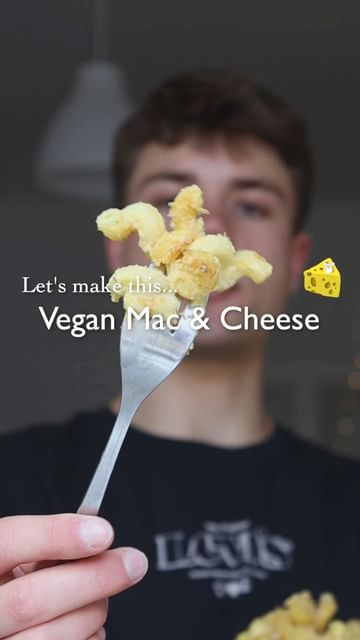

# VEGAN MAC & CHEESE 🧀🌱 you won’t believe it’s vegan! 

> recipe by [@herbifoods](https://www.instagram.com/herbifoods/) 
(Paul Köber | vegan recipes) - [see original post](https://instagram.com/p/Ccx9HOrKuT_)

••\
AD When @wusthof challenged me to make a recipe with a „sustainability swap“, I immediately knew it would have to be around a meat or dairy product.\
⠀\
Eating a more plant based diet may be the single biggest way to reduce our impact on planet Earth as an individual. Not just greenhouse gases, but also in terms of pollution, deforestation, land use and water use! I’ve linked some resources in my bio for further information.\
⠀\
Please don’t take me wrong, I’m not saying this to bash on the non-vegans among you, I just want to shine some light on this amazing potential that lies in eating more plants!\
⠀\
RECIPE (3 portions)\
- 300 g pasta of choice\
⠀ \
Vegan cheese sauce:\
- 2 medium potatoes\
- 1 small carrot\
- 3/4 cup (100 g) cashews\
- 1 tbsp olive oil\
- 1 medium onion\
- 2-3 garlic cloves\
- 4 tbsp nutritional yeast (optional)\
- 1 tbsp mustard\
- 1/2 lemon, juiced\
- salt & pepper\
- 1/2 cup (120 ml) plant milk or water\
⠀\
Optional toppings:\
- garlic breadcrumbs\
- vegan parmesan\
⠀\
❶ Boil potatoes, carrot and cashews until soft.\
❷ In a pan sauté onion until translucent, add garlic and cook for another 1-2 minutes.\
❸ Blend all ingredients for the sauce. Set aside.\
❹ Cook pasta in salted water for about 1 minute less than on the package. Add it right to the pan with the sauce and loosen it with a splash of pasta water.\
❺ Optional: Top with some garlic bread crumbs and vegan parmesan and bake for a few minutes until golden.\
Try it yourself and tag me @herbifoods ✨ I love seeing your remakes!\
⠀ \
MACROS (per portion, without toppings)\
554 kcal\
22 g protein\
61 g carbohydrates\
22 g fats\
13 g fiber\
••\
Follow @herbifoods for easy to follow vegan recipes!\
Much love to all of you, Paul 👋💚\
⠀\
\#MyWUSTHOF \#WUSTHOF \#vegan \#easyrecipes \#healthyfood 